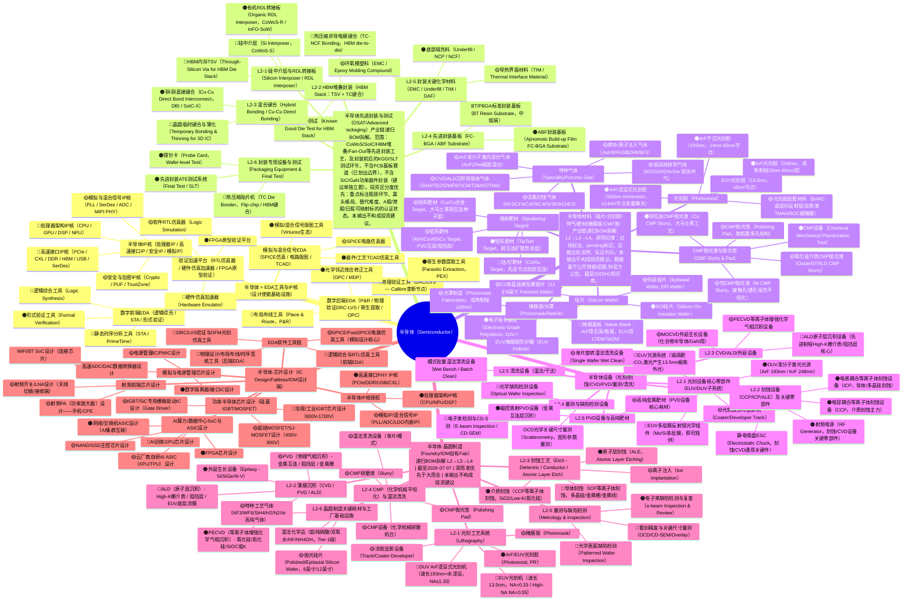

# 半导体（Semiconductor） 产业画布蓝图

> 中心主干=产业生命周期；上/中/下游分区；P0/P1 瓶颈高亮；右侧仪表盘；左侧审计区。

## 右侧投研仪表盘

- [?] **AI训练GPU芯片设计的供给瓶颈由三层叠加构成，且相互强化：①CUDA软件生态护城河——17M+开发者、PyTorch/JAX框架默认CUDA后端、20年生态积累，形成极高迁移成本，AMD ROCm为Tier-2支持，实际工程适配代价显著；②TSMC CoWoS先进封装物理瓶颈——HBM+GPU die异质集成需专属产线，TSMC已公告2024年满负荷，新产能需2-3年爬坡；③HBM3e内存分配刚性——SK Hynix/三星/Micron三家寡头，NVIDIA拥有优先分配协议，其他竞争对手分配受压。国内替代（华为Ascend 910B量产）存在三重约束：制程代差（等效7nm vs B200 3nm节点）、训练性能差距（单卡BF16算力约2-4倍，待精确benchmark核验）、HBM断供导致内存带宽瓶颈，难以替代顶级训练集群。AMD MI300X性能接近H100但生态完整度和云实际采购占比仍显著低于NVIDIA。** → 寒武纪、海光信息
- [?] **EUV光刻机（13.5nm，NA=0.33/0.55）体系存在三层单点卡脖子：①整机：ASML全球唯一制造商，NXE:3600D售价约2亿欧元，High-NA EXE:5000约3.5亿欧元；②光学模块：Carl Zeiss SMT垄断全部EUV反射镜（Mo/Si多层膜，600+超精密元件/台），产能与ASML产能强耦合，无替代商；③EUV光源驱动激光：Trumpf提供全功率CO₂脉冲激光（50kW级），ASML子公司Cymer负责LPP等离子体及集光腔，二者高度绑定。整机年产能约60台已近工程极限，扩产需同步扩Zeiss光学产能，周期3年+。High-NA EXE:5000首台2024Q1交付Intel Fab 34（爱尔兰），工艺尚处开发阶段，量产预计2026-2027年。中国出口管制（2019/2023年双轮收紧）完全封堵大陆采购，国内SMEE仍停留DUV ArFi前级（差距3代以上），近中期国产替代不存在。证伪指标：TSMC 2025年CapEx指引低于450亿美元将下修EUV台次需求；High-NA工艺验证进度（Intel 2026H1 volume ramp是否达成）是关键节点。** → —
- [?] **光学表面缺陷检测（Patterned Wafer Inspection）的瓶颈由三重结构性壁垒叠加构成：①【数据飞轮锁定】KLA的良率管理软件（YMS/Klarity）将历代缺陷数据库与设备平台强绑定，更换供应商须重建多年良率历史，迁移成本接近无限；②【先进节点认证壁垒】每代制程节点（如N3→N2）检测灵敏度要求提升30-40%，新型号须在量产Fab完成18-24个月完整验证周期，非领先厂商无法快速切入；③【核心零件高度集中】DUV激光源（Coherent/II-VI主导）和高数值孔径物镜（Carl Zeiss/Nikon主导）两个关键子系统在全球仅有极少数供应商，KLA及任何潜在国产替代商均面临零件瓶颈，扩产周期约2-3年。证伪触发器：若TSMC N2/N3扩产计划放缓，检测台数采购将滞后6-9个月；若国内客户在先进节点（≤7nm）明确向中科飞测颁发量产资格认证，国产替代逻辑将升级。** → 中科飞测
- [?] **全球处理器架构IP核高度集中于Arm（覆盖约90%移动/嵌入式SoC ISA授权，架构授权＋处理器许可双层商业模式，2023财年营收约26亿美元、授权+Royalty各半）、Cadence Tensilica（Xtensa/ConnX DSP及视觉/AI DSP IP，覆盖音频/调制解调器/神经网络SoC子系统）、Synopsys ARC（嵌入式CPU IP，覆盖IoT/汽车/工业MCU）三家，市场集中度极高。Arm官方披露已在美国政府指引下审查中国客户许可证续签；中国最大商业RISC-V IP供应商（芯来科技、赛昉科技/StarFive、SiFive）均为未上市企业，A股中真正具备商业处理器IP授权收入模型的公司仅芯原股份一家；龙芯中科是唯一拥有自研ISA（LoongArch）的A股上市公司。证伪触发条件：Arm正式宣布终止中国客户许可证将使本映射紧急升级；若许可证顺利续签，风险溢价回落。** → 芯原股份（VeriSilicon）、龙芯中科、寒武纪
- [?] **布局布线（P&R）是EDA产业链中技术壁垒最高、替换成本最大的单点环节。全球由Synopsys（Fusion Compiler / IC Compiler II）与Cadence（Innovus）形成事实寡头，合计市场份额据行业估算超过90%。Siemens EDA（Aprisa）占据极小份额。

核心壁垒：① 算法积累（时序收敛引擎、多模多角分析、拥塞预测）需10年以上迭代；② 与Foundry PDK深度绑定——TSMC N3/N2/A16、Samsung SF3均在Synopsys/Cadence工具上率先流片验证，工具商是PDK的"共同开发者"；③ 客户端切换成本极高：完整重跑signoff流程≥1年设计周期；④ PPA差异直接影响频率/功耗/面积，顶层芯片公司无法承担切换风险。

A股现状：华大九天的主力产品集中于模拟/定制IC工具（ALPS、Zeni），数字P&R工具在2023年报中仅提及研发方向，无可核验的先进节点（14nm以下）商业案例。芯华章（未上市）主攻形式验证。国内EDA与先进数字P&R之间存在结构性代差，本环节A股无法产生a_leaders/a_earnings/a_darkhorse分层标的。** → —
- [?] **DRC/LVS物理验证工具被Siemens Calibre高度垄断先进节点：TSMC/Samsung/GLOBALFOUNDRIES/SMIC的rule deck均以Calibre原生格式交付，由各Foundry内部工程师维护；切换成本在Foundry侧，需2-3年重写rule deck，Foundry无主动替换动力。Siemens 2017年以$45亿收购Mentor Graphics后，将Calibre嵌入全球主要Foundry生产流程，形成平台级锁定。出口管制下Calibre许可证续约成为中国Fab（SMIC/华虹/中芯绍兴等）最直接、最确定的EDA卡脖点。当前中国无任何商业DRC/LVS工具具备先进节点（<28nm）Foundry认证rule deck覆盖。证伪条件：TSMC正式发布Synopsys ICV作为primary signoff官方认证（现ICV仅辅助/二次验证）。** → 华大九天
- [?] **硬件仿真加速器（Hardware Emulator）是半导体设计验证的核心基础设施。全球商业产品仅Cadence（Palladium Z2/Protium X2）、Synopsys（ZeBu Server）、Siemens EDA（Veloce Strato）三家，形成事实寡头垄断。核心技术壁垒：①大规模FPGA互联架构（数万片高密度AMD/Xilinx UltraScale+ FPGA并联）；②编译仿真软件生态与IP适配层；③全球头部芯片客户（Apple、NVIDIA、Qualcomm、Intel等）多年深度集成。AI时代大芯片复杂度非线性上升（Blackwell 2080亿晶体管），推动仿真需求4-8x放大，但扩产受AMD FPGA供应链约束≥3年，形成供给刚性瓶颈。中国大陆无任何商业化硬件仿真器产品，且头部AI芯片企业因出口管制无法合法采购新系统，国内空白明确且短期无解。唯一接近产品化的国内玩家芯华章科技（2020年成立，ex-Cadence工程师创办）仍处研发阶段且为非上市公司（private）。** → —
- [?] **逻辑综合（Logic Synthesis）是半导体设计自动化（EDA）中将RTL代码映射到工艺标准单元库的核心环节。先进节点（5/3nm）时序收敛技术壁垒极高：①算法复杂度随节点迭代超线性增长；②Synopsys Fusion Compiler将综合+布局布线打通形成PPA闭环，换工具需重建约束文件/脚本生态，设计周期损失≥1年；③ISO 26262功能安全认证进一步锁定主供；④国产工具在7nm以下无量产Tapeout背书，替代周期>5年。全球市场由Synopsys（>55%）和Cadence（~30%）双寡头垄断，Siemens EDA份额极小且主攻FPGA/成熟节点。** → 华大九天
- [?] **STA/PrimeTime是EDA壁垒最高单体工具。制度性锁定机制：TSMC PDK标准单元库（Liberty格式）、互连寄生参数（SPEF/RCXT）以PrimeTime格式原生校验，替换工具须Foundry额外签字（非纯技术问题）；设计公司30年累积的SDC/TCL脚本生态无法快速迁移；全球仅Synopsys PrimeTime为TSMC先进节点（≤3nm）唯一主流primary signoff工具，Cadence Tempus为唯一可信挑战者但尚未获TSMC官方primary signoff全面认可。中国本土无任何先进节点等价商业STA产品，亦无已知的先进节点signoff案例，从零开发至TSMC主signoff认证估计>7年。证伪条件：Cadence Tempus正式获TSMC N3/N2节点官方primary signoff认可（需持续跟踪Cadence与TSMC联合公告）。** → —
- [?] **高速接口PHY IP（PCIe 5.0/6.0、CXL 2.0/3.0、HBM3/3E、DDR5、SerDes 112G/224G）是AI算力时代的关键制程绑定资产：每换一个Foundry节点（N5→N3→N2）需重新流片硅验证，周期18-24个月，且PHY IP必须与Foundry PDK深度耦合（TSMC N3 PHY ≠ Samsung N3 PHY），形成极高切换壁垒。全球格局：Synopsys DesignWare控制头部AI加速器（H100/B200/MI300系列）绝大多数接口IP需求；Cadence、Rambus、Alphawave Semi各占细分位置；PCI-SIG/JEDEC协议认证进一步拉长竞争者进入周期。中国现状：目前无商业化HBM3/3E PHY IP（pending最新年报核验）、无商业化CXL 2.0/3.0 PHY IP、PCIe 5.0+高级工艺节点PHY IP极度稀缺，直接制约国产AI芯片设计路径。A股映射高度稀薄——国内有商业IP许可业务的公司极少，多数"接口IP"概念映射来自芯片用户而非IP提供商，需严格区分。** → 芯原股份（VeriSilicon）

## 左侧研究审计区（待核验下钻）

- [ ] 寒武纪：A股唯一纯AI芯片设计上市公司，MLU590为其旗舰训练芯片（7nm节点，定位对标A100级别），已进入量产阶段
- [ ] 寒武纪：2023年营收约7.09亿元（同比约-8.7%），归母净亏损约8.48亿元，尚未盈利；主要收入来自云端AI芯片（训练+推理混合），未单独披露训练芯片收入
- [ ] 寒武纪：已披露客户包括中国移动、国家超级计算中心等；训练芯片批量采购客户、订单金额未在年报中明确披露
- [ ] 寒武纪：技术约束：使用TSMC代工，受美国出口管制（EAR）影响，先进节点（<5nm）供货路径存在不确定性；国内替代方案（中芯国际N+2）性能差距待评估
- [ ] 海光信息：2023年总营收约21.6亿元（同比约+26%），净利润约4.5亿元，盈利为正；CPU与DCU收入占比未单独披露，DCU营收规模待拆分核验
- [ ] 海光信息：DCU已在部分国内云/HPC客户部署（曙光超算、国内高校HPC集群等），但AI大模型训练场景实际采购规模显著低于华为Ascend 910B
- [ ] 芯原股份：AI训练GPU芯片设计客户是否采用芯原IP及收入规模未公开披露，映射路径无法核验
- [ ] 华卓精科：EUV工件台技术要求远超DUV（定位精度须达亚纳米级，热稳定性/振动隔离至皮米量级）；公司招股书提及'研究方向涵盖下一代光刻机超精密工件台技术'，但无EUV具体客户/订单/送样的公开证据
- [ ] 华卓精科：弹性逻辑：若SMEE未来突破ArFi+/EUV-like工艺节点，华卓精科作为唯一国内工件台供应商具备优先卡位优势；但当前SMEE DUV产品与EUV差距3代，近中期证伪点明确
- [ ] 彤程新材：EUV光刻胶研发进展未公开具体技术指标或客户名称；全球EUV光刻胶市场技术壁垒极高（极低金属离子含量<0.1ppb，超高解析度），国内企业与国际领先水平差距显著
- [ ] 雅克科技：通过子公司安集微电子（已分拆独立上市，688019）及其他子公司涉及半导体特种气体和前驱体材料；自身光刻胶业务通过收购韩国SI-KM相关资产布局ArF光刻胶，EUV光刻胶尚无公开送样/认证记录
- [ ] 中科飞测：中科飞测（688361）在STAR Market上市，主营业务包含半导体光学缺陷检测设备（含亮场/暗场光学晶圆检测）和量测设备，是A股中唯一有光学Patterned Wafer Inspection量产交付记录的上市公司
- [ ] 中科飞测：已向国内成熟节点晶圆厂（28nm及以上）交付光学缺陷检测工具并有收入确认，但量产客户名称及合同金额未经一手公告验证
- [ ] 中科飞测：在先进节点（≤14nm）光学检测灵敏度上与KLA存在显著差距；高端型号处于送样/认证阶段而非主供，严格区分红线：成熟节点量产≠先进节点认证
- [ ] 中科飞测：公司营收规模（预计数亿元人民币量级）远低于KLA（百亿美元），且处于持续研发投入期，盈利时间表不确定
- [ ] 精测电子：精测电子主营业务为显示面板检测设备（FPD检测），占营收绝大部分；半导体检测方向处于早期布局，无光学Patterned Wafer Inspection量产交付记录
- [ ] 精测电子：公司在半导体检测领域有战略布局公告，但具体产品为后道/外观检测，与前道光学晶圆缺陷检测（Patterned Wafer Inspection）在技术和客户层面无直接重叠证据
- [ ] 天准科技：天准科技主营半导体量测和外观检测设备（主要覆盖后道封装和晶圆外观），无光学Patterned Wafer Inspection（前道有图案晶圆缺陷检测）的量产记录
- [ ] 芯原股份（VeriSilicon）：Vivante GPU IP已进入瑞芯微（603893）、紫光展锐等SoC量产产品线；VeriSilicon NPU IP已授权多家边缘AI芯片客户，具体客户名单部分未公开披露
- [ ] 龙芯中科：2022年营收约7.2亿元人民币，净利润约1.2亿元，主要来自信创政府采购；2023年受信创采购周期影响营收有所回落，具体数据待2023年报核验
- [ ] 寒武纪：华为被制裁后IP授权收入大幅下降，2022-2023年收入主体转为云端AI训练芯片（MLU系列）及边缘推理芯片；2024年受国内大模型算力采购潮推动，MLU系列营收出现明显增长
- [ ] 国芯科技：国芯科技基于PowerPC架构（IBM授权）开发CAN/LIN总线工业及汽车SoC（CS系列），已布局RISC-V核的CS32系列MCU产品，面向汽车/工业市场
- [ ] 华大九天：国内14nm以下先进节点流片需通过工具的Foundry认证，华大九天尚无可核验的此类认证信息
- [ ] 华大九天：华大九天FY2023总营收约6亿元人民币（同比增长约30%），物理验证工具收入未单独拆分披露。
- [ ] 华大九天：出口管制场景下，华大九天是中国Fab物理验证工具国产化的唯一具备商业规模的备选，但能否覆盖先进节点（<7nm）rule deck为核心证伪点，预计窗口在2026-2028年。
- [ ] 华大九天：国内AI芯片验证需求爆发若倒逼国产替代，华大九天有可能成为战略布局方向之一，但截至目前无任何公告或财报证明其有硬件仿真器研发投入
- [ ] 华大九天：任务背景中指出：'若华大九天在7nm及以下取得台积电流片量产案例需修正（当前pending）'——截至2025年底无可核验的一手公告印证该里程碑
- [ ] 华大九天：2024年公司加大研发投入在数字EDA领域，但营收贡献仍主要来自模拟EDA工具和IP，逻辑综合在整体营收中占比未单独披露，估计极低
- [ ] 华大九天：华大九天STA工具能否兼容TSMC先进节点PDK格式、能否通过Foundry signoff认证，均无公开一手证据
- [ ] 芯原股份（VeriSilicon）：PCIe 5.0 PHY IP已在部分先进节点（TSMC 7nm/5nm）完成硅验证并对外授权（pending：需核验最新年报是否有商业客户披露）
- [ ] 创耀科技：FY2023收入约4-5亿元，主要来自以太网PHY芯片销售，无PCIe 5.0/CXL/HBM PHY产品线披露
