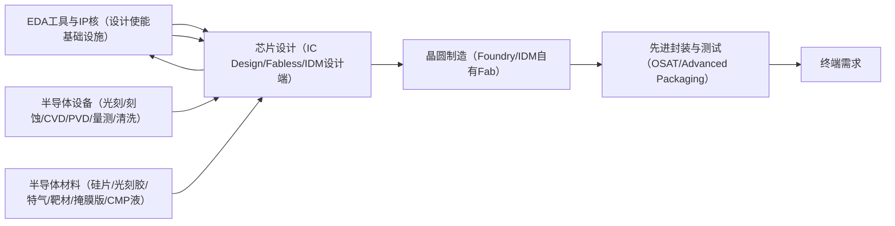

# 半导体（Semiconductor） 产业链投研报告

研究主题：半导体｜生成日期：2026-07-09｜研究成本：$19.11

> 本报告由 AI 研究流水线生成，不构成投资建议。所有客户认证、供应链关系、订单、收入占比等信息需以公开资料继续核验；标注「待核验」处尤其如此。

## 1. 结论先行

- **L0 需求**：① AI/云算力：AWS/Azure/Google/阿里/腾讯/字节等超大规模云厂商资本开支采购GPU、HBM、AI ASIC，买单方明确，订单有季度级可见性，需求真实性最高。② 智能手机OEM（苹果/三星/小米/华为）：换机周期+SoC升级，2025-2026处于补库周期，需求真实但弹性大。③ 汽车OEM/Tier1（比亚迪/特斯拉/博世）：EV渗透率+智驾NOA落地驱动MCU/SoC/功率器件采购，需求真实性较高。④ 中国晶圆厂（中芯国际/华虹/长鑫/长江存储）：政策基金注资+国产替代双轮驱动，采购国产设备/材料，最终资金含政策资本，受管制风险影响。；多重驱动并存须分赛道判断。AI算力芯片：技术驱动（大模型参数规模扩张）+资本开支驱动，景气处于上行周期但估值已大幅透支，需警惕云厂商CapEx单季波动传导至砍单风险。消费电子芯片：库存周期驱动为主，2022-2023去库完成后补库，全球手机出货增速个位数非结构性增长。汽车半导体：技术驱动（智驾算力需求≥1000TOPS）+国产替代（MCU/功率器件进口依赖度高），周期性弱于消费电子，单车半导体价值量提升逻辑可验证。国产设备/材料：政策驱动+国产替代，大基金三期2024年成立（规模3440亿元），招标订单是可验证指标，但送样≠认证≠量产≠主供，须逐级核验切勿跳跃。
- **当前周期**：业绩行情后段——【定性依据】半导体产业内部分化明显，但整体以「业绩行情后段」定性，理由如下：

①订单确认（最强信号）：TSMC CoWoS/SoIC 产线进入满产+等待分配状态，HBM3E 供给持续由三家内存厂（SK Hynix/Samsung/Micron）按配额分配；超大型科技公司（Meta/MSFT/Google/Amazon）资本开支指引均为多年期，能见度高。

②扩产加速（第二信号）：TSMC 宣布美国亚利桑那 N2 厂、日本 Kumamoto 二期、CoWoS 产能翻倍计划（均有官方公告可查）；ASML High-NA EUV（EXE:5000）于 2025 年起向客户交付；Lam Research/AMAT 的设备交货期拉长至 9-15 个月。

③业绩兑现（第三信号）：NVIDIA FY2025 数据中心营收 $1153 亿（同比+142%），毛利率>75%；ASML/KLA/Lam 盈利均已上修并兑现；这是「业绩行情后段」区别于「前段」的核心特征。

④估值位置（风险信号）：AI 链核心设备/EDA/HBM 类标的估值已在 25-50x fwd P/E，估值透支风险上升。单纯靠估值扩张驱动的机会已基本结束，需要业绩持续超预期才能支撑股价。

【分化说明】
- 成熟节点/消费电子链（NAND、MCU、功率器件消费端）：库存去化尚未完全结束，价格底部震荡，更接近「业绩行情前段」末尾。
- 出口管制风险：美国对华先进芯片出口管制持续升级，制造了额外的不确定性，但同时也刺激国内国产替代资本开支，形成双向效应。

【关键待核验指标（pending）】：TSMC 2026Q2 月度营收同比增速、ASML 2026Q2 订单值 vs 出货值、HBM3E 合约价、NAND 现货价、国内晶圆厂稼动率（来源：SEMI、公司法说会、月度营收公告）。
- **[P0] 静态时序分析工具（STA / PrimeTime）**：EDA单体工具壁垒最高节点。卡点具体化：TSMC PDK lib文档以PrimeTime格式原生校验，换工具需Foundry额外签字确认——制度性锁定，非仅技术依赖；30年工程师脚本积累无法快速迁移；中国无等价商业产品，缺先进节点signoff案例；从零开发至TSMC主signoff认证估计>7年。Synopsys EDA订阅收入FY2024超$3B（全线），价格随节点升级持续上行。证伪条件：Cadence Tempus获TSMC官方primary signoff认可（需持续跟踪）。
- **[P0] 硬件仿真加速器（Hardware Emulator）**：AI时代需求超线性增长的硬件稀缺品。具体事实：Blackwell 2080亿晶体管，设计复杂度使仿真需求呈4-8x非线性放大；Cadence Palladium Z2单台$5-15M，交货周期6-12个月，上游卡点是AMD FPGA供应；仅Cadence/Synopsys/Siemens有商业产品，中国无商业化硬件仿真器；Cadence硬件业务（Palladium/Protium）年营收约$6-8亿（pending精确核验），backlog可见；中国头部AI芯片公司受出口管制无法合法采购新系统，国内空白明确。扩产周期受AMD FPGA供应链制约≥3年。financial_delivery=5因需求驱动AI算力扩张，Cadence硬件增长已体现在公开财报。
- **[P0] 物理验证工具（DRC/LVS — Calibre垄断节点）**：确定性最高的出口管制卡点。具体事实：TSMC rule deck以Calibre格式原生交付，由TSMC自有工程师维护——切换需Foundry投入2-3年重写rule deck，属Foundry侧成本，Foundry无替换动力；Siemens 2017年以$45亿收购Mentor/Calibre，嵌入全球主要Foundry生产流程；中国无任何商业DRC/LVS工具具备先进节点rule deck覆盖；EDA出口管制下Calibre续约成为中国Fab最直接供应链风险。证伪条件：TSMC发布Synopsys ICV官方primary signoff认证（目前ICV仅辅助验证）。
- **[P0] 高速接口IP核（PCIe / CXL / DDR / HBM / USB / SerDes）**：AI算力时代最关键接口IP节点。具体事实：每换一个Foundry节点（N5→N3），PCIe 6.0/HBM3E PHY需重新流片验证，周期18-24个月，且需PCI-SIG/JEDEC协议组织认证；国内无商业化HBM3E PHY IP，直接制约中国AI加速器芯片设计能力；Synopsys DesignWare PHY IP在每代AI加速器（H100/B200级）设计中是必选组件，随协议换代（PCIe 5.0→6.0→7.0）形成持续替换需求；CXL 2.0/3.0 PHY国内无商业IP（pending最新年报核验）。价格随协议代数升级呈阶梯式上涨。
- **[P0] 处理器架构IP核（CPU / GPU / DSP / NPU）**：存在断供风险的最高级别IP核。Arm授权分架构级（$数千万-亿级）与处理器许可级，2024年Arm已在美国政府指引下审查中国客户许可证续签（公司官方披露事项）；若许可证到期不续，影响覆盖中国几乎所有SoC设计。RISC-V是唯一结构性替代，但高性能RISC-V IP对标Neoverse N2性能差距3-5年：软件生态缺位、向量扩展碎片化。financial_delivery=3因断供未正式触发，业绩传导路径为风险溢价而非已实现订单。证伪条件：Arm正式宣布终止中国客户许可证（将使评级紧急升级）。
- **[P0] 逻辑综合工具（Logic Synthesis）**：先进节点（3/5nm）时序收敛是核心技术壁垒。Synopsys Fusion Compiler将综合+布局布线打通实现PPA闭环迭代，解决先进节点时序收敛问题，算法复杂度随节点升级超线性增长；换工具需整条设计流程（约束文件/脚本生态）重建，≥1年设计周期损失；功能安全（ISO 26262）场景需工具认证进一步锁定；国产工具在7nm以下无量产tapeout背书，替代周期估计>5年。反证：若华大九天在7nm及以下取得台积电流片量产案例需修正（当前pending）。
- **[P0] 布局布线工具（Place & Route，P&R）**：Synopsys/Cadence寡头，国内无7nm以下量产记录。PPA差异直接影响芯片性能（时钟频率差距可达10-20%）和良率；顶层客户确认工具选型后几乎不切换（苹果SoC据报道主用Cadence，英伟达据报道主用Synopsys，均pending核验）；切换需完整重新跑signoff流程，≥1年设计周期；先进节点P&R需与Foundry PDK版本深度绑定，PDK更新后工具须同步适配；国内EDA（华大九天/芯华章）在先进数字P&R无可核验先进节点量产案例。扩产约束是技术积累而非产能，从零到先进节点商业P&R需≥5年研发。
- **[P0] AI训练GPU芯片设计**：【最强财务兑现+最强供给刚性组合】NVIDIA FY2025数据中心营收$1153亿（同比+142%），毛利率>75%，直接通过财报可核验——这是本清单中唯一同时满足「需求爆发+供给极度受限+财务已全面兑现」的P0资产。【供给三重瓶颈】①CUDA软件生态：1700万+开发者、20年积累、PyTorch/JAX框架默认CUDA，AMD ROCm一级支持滞后是可持续的竞争壁垒；②CoWoS先进封装：TSMC CoWoS产能是物理瓶颈，TSMC已公告2024年CoWoS满负荷，扩产需2-3年；③HBM内存：SK Hynix/三星/Micron三家产能受限，HBM3e分配倾斜NVIDIA。【localization现状】华为Ascend 910B有量产，但：制程代差（等效7nm vs B200 3nm），训练性能差距约2-4倍（待核验精确benchmark），且HBM断供使内存带宽受限，无法替代头部训练集群。AMD MI300X性能接近，但ROCm生态完整度和云厂商实际采购比例仍处于20%以下（待核验）。

## 2. 全产业链地图

研究边界：包含：① 芯片设计（Fabless/IDM设计端）逻辑/存储/模拟/功率/射频芯片 ② 晶圆制造（Foundry/IDM自有Fab）先进制程(≤7nm)与成熟制程(≥28nm) ③ 先进封装与测试（OSAT/CoWoS/HBM堆叠） ④ 半导体设备（光刻/刻蚀/CVD/PVD/量测/清洗） ⑤ 半导体材料（硅片/光刻胶/特气/靶材/CMP液/掩膜版） ⑥ EDA工具与IP核。明确不包含：纯电子整机（手机/PC/服务器）属下游客户不在制造侧；封装用PCB基板归属PCB赛道；芯片应用软件与云SaaS；第三代半导体SiC/GaN需求逻辑差异大建议单独立题。防发散警示："半导体"在A股涵盖300+家公司，不按设计/制造/封测/设备/材料/EDA六子赛道分别立项则研究无效。

| L1 系统 | 决定什么 |
|---|---|
| 芯片设计（IC Design/Fabless/IDM设计端） | 决定性能：芯片架构、制程节点选择、IP授权决定最终产品竞争力；是价值链毛利率最高环节（龙头毛利率50-70%），但EDA/IP卡脖子风险集中于此 |
| 晶圆制造（Foundry/IDM自有Fab） | 决定交付：产能利用率决定短期收入弹性；先进制程(≤3nm)由台积电/三星寡占，成熟制程(≥28nm)国内快速扩产；资本密集（一座12寸厂≥150亿美元），扩产周期18-36个月是关键约束 |
| 先进封装与测试（OSAT/Advanced Packaging） | 决定可靠性与系统集成度：CoWoS/SoIC/HBM堆叠已成AI芯片产能瓶颈（台积电CoWoS产能是N卡交付约束，2024-2025多次财报披露）；传统封测毛利率低(10-20%)，先进封装毛利率显著更高但需重资产投入 |
| 半导体设备（光刻/刻蚀/CVD/PVD/量测/清洗） | 决定制程能力上限：ASML EUV光刻机是先进制程唯一路径，受瓦森纳协议管制无法出口中国；国产设备聚焦成熟制程，刻蚀(中微)、薄膜(北方华创)进展相对领先；设备交期12-18个月，是晶圆厂扩产的实际时间轴 |
| 半导体材料（硅片/光刻胶/特气/靶材/掩膜版/CMP液） | 决定良率与成本：品类多（8大类50+细分），单类市场规模小但客户导入周期长（主流客户认证1-3年）；硅片被信越/Sumco寡占（合计约50%市占率），国产化率普遍低于设备，是更长周期的国产替代机会 |
| EDA工具与IP核（设计使能基础设施） | 决定设计可行性：Synopsys/Cadence/Mentor三家合计垄断全球EDA市场>75%；国内EDA(华大九天等)覆盖模拟/数字部分流程，全流程EDA尚未国产化；RISC-V架构在中美脱钩背景下战略地位上升，是IP核层面的重要替代路径 |

## 3. 递归 BOM 总表

### 半导体 > EDA工具与IP核（设计使能基础设施）

| L2 | L3 原子项 | 上游 | 中游 | 下游 | 备注 |
|---|---|---|---|---|---|
| 数字前端EDA（逻辑综合 / STA / 形式验证） | **逻辑综合工具（Logic Synthesis）** | Foundry标准单元时序库（.lib/.lef格式，TSMC/三星/中芯国际分别提供）、高性能x86服务器集群（算力消耗随节点先进化指数上升）、多corner多mode约束（SDC脚本） | Synopsys Design Compiler / Fusion Compiler（市场份额~60%，Fusion将综合与P&R闭环）、Cadence Genus Synthesis Solution（市占~35%，与Innovus P&R协同）、Siemens Catapult（高层次综合HLS，C/C++→RTL，份额小但差异化强）、华大九天逻辑综合产品（国内有少量成熟节点客户，28nm以下tapeout记录缺失，截至2025年） | Fabless芯片公司（高通/博通/联发科/海思/英伟达）、IDM自有设计团队（英特尔/三星LSI）、汽车芯片设计（恩智浦/英飞凌/芯驰科技） | 先进节点（3nm/5nm）时序收敛难度指数上升，Synopsys Fusion Compiler通过将综合+布局布线打通实现PPA闭环优化，形成差异化壁垒。国产工具在先进节点缺乏tapeout背书，功能安全（ISO 26262）场景需认证，替代周期>5年。反证：若华大九天在7nm及以下取得台积电流片量产案例，则判断需修正。 |
| 数字前端EDA（逻辑综合 / STA / 形式验证） | **静态时序分析工具（STA / PrimeTime）** | 标准单元时序库（Foundry认可格式）、互连寄生参数数据（来自StarRC/Quantus提取结果）、工艺角参数（FF/TT/SS/FNSP等多corner） | Synopsys PrimeTime（tapeout signoff市场份额>85%，是Foundry PDK认可的首选工具）、Cadence Tempus（追赶中，集群并行能力有优势，份额~15%） | 全球所有数字IC tapeout流程（无例外，PrimeTime signoff是TSMC/GF/中芯流片的实际要求）、汽车芯片功能安全认证（AEC-Q100流程）、AI ASIC（英伟达Blackwell/谷歌TPU） | PrimeTime是整个EDA领域壁垒最高的单一工具之一：TSMC的PDK文档以PrimeTime格式校验为准，使用其他工具需额外签字确认，工程师技能栈和脚本积累数十年。中国无等价替代工具——这是出口管制下国内先进芯片设计面临的直接卡脖子节点。证伪条件：若Cadence Tempus获TSMC官方primary signoff认可，则竞争格局改变。 |
| 数字前端EDA（逻辑综合 / STA / 形式验证） | **形式验证工具（Formal Verification）** | RTL源代码（SystemVerilog/VHDL）、综合后门级网表、验证属性/断言规范（SVA/PSL） | Cadence JasperGold（市场份额领先，尤其在汽车/功能安全领域）、Synopsys VC Formal（与VCS生态集成）、Siemens Questa Formal（原Mentor，在FPGA和功能安全场景有粘性） | 汽车芯片公司（ISO 26262 ASIL-D认证要求形式验证作为必要证据）、处理器设计公司（Arm/英特尔用于微架构正确性验证）、安全芯片（CC EAL5+认证流程） | JasperGold在功能安全认证流程中已形成方法学绑定（ISO 26262 Tool Confidence Level评估已包含JasperGold），工具更换需重新建立方法学文档，替代成本高。国内无商业化形式验证工具。 |
| 数字后端EDA（P&R / 物理验证DRC-LVS / 寄生提取 / OPC） | **布局布线工具（Place & Route，P&R）** | 逻辑综合后网表（来自DC/Genus）、Foundry技术文件（LEF/DEF格式工艺规则）、时钟约束与功耗意图文件（UPF/CPF） | Synopsys IC Compiler II / Fusion Compiler（旗舰产品，先进节点份额~50%）、Cadence Innovus Implementation System（~45%份额，Tempus-Innovus时序-布线协同有优势）、Siemens Aprisa（较小份额，聚焦特定客户） | 台积电3nm/5nm流片的Fabless客户（苹果/高通/英伟达/AMD）、三星代工先进节点客户、中国先进节点Fabless（华为海思在7nm受限前为主要用户，当前受管制） | Synopsys与Cadence在顶层客户中均有锚定（苹果SoC据报道主用Cadence pending核验，英伟达据报道主用Synopsys pending核验），形成寡头竞争。先进节点PPA差异直接影响芯片性能/功耗/面积，换工具需完整重新验证，切换成本≥1年设计周期。国内EDA在7nm以下P&R无量产tapeout记录。 |
| 数字后端EDA（P&R / 物理验证DRC-LVS / 寄生提取 / OPC） | **物理验证工具（DRC/LVS — Calibre垄断节点）** | Foundry工艺规则文件（Rule Deck，TSMC以Calibre格式原生交付）、GDS/OASIS版图数据、器件连接网表 | Siemens Calibre（DRC/LVS/PERC市场份额>90%，TSMC/三星/英特尔Foundry官方认证工具）、Synopsys IC Validator（追赶中，~8%份额，TSMC有条件支持但非primary）、Cadence Pegasus（云端并行DRC，定位补充工具） | 全球所有数字/模拟IC tapeout（无Calibre signoff即无法流片至任何主流Foundry）、掩膜版制造公司（PhotoMask/大日本印刷/凸版印刷需Calibre签核数据）、EUV先进节点（3nm以下DRC复杂度大幅提升，Calibre依赖度更高） | Calibre是EDA领域护城河最深的单一产品：TSMC rule deck以Calibre格式原生交付并由TSMC工程师维护，切换到其他工具需要Foundry重写rule deck（估计需2-3年并大量工程资源）。这是Siemens EDA（前Mentor Graphics，2017年以45亿美元被西门子收购）的核心资产。中国无等价替代——这是最确定性的管制卡点之一。反证条件：若TSMC发布Sy |
| 数字后端EDA（P&R / 物理验证DRC-LVS / 寄生提取 / OPC） | **寄生参数提取工具（Parasitic Extraction，PEX）** | 版图GDS数据、Foundry工艺层叠参数（RC表格/场求解器校准数据）、3D电磁场求解器（部分先进节点需Ansys HFSS校准） | Synopsys StarRC（主流signoff工具，份额~55%）、Cadence Quantus（份额~40%，与Innovus P&R紧密集成）、Siemens xACT（较小份额） | 先进节点STA signoff（提取结果直接输入PrimeTime）、功耗仿真（与PrimePower/Joules联动）、射频/模拟IC设计（对寄生精度要求更高） | 先进节点互连层数增加（TSMC N3有20+层金属），RC寄生对时序/功耗影响显著，提取精度直接影响tapeout成功率。StarRC与PrimeTime的紧密集成形成Synopsys signoff套件壁垒。 |
| 数字后端EDA（P&R / 物理验证DRC-LVS / 寄生提取 / OPC） | **光学邻近效应修正工具（OPC / MDP）** | 光刻机参数模型（ASML EUV机台光学模型，机台厂商提供数据接口）、GDS版图数据、Foundry光刻工艺实验数据 | Siemens Calibre OPCpro / nmOPC（OPC主导工具）、Synopsys Proteus OPC（竞争工具，GPU加速有优势）、Applied Materials（AMAT）：与Siemens合作提供晶圆实测反馈闭环 | Foundry光刻部门（台积电/三星Foundry OPC团队是直接客户）、掩膜版制造商（PhotoMask Japan/Toppan/DNP）、EUV多重曝光工序（计算量较DUV提升10x以上） | OPC/ILT（逆光刻技术）在EUV节点的计算量极大（单层版图OPC需数百CPU小时），GPU加速成为竞争维度。与光刻机型号强绑定，属Foundry内部流程工具，切换成本高。Synopsys GPU加速OPC在部分场景有性能优势，正蚕食Siemens份额（pending核验具体数据）。 |
| 模拟与混合信号EDA（SPICE仿真 / 电路版图 / TCAD） | **SPICE电路仿真器** | Foundry SPICE工艺紧凑模型（BSIM-CMG/PSP/BSIM-IMG，由Foundry工艺团队标定）、器件参数提取测试数据（来自Foundry晶圆测试）、高性能仿真服务器 | Synopsys HSPICE（行业金标准，signoff级仿真份额>60%）、Cadence Spectre / Spectre APS（并行加速版，模拟IC设计公司主流）、Siemens Eldo / AFS（欧洲汽车芯片公司有较高使用率）、概伦电子 EDA²（国内存储/FinFET紧凑模型提取，长鑫存储有实质性采购记录） | 模拟IC设计公司（TI/ADI/思佳讯/圣邦微/艾为电子/纳芯微）、存储芯片Foundry设计团队（长鑫存储/长江存储）、射频IC（卓胜微/唯捷创芯） | 概伦电子是A股EDA中最具可验证落地的公司：招股书披露长鑫存储为主要客户，营收中存储相关收入占比>50%（2022年数据）。但HSPICE在最终signoff仿真中仍主导，概伦切入的是紧凑模型提取和快速仿真环节，属差异化补充而非全面替代。风险：长鑫存储客户集中度风险，单一客户依赖度高。 |
| 模拟与混合信号EDA（SPICE仿真 / 电路版图 / TCAD） | **模拟/混合信号版图工具（Virtuoso生态）** | SPICE仿真结果（网表）、Foundry模拟PDK（包含器件模型/设计规则/显示层信息）、模拟版图规则文件 | Cadence Virtuoso（全球模拟IC版图设计事实标准，占有率>80%，30年积累）、Synopsys Custom Compiler（追赶工具，与Synopsys SPICE生态集成）、华大九天 Aether（国内模拟版图工具，在平板显示驱动IC/成熟工艺模拟有付费客户） | 模拟/射频IC Fabless（ADI/TI/Skyworks；国内圣邦微/芯朋微/卓胜微）、混合信号SoC设计团队（高通射频前端/苹果PMU）、国内成熟节点模拟IC（28nm及以上，是华大九天Aether的主要落地场景） | Virtuoso的壁垒来自：①与Foundry PDK的深度集成（网表-版图双向关联+实时LVS）；②工程师技能积累数十年；③30年以上的参数化单元库（Pcell）资产。华大九天Aether是目前最接近可验证替代的国产工具，但在FinFET模拟节点（16nm以下）和RF/mmWave设计中仍有功能差距，客户主要集中在28nm以上成熟工艺和TFT-LCD驱动IC设计。华大九天FY2023营收约¥12 |
| 模拟与混合信号EDA（SPICE仿真 / 电路版图 / TCAD） | **器件/工艺TCAD仿真工具** | Foundry工艺实验数据（掺杂浓度/膜层厚度/热处理参数）、物理模型参数库（量子效应/载流子迁移率模型）、高性能计算集群（有限元/蒙特卡洛仿真极耗算力） | Synopsys Sentaurus TCAD（先进节点器件/工艺仿真事实标准，垄断地位）、Silvaco Victory Process/Device（第二选择，在特殊工艺如SiC/GaN有较强地位）、概伦电子（紧凑模型提取工具，TCAD→SPICE模型的桥接环节） | Foundry工艺研发团队（台积电/三星/英特尔Foundry/中芯国际/华虹）、IDM器件工程师（TI功率器件/英飞凌功率半导体）、学术研究机构（高校半导体物理研究） | TCAD是Foundry开发新制程节点的必要工具，Sentaurus在5nm以下先进工艺TCAD中几乎垄断。中国无商业化高端TCAD工具——这直接制约中芯国际/华虹自主开发先进节点的能力（需向Synopsys购买Sentaurus或依赖第三方数据）。Sentaurus目前处于出口管制模糊地带，中芯国际能否持续获得授权值得持续跟踪（pending官方管制清单更新）。 |
| 验证加速平台（RTL仿真器 / 硬件仿真加速器 / FPGA原型验证） | **软件RTL仿真器（Logic Simulation）** | 高性能x86服务器（Intel Xeon/AMD EPYC，仿真为单线程主导）、EDA License管理服务器（FlexLM）、验证方法学库（UVM/OVM，开源但工具适配不同） | Synopsys VCS（Virtual Component Simulator，市场份额~50%）、Cadence Xcelium（~40%，多核并行优化强于VCS）、Siemens Questa / ModelSim（~10%，FPGA仿真场景和功能安全认证场景份额更高） | 所有数字IC设计公司RTL验证流程（无例外）、AI芯片验证（英伟达/谷歌/百度昆仑：验证工时占设计周期40-60%）、EDA公司自身（用自家工具验证自家工具，内部循环） | RTL仿真器替换成本来自验证环境积累（UVM testbench/coverage database/回归测试套件），大型芯片公司验证脚本资产积累超十年，单纯工具切换需同步迁移百万行验证代码。软件仿真速度受限于单核性能，无法有效并行，驱动客户向硬件仿真器/FPGA原型迁移（速度差约1000x）。 |
| 验证加速平台（RTL仿真器 / 硬件仿真加速器 / FPGA原型验证） | **硬件仿真加速器（Hardware Emulator）** | Xilinx UltraScale+/Versal FPGA芯片（AMD收购Xilinx后，仿真器厂商主要依赖AMD FPGA）、定制高速互连ASIC（仿真器厂商自研，用于FPGA间高速互连）、高密度服务器机箱/散热系统、PCB基板与高速连接器（用于多FPGA互连背板） | Cadence Palladium Z2（市场份额~50%+，AI芯片验证首选）、Synopsys ZeBu EP2（~30%，GPU加速调试有差异化）、Siemens Veloce（~10%） | 英伟达（Blackwell GPU系列验证，主要用户之一）、苹果（SoC系统级验证，软件栈在流片前运行于仿真器）、高通/博通/AMD（大规模AI ASIC验证）、中国AI芯片公司（华为昇腾验证环境——管制后能否续购Palladium pending核验） | 硬件仿真器是EDA中最重要的硬件产品：单台Palladium Z2价格$5-15M，交货周期6-12个月，主要卡点是AMD FPGA芯片供应。AI芯片设计复杂度上升（Blackwell 2080亿晶体管）直接驱动仿真器需求——设计规模增大1倍，仿真时间增大4-8倍，对硬件仿真器需求呈超线性增长。中国无商业化硬件仿真器产品。Cadence Palladium贡献Cadence硬件业务约$6-8亿年营 |
| 验证加速平台（RTL仿真器 / 硬件仿真加速器 / FPGA原型验证） | **FPGA原型验证平台** | Xilinx UltraScale+ FPGA（AMD供应，多颗FPGA拼接实现大设计容量）、高速SerDes接口与连接器（板间高速信号）、定制化PCB基板（大型多FPGA互连板） | Synopsys HAPS平台（HAPS-100，业界份额领先）、Cadence Protium X2（与Palladium互补定位）、S2C / Dini Group（小型第三方FPGA原型板厂商） | 苹果/高通/三星（SoC流片前软件栈验证，iOS/Android驱动在原型板上跑通）、汽车SoC（在流片前验证ADAS软件栈）、中国SoC公司（部分使用国产FPGA原型方案pending验证） | FPGA原型验证与硬件仿真器定位互补：原型速度快（接近实时10-100MHz），适合运行软件栈；硬件仿真器速度慢（1-10MHz）但调试可见性强（信号全可见）。HAPS对AMD FPGA依赖度极高，AMD-Xilinx供应稳定性是关键上游风险。AMD收购Xilinx后，理论上有意愿优先供应自家EDA竞争对手（Synopsys依赖AMD FPGA），此为潜在供应链风险（低概率但需关注）。 |
| 半导体IP核（处理器IP / 高速接口IP / 安全IP / 模拟IP） | **处理器架构IP核（CPU / GPU / DSP / NPU）** | EDA全套工具（综合/P&R/验证/signoff，处理器IP本身需在特定工艺节点PPA优化）、Foundry PDK（IP需在目标制程节点完成特征化——process-specific hard IP）、指令集架构授权（Arm ISA许可/RISC-V开源ISA） | Arm Holdings（Cortex-A/Cortex-M/Neoverse/Mali GPU IP，全球移动SoC CPU IP>95%份额）、CEVA（DSP/NPU IP，专注无线基带/机器学习加速器，约80+授权客户）、Imagination Technologies（PowerVR GPU IP，苹果曾大客户已终止，现主要服务中国客户）、SiFive（RISC-V商业IP，高性能P550/P650系列，主要客户Intel Foundry Services） | 苹果（Arm架构定制，A/M系列芯片）、高通骁龙（Arm Cortex + Oryon自研架构混用）、联发科天玑（Arm Cortex-A/Cortex-X）、海思（2020年后Arm许可受限，转向RISC-V/自研pending管制状态） | Arm的授权模式分两层：①架构授权（可自研微架构，苹果/高通/华为）价格$数千万-$亿级；②处理器许可（直接用Cortex IP，联发科主要模式）。关键风险：2024年Arm确认在美国政府指引下审查中国客户许可证续签，若现有Arm许可证到期不续，国内大量SoC设计将面临架构层断供。RISC-V是唯一结构性替代——但高性能RISC-V IP（对标Neoverse N2性能级）仍有显著差距，不宜高估短 |
| 半导体IP核（处理器IP / 高速接口IP / 安全IP / 模拟IP） | **高速接口IP核（PCIe / CXL / DDR / HBM / USB / SerDes）** | 目标Foundry PDK（接口PHY IP是hard IP，必须在目标制程重新流片验证）、信号完整性仿真工具（Ansys HFSS/SIwave/Keysight ADS）、协议标准组织会费（PCIe-SIG/CXL联盟/JEDEC会员资格） | Synopsys DesignWare IP（PCIe 6.0/CXL 3.0/LPDDR5X/HBM3E PHY+Controller，接口IP市场份额第一，约贡献Synopsys IP部门$14亿+年营收）、Cadence IP（USB4/PCIe/DDR IP，份额第二）、Rambus（HBM控制器/PHY IP，GDDR6/LPDDR专项，内存接口IP领导者）、Alphawave Semi（高速SerDes IP，>112G，数据中心互连场景差异化） | AI加速器SoC（英伟达H100/B200：HBM3E PHY IP是必需；谷歌TPU v5）、数据中心CPU/交换机ASIC（PCIe 6.0/CXL 3.0接口IP需求驱动）、汽车SoC（PCIe/USB C接口IP，ASIL-B功能安全版本溢价明显）、中国AI芯片（华为昇腾910C之前使用Synopsys DesignWare IP pending—管制后能否续购须核验） | 接口IP的壁垒在于：①与Foundry工艺强绑定（台积电3nm的PCIe 6.0 PHY需在N3制程重新流片验证，耗时18-24个月）；②协议规范复杂（PCIe 6.0 PAM4信号需大量SI/PI工程积累）；③面积和功耗PPA优化需长期迭代。Synopsys DesignWare PHY IP系列是每一代AI加速器芯片设计的必要组件，且随协议换代（PCIe 5.0→6.0→7.0）形成持续替换需 |
| 半导体IP核（处理器IP / 高速接口IP / 安全IP / 模拟IP） | **安全与加密IP核（Crypto / PUF / TrustZone）** | 密码算法标准（NIST AES/RSA/ECC/SHA，中国国密SM2/SM3/SM4）、物理不可克隆函数（PUF）器件机理研究、侧信道攻击防御技术（差分功耗分析DPA抗性设计） | Rambus Security IP（收购Inside Secure后为最大商业安全IP供应商，CryptoCell/SafeZone系列）、Synopsys DesignWare Security IP（AES/RSA/ECC/TRNG/PKA内核）、国微集团 / 国芯科技（国密SM2/SM4/SM3算法IP，国内政务/金融芯片主要供应商）、Intrinsic ID（SRAM PUF IP，设备唯一身份识别，已被高通/NXP认证） | 智能卡/SIM卡SoC（NXP/英飞凌，CC EAL5+认证必要安全IP）、汽车SoC（EVITA安全规范/V2X通信加密）、手机SoC安全飞地（苹果Secure Enclave集成Arm TrustZone+AES IP）、中国政务/军工芯片（国密算法强制要求，国微/国芯科技主供） | 安全IP的国产替代逻辑最清晰：政务/金融/军工场景明确要求国密算法（SM2/SM3/SM4），且禁止使用境外加密算法，形成结构性本土需求。国微集团/国芯科技在该细分有可验证的政府采购背书（但具体收入数据需查公告）。商业安全IP（国际场景）由Rambus主导，Intrinsic ID的SRAM PUF在IoT器件身份认证中形成差异化。 |
| 半导体IP核（处理器IP / 高速接口IP / 安全IP / 模拟IP） | **模拟与混合信号IP核（PLL / SerDes / ADC / MIPI PHY）** | 模拟EDA工具（Cadence Virtuoso，模拟IP设计必需）、Foundry模拟PDK（工艺特定，hard IP需在目标制程流片验证）、射频/高频测试设备（Keysight/Rohde & Schwarz，用于IP性能表征） | Synopsys DesignWare Analog IP（PLL/LVDS/差分输入输出，随数字IP捆绑销售）、Silicon Creations（高性能PLL/SerDes IP专业供应商，已被Cadence收购）、Mixel（MIPI DSI/CSI PHY IP专业供应商，已被Synopsys收购）、Cadence IP（USB PHY/DisplayPort PHY） | 移动SoC（苹果/三星/联发科：MIPI CSI摄像头/DSI显示接口）、数据中心（SerDes IP用于高速互连）、工业/汽车（PLL IP用于时钟生成，ADC IP用于传感器接口） | 模拟IP因与工艺强绑定（同一PLL IP在不同Foundry制程需重新特征化），形成碎片化市场，单个IP供应商很难做到全覆盖。Synopsys和Cadence通过收购（Mixel/Silicon Creations）快速扩充模拟IP品类，形成'一站式IP平台'优势。VeriSilicon（芯原微电子）是A股中IP授权模式最接近的公司，但其商业模式兼含IP授权+流片服务+芯片定制，纯IP授权收入占比 |

### 半导体先进封装与测试（OSAT/Advanced Packaging）产业链递归BOM拆解。范围：CoWoS/SoIC/HBM堆叠/Fan-Out等先进封装工艺，及封装前后的KGD/SLT测试环节。不含PCB基板赛道（已划出边界），不含SiC/GaN功率器件封装（建议单独立题）。投资区分度优先：重点标注瓶颈环节、寡头格局、替代难度、A股/港股/日股可映射标的的认证状态。本输出不构成投资建议。

| L2 | L3 原子项 | 上游 | 中游 | 下游 | 备注 |
|---|---|---|---|---|---|
| L2-1 硅中介层与RDL转接板（Silicon Interposer / RDL Interposer） | **硅中介层（Si Interposer，CoWoS-S）** | 300mm硅片（Shin-Etsu/SUMCO/SK Siltron）、TSV深孔刻蚀设备：Lam Research Syndion（主流）、TEL Impressio、TSV铜电镀填充设备：Lam Research Sabre系列、中道RDL光刻：ASML DUV（KrF/ArF） | TSMC（垄断性主供，CoWoS-S产能全球>85%，pending核验）、Samsung（SF-CoWoS，2.5D方向研发中，量产规模远低于TSMC）、Intel Foundry（EMIB技术路线不同，硅桥而非全硅中介层） | NVIDIA H100/H200/B100/B200 GPU（CoWoS-S认证量产）、AMD MI300X/MI325X GPU（CoWoS-S认证量产）、Google TPU v5/v6（CoWoS-S认证量产）、Broadcom AI ASIC（CoWoS-L/R方向为主） | TSMC CoWoS-S为当前AI GPU封装主流工艺，2023年产能瓶颈直接制约NVIDIA H100出货。中介层尺寸从CoWoS-S 1倍倍增至CoWoS-L 2倍（≥2000mm²），需要大面积均匀TSV填充，良率和warpage控制是工艺难点。TSMC CoWoS产能扩张周期18-24个月，2025-2026年新增产能主要在Hsinchu P6/竹科，产能数据以TSMC季度法说为准。Int |
| L2-1 硅中介层与RDL转接板（Silicon Interposer / RDL Interposer） | **有机RDL转接板（Organic RDL Interposer，CoWoS-R / InFO-SoW）** | ABF（Ajinomoto Build-up Film）：味之素精细技术AFT（全球唯一主供，日本生产）、感光型PI/PBO介质：Toray、HD Microsystems（日立化成）、铜箔/溅射靶材（Cu/Ti）：Materion、住友金属矿山、RDL光刻设备：ASML DUV、Canon FPA-8000iZ | TSMC InFO（Fan-Out晶圆级，苹果A系列SoC独占历史）、TSMC CoWoS-R（有机RDL替代Si Interposer，成本降低~30% pending核验）、ASE（Fan-Out Panel Level Packaging，FOPoP/FOCoS）、Amkor SWIFT/SLIM（有机RDL封装方案） | Apple A系列/M系列SoC（TSMC InFO认证量产，非CoWoS-R）、Broadcom Tomahawk交换芯片（部分采用CoWoS-R路线，pending核验）、中低算力AI ASIC（成本敏感应用） | AFT的ABF在有机RDL中是关键材料，味之素在全球ABF市场份额>90%（ABF基板用途），AFT对RDL用ABF供应属同一材料体系但应用规格不同。有机RDL vs Si Interposer的技术路线之争：前者成本更低、warpage较大、IO密度较低；后者带宽密度更高但成本高2-3x。随AI ASIC向定制化演进，CoWoS-R有望承接中低端需求，TSMC同时发展两条路线。A股无直接RDL工 |
| L2-2 HBM堆叠封装（HBM Stack：TSV + TC键合） | **HBM内存TSV（Through-Silicon Via for HBM Die Stack）** | TSV刻蚀：Lam Research（Syndion/Kiyo）、TEL、TSV铜电镀填充：Lam Research Sabre 3D、晶圆薄化研磨：Disco DFG 8760系列（全球研磨市场~70%份额 pending核验）、临时键合/解键合系统：EV Group GEMINI系列、SUSS MicroTec XBC300 | SK Hynix（HBM3E量产主供，2024年NVIDIA HBM3E独家供应H200 pending核验）、Samsung（HBM3E量产，NVIDIA认证延迟问题2023-2024年有公开报道）、Micron（HBM3E 2024年入局，认证状态：NVIDIA已开始认证 pending量产占比） | NVIDIA H200/B200（HBM3E，CoWoS封装中与GPU die并排）、AMD MI300X（HBM3 × 8颗，量产中）、Google TPU v5p/v6（HBM3/3E）、Intel Gaudi 3（HBM2e，规格较低） | HBM堆叠TSV是SK Hynix/Samsung/Micron内部工艺，TSV密度（via pitch约50μm）、堆叠层数（HBM3E标准8-hi，12-hi开发中）是良率瓶颈。Disco的晶圆减薄设备在TSV制程中不可或缺，单颗HBM die需减薄至约50μm，Disco在此环节市占接近垄断级别。A股无直接HBM TSV制造标的。三星HBM3E认证延迟事件（2023-2024）是典型'认证≠ |
| L2-2 HBM堆叠封装（HBM Stack：TSV + TC键合） | **热压缩非导电膜键合（TC-NCF Bonding，HBM die-to-die）** | NCF/NCP材料（Non-Conductive Film/Paste）：Resonac（原昭和电工+日立化成，全球主供）、Henkel、Namics、微凸块（Micro-bump）：Senju Metal（千住金属，Sn-Ag焊料）、Indium Corporation、TCB键合机：Besi（荷兰，HBM TCB主供机台）、Toray Engineering、Panasonic Factory Solutions（已并入Besi体系 pending核验） | SK Hynix（内部HBM堆叠键合产线）、Samsung（内部HBM堆叠键合）、Micron（内部HBM堆叠键合，收购Intel Lehi Fab后扩产） | CoWoS封装中的HBM模块、HBM KGD（Known Good Die）供应给TSMC CoWoS、AI加速卡（NVIDIA/AMD/Google/自研ASIC） | TCB（Thermal Compression Bonding）键合机市场Besi占主导，但Toray Engineering也有竞争。Besi 2023年受益于HBM需求爆发，TCB订单可见性较高（季报可追踪）。NCF材料Resonac为全球主供，是HBM堆叠的隐性卡脖子材料，一旦出现供应问题影响三家HBM厂同时。A股无直接TC-NCF键合机标的；新益昌（A股）做普通固晶机，与HBM TCB规格 |
| L2-2 HBM堆叠封装（HBM Stack：TSV + TC键合） | **HBM KGD测试（Known Good Die Test for HBM Stack）** | 探针卡（Probe Card）：FormFactor（美股，DRAM/HBM探针卡主供）、Technoprobe（意大利）、MPI Corporation、ATE设备：Advantest T2000/V93000系列（内存测试主流）、Teradyne Magnum Prime、测试用临时封装载板：专用设计，各OSAT/内存厂自制 | SK Hynix、Samsung、Micron（内建测试产线，HBM在堆叠前进行KGD筛选）、Amkor（提供KGD外包测试服务，部分） | TSMC CoWoS封装使用KGD-HBM、先进封装品质保证（避免将坏die封入昂贵封装体）、NVIDIA/AMD供应链质量控制 | HBM KGD测试是先进封装质量门控的核心环节：单颗CoWoS封装体价值>$3000，若使用未经KGD测试的HBM则良率损失极大。FormFactor是HBM探针卡最大供应商（市占率~30-40% pending核验），HBM3/3E的更高IO密度要求探针卡间距<40μm，技术门槛显著提升。Advantest在内存ATE市场市占~70%（pending核验），为SK Hynix/Samsung/M |
| L2-3 混合键合（Hybrid Bonding / Cu-Cu Direct Bonding） | **铜-铜直接键合（Cu-Cu Direct Bond Interconnect，DBI / SoIC-X）** | 晶圆键合机：EV Group（EVG ComBond/GEMINI系列，奥地利，市场领先）、SUSS MicroTec XBC300（德国）、表面活化等离子设备：Nordson March、Tokyo Electron、超精密CMP（键合面平坦化，Cu凹陷控制在<1nm）：Applied Materials Reflexion LK Prime、对准精度检测：KLA-Tencor Wafer Alignment系统 | TSMC SoIC-X（芯片堆叠，商业量产中，用于Apple A17 Pro和AMD MI300X pending核验）、Intel Foveros Direct（Cu-Cu，Meteor Lake部分采用）、Samsung X-Cube（研发阶段，量产规模小 pending核验）、Sony IMX系列CMOS图像传感器（背照式堆叠采用DBI，量产最早落地场景之一） | Apple A17 Pro / M4（TSMC SoIC，cache die堆叠）、AMD MI300X（GPU+HBM+CPU异构集成，SoIC参与部分）、Sony CMOS图像传感器（BSI堆叠）、下一代AI芯片（3D chiplet主流方向） | 混合键合是下一代先进封装最关键技术路线：将互连间距从micro-bump的40μm收窄至<10μm（目标<2μm），带宽密度提升10x以上，延迟和功耗大幅改善。核心工艺难点：①键合前Cu凹陷控制（CMP精度<1nm）；②对准精度（<200nm overlay）；③键合温度/压力窗口（约200-400℃）；④热膨胀系数匹配。EV Group是全球晶圆键合设备最大供应商，在hybrid bonding |
| L2-3 混合键合（Hybrid Bonding / Cu-Cu Direct Bonding） | **晶圆临时键合与薄化（Temporary Bonding & Thinning for 3D IC）** | 临时键合设备：EV Group GEMINI、SUSS MicroTec XBC300、临时键合胶材料：Brewer Science WaferBOND（市场领先）、3M WSS（Wafer Support System）、Tokyo Ohka（TOK）、晶圆背面研磨：Disco DFG系列（研磨，市占率约70% pending核验）、Tokyo Seimitsu Accretech、晶圆背面CMP：Applied Materials | TSMC（SoIC/CoWoS内部3D薄化工艺）、各OSAT（ASE/Amkor/长电在承接外包薄化工艺，体量有限） | 所有3D堆叠封装（HBM/SoIC/Foveros）、高端CMOS图像传感器（BSI薄化至<5μm）、AI/HPC封装前道工序 | Disco Corporation是晶圆减薄/切割设备的全球垄断性供应商，在精密切割（dicing）和背面研磨（grinding）两个子市场均处于主导地位（市占~70-80% pending核验）。Disco为日本上市公司（6146 JP），直接受益于先进封装需求增长且客户包含所有主流封装厂。Tokyo Seimitsu（7729 JP）是第二大竞争者但差距较大。A股无同级别标的，国内设备商在晶圆 |
| L2-4 先进封装基板（FC-BGA / ABF Substrate） | **ABF封装基板（Ajinomoto Build-up Film FC-BGA Substrate）** | ABF材料（绝缘层）：味之素精细技术AFT（Ajinomoto Fine-Techno，全球唯一主供，市占>90% pending核验）、铜箔（表面配线层）：三井金属矿业、古河电气（日本主供）、基材BT/玻纤布：三菱瓦斯化学（BT树脂）、旭化成、Isola、激光打孔设备：三菱电机CO₂激光、Hitachi Via Mechanics | ibiden（揖斐电，日股4062，FC-BGA基板全球#1，Intel/AMD主供，含高端CoWoS配套基板）、Shinko Electric（信越半导体子公司系，日股6967，全球#2）、AT&S（奥地利，欧洲唯一FC-BGA厂，Intel Xe GPU基板供应商）、南亚科技（台，ABF基板，NVIDIA部分供应） | NVIDIA GPU（H100/H200/B100系列，ibiden/南亚为主供 pending各厂份额）、AMD CPU/GPU（ibiden主供）、Intel CPU/GPU（ibiden/Shinko/AT&S）、AI加速卡整体采购链（AWS/Google/Meta CapEx驱动） | ABF基板是AI GPU封装供应链中继CoWoS之后的第二大瓶颈。AFT对ABF材料的垄断地位使其成为真实上游卡脖子点，但AFT为未上市公司（味之素集团子公司），间接暴露须买母公司味之素（2802 JP）但占比很小。ibiden是A股主题炒作中被频繁提及的日本标的，其FC-BGA产能扩张周期约2-3年（土地→设备安装→认证→量产），2021-2023年大规模扩产，2024-2025年产能陆续释放， |
| L2-4 先进封装基板（FC-BGA / ABF Substrate） | **BT/PBGA标准封装基板（BT Resin Substrate，中低端）** | BT树脂（Bismaleimide-Triazine）：三菱瓦斯化学（全球主供）、玻纤布：旭化成、中国巨石（中国玻纤布主供）、铜箔：三井金属、长春集团 | Ibiden（BT基板也生产）、华通电脑（台，中低端BT基板）、南亚科技（台）、深南电路（A股002916，含BT基板业务但规模有限） | 移动SoC（高通骁龙中低端、联发科）、标准逻辑ASIC、消费电子MCU | BT基板为成熟技术，竞争充分，毛利率远低于ABF基板（~15-20% vs ~30%+ pending核验），无显著技术护城河。三菱瓦斯化学（4182 JP）的BT树脂是该领域最具定价权的上游材料，但整体市场量级与ABF基板不可比。A股深南电路含BT基板但非主业，不构成独立投资逻辑。 |
| L2-5 封装关键化学材料（EMC / Underfill / TIM / DAF） | **环氧模塑料（EMC / Epoxy Molding Compound）** | 环氧树脂基体：住友电木（Sumitomo Bakelite，6816 JP，全球EMC #1）、Resonac（昭和电工+日立化成合并体）、Kyocera、二氧化硅填料（Fused Silica）：龙山矽粉（日本龙山）、中国新亚强硅化工（pending认证）、阻燃剂、固化剂（专用化学品）：各EMC厂自配 | Sumitomo Bakelite（全球EMC市占~30-35% pending核验，覆盖先进封装EMC）、Resonac（原日立化成EMC业务，全球#2）、Kyocera（日，中端EMC）、国内：江苏中鹏新材料（002108，A股）——送样阶段，pending量产认证 | ASE（日月光，全球最大OSAT，EMC最大买家之一）、Amkor（美国第二大OSAT）、长电科技（600584，A股，国内最大OSAT，高通/AMD/博通客户）、通富微电（002156，A股，AMD封测绑定） | EMC是芯片保护的最大用量封装材料。先进封装（Fan-Out/CoWoS）对EMC warpage控制要求极高，需定制化低CTE（热膨胀系数）配方，Sumitomo Bakelite在高端EMC有较强壁垒。国内A股标的（江苏中鹏/洁美科技）处于送样/认证早期阶段，红线提示：送样≠认证≠量产≠主供，当前A股估值包含大量预期，需以公告中明确的客户、认证节点、营收占比为核实依据。 |
| L2-5 封装关键化学材料（EMC / Underfill / TIM / DAF） | **底部填充料（Underfill / NCP / NCF）** | 双酚F型环氧树脂：DIC Corporation（日）、纳米二氧化硅填料：Denka、Admatechs（日本特种填料）、固化剂/促进剂：专用化学品 | Resonac（Namics品牌，全球underfill主供，含NCP/NCF for HBM）、Henkel（德国，Loctite系列underfill，全球#2）、Shin-Etsu Chemical（硅基underfill，部分应用）、国内：华海诚科（300961，A股）——underfill产品，pending先进封装认证 | FC-BGA flip-chip封装（Underfill保护焊点）、CoWoS封装中的芯片间underfill、HBM TC-NCF键合（NCP/NCF作为键合介质兼underfill）、长电科技、Amkor、TSMC先进封装产线 | NCF（Non-Conductive Film）是Resonac/Namics在HBM堆叠中的核心护城河产品，与Besi TCB设备形成工艺捆绑关系。HBM3E的高温高密度键合对NCF的热稳定性、流动性、void-free要求极高，目前Resonac在HBM NCF市场的主供地位较为稳固。华海诚科在underfill领域有一定进展但主要服务国内中端封装，先进封装认证状态pending，不宜与Res |
| L2-5 封装关键化学材料（EMC / Underfill / TIM / DAF） | **导热界面材料（TIM / Thermal Interface Material）** | 铟金属（In）：Indium Corporation（美，全球铟TIM主供）、Umicore、硅脂基体：信越化学（Shin-Etsu，X-23系列）、Dow（DOWSIL）、银颗粒填料：Metalor、Dowa Mining | Indium Corporation（铟TIM for HPC GPU，高端导热方案）、Honeywell PCM（相变材料TIM）、信越化学（硅脂TIM，高端服务器/GPU用）、Parker Chomerics（压缩导热垫） | NVIDIA GPU模组散热（TIM位于die与散热器之间）、AMD CPU/GPU散热、HBM封装体热管理、数据中心服务器散热系统（与液冷方案配合） | 随AI GPU功耗从300W（A100）→700W（H100）→1000W+（B200），TIM热导率要求从4 W/mK提升至10 W/mK以上，铟TIM（热导率~80 W/mK）在旗舰GPU中已是标配。Indium Corporation是私有公司，无直接上市标的。A股散热相关公司（飞荣达、超众科技等）主要做散热模组，不在TIM材料环节，需区分。 |
| L2-6 封装专用设备与测试（Packaging Equipment & Final Test） | **热压缩贴片机（TC Die Bonder，Flip-chip / HBM键合）** | 精密温控系统：Watlow、Heraeus、视觉对准系统：Cognex（美）、Keyence（日）、精密线性电机：Yaskawa、Renishaw编码器 | Besi（荷兰BE SEMICONDUCTOR，全球TC Bonder主供，覆盖HBM TCB和Flip-chip）、ASMPT（ASM Pacific Technology，香港上市0522.HK，Die Bonder/Wire Bonder全线）、Kulicke & Soffa（美，KLIC，Wire Bonder为主，Flip-chip也有布局）、国内：新益昌（301416，A股）——固晶机，定位LED/中低端封装，与HBM TCB规格有显著差距 | SK Hynix/Samsung/Micron HBM堆叠产线（TC Bonder主要需求方）、TSMC CoWoS die-attach产线、ASE/Amkor flip-chip大封装产线、长电科技先进封装线（Besi/ASMPT设备采购） | Besi在HBM TCB市场具有极强的工艺捆绑关系，SK Hynix/Samsung/Micron均使用Besi TCB设备，设备更换成本（认证周期1-2年）构成实质壁垒。Besi 2023年因HBM需求爆发，TC Bonder订单大幅增长，可通过Besi季度订单数据追踪先进封装需求景气度（领先指标）。ASMPT业务更分散（Wire Bond为主），Flip-chip TC Bonder是其增量方 |
| L2-6 封装专用设备与测试（Packaging Equipment & Final Test） | **先进封装ATE测试系统（Final Test / SLT）** | 高速数字IO器件：TI、ADI（测试机内部信号链）、定制化FPGA（测试机算法加速）：Xilinx（AMD）、测试探针/socket：Sensata、Yamaichi（日）、Enplas（日） | Advantest（7726 JP，全球ATE#1，内存/逻辑/SoC测试全覆盖，AI SoC测试需求直接受益）、Teradyne（NASDAQ TER，全球ATE#2，UltraFlex/Magnum Prime，Apple SoC重要客户）、Cohu（NASDAQ COHU，Handler+ATE，中低端为主）、华峰测控（688261，A股）——模拟/混合信号ATE，主要服务电源管理/功率器件，非数字高速SoC测试赛道 | NVIDIA GPU最终测试（Advantest系统）、Apple A/M系列SoC测试（Teradyne/Advantest）、HBM内存KGD+最终测试（Advantest T2000）、高通/联发科移动SoC测试 | Advantest和Teradyne双寡头垄断逻辑/内存高端ATE市场，合计市占>85%（pending核验）。AI GPU的测试时间（test time）远长于传统CPU（因算法验证复杂），推动单台ATE单位测试成本上升，Advantest从中受益明显。SLT（System Level Test）是封装完成后模拟真实工作条件的整机级测试，Apple对SLT要求极严格，Teradyne和Advan |
| L2-6 封装专用设备与测试（Packaging Equipment & Final Test） | **探针卡（Probe Card，Wafer-level Test）** | 钨丝/钴合金探针：日本精线、Cascade Microtech、陶瓷MLO基板（探针卡基板）：Kyocera、NGK、MEMS探针制造：FormFactor内部MEMS工艺 | FormFactor（FORM，美股，全球探针卡#1，DRAM/HBM/先进逻辑覆盖）、Technoprobe（意大利，2022年上市，全球#2）、MPI Corporation（台，全球#3）、日本电子（JEOL，分析设备为主，探针台为辅） | SK Hynix/Samsung/Micron HBM晶圆级测试（FormFactor主供）、TSMC逻辑晶圆测试、各OSAT封装前KGD测试、AI/HPC芯片量产良率管控 | HBM3/3E探针卡的间距要求（<40μm）和信号完整性挑战推动探针卡ASP上涨，FormFactor营收结构中DRAM/HBM探针卡比重持续提升（2023年可从其年报验证）。Technoprobe上市后市值快速增长，是FormFactor唯一同量级竞争者。A股无直接可比探针卡上市标的，深科达（688508）做半导体清洗设备和精密机械，不在探针卡主赛道。 |

### 半导体材料（硅片/光刻胶/特气/靶材/掩膜版/CMP液）产业链递归BOM拆解 L2→L3→L4。研究纪律：红线标注、pending标记、证据出处说明、反证列示。本输出不构成投资建议。数据基于公开财报/招股书/官方公告，截至2025H1知识库。

| L2 | L3 原子项 | 上游 | 中游 | 下游 | 备注 |
|---|---|---|---|---|---|
| 硅片（Silicon Wafer） | **电子级多晶硅（Electronic-Grade Polysilicon, 11N+）** | 工业硅（SiO2碳热还原）、三氯氢硅（TCS, SiHCl3）合成与提纯、氢气/HCl（西门子法还原剂）、CVD沉积炉（改良西门子法核心设备） | Wacker Chemie（德，全球电子级多晶硅约35%市占）、Hemlock Semiconductor（美，DOW/信越合JV）、协鑫科技旗下颗粒硅（FBR法，电子级认证 pending 量产）、新特能源（中，电子级在认证中 pending） | CZ直拉单晶炉→硅棒→硅片、逻辑晶圆厂（台积电/三星/中芯国际）、存储晶圆厂（长鑫/长存） | 电子级多晶硅（11N~12N）与光伏级（6N）工艺路线共用设备但提纯要求天壤之别。中国企业送样≠认证，协鑫/新特目前公告以光伏多晶硅为主营，电子级进展需逐季跟踪财报披露。Wacker德国装置2022年火灾后全球短缺证明供应集中度风险。反证：FBR颗粒硅杂质控制难于块状硅，电子级FBR尚无大批量交付记录。证伪节点：协鑫/新特是否在年报中披露电子级收入超过总多晶硅收入1%。 |
| 硅片（Silicon Wafer） | **CZ单晶硅棒及裸抛片（12英寸/8英寸 Polished Wafer）** | 电子级多晶硅（11N+）、石英坩埚（CZ法一次性耗材，羟基含量<10ppm）、氩气（5N保护气氛）、掺杂剂（硼/磷，ppb级精度） | 信越化学 Shin-Etsu（全球市占约28%）、SUMCO（全球市占约25%）、Siltronic（德，约10%）、环球晶圆 GlobalWafers（台，约15%） | 逻辑代工（台积电/三星/中芯用于成熟制程≥28nm）、存储（长鑫/长存）、功率器件（IDM/Fabless） | 12英寸裸抛片国产化是国内最大进展：沪硅产业已在中芯国际获得量产认证（可查公告）。但量产≠主供——信越/SUMCO仍占中芯12英寸采购绝对主体（估计>70%）。证伪节点：沪硅产业12英寸收入占总收入比例及大客户依赖度披露（年报）。难点：氧含量（目标10-17ppma）与漩涡缺陷（COP）控制需数年工艺积累。反证：先进制程（≤14nm）用EPI片仍100%依赖信越/SUMCO。 |
| 硅片（Silicon Wafer） | **外延硅片（Epitaxial Wafer, EPI Wafer）** | CZ抛光片（基底）、二氯硅烷 SiH2Cl2 / 硅烷 SiH4（外延气源，5N+）、HCl（腔体清洗气）、CVD外延炉（ASM Epsilon/Axcelis/AMEC） | 信越化学（EPI片全球最大，市占约30%）、SUMCO（外延片约占其收入30%）、GlobalWafers、沪硅产业（12英寸EPI在认证阶段 pending 量产） | 先进逻辑（台积电3/5/7nm，要求EPI层厚均匀性<1%，COP<0.1/cm²）、功率半导体（IGBT/MOSFET，8英寸EPI需求大）、CIS图像传感器（Sony/三星/格科微） | 先进制程EPI片是信越/SUMCO寡头市场，替代难度>裸抛片。EPI层厚均匀性（<±0.5%）和外延缺陷密度（<0.01/cm²）是认证门槛。国内立昂微8英寸EPI已实现量产，但12英寸EPI for逻辑先进制程仍空白。功率器件EPI需求受益于新能源车渗透率提升，可独立追踪立昂微功率EPI收入变化。反证：先进EPI工艺中的碳/氧自掺杂抑制需专有热场设计，短期难以工艺逆向。 |
| 硅片（Silicon Wafer） | **SOI硅片（Silicon-On-Insulator Wafer）** | H+离子注入机（Smart-Cut工艺核心）、热氧化SiO2层（埋氧层BOX）、高质量CZ抛光片（供体+handle wafer） | Soitec（法，Smart-Cut专利持有，FD-SOI/RF-SOI垄断性供应，市占>80%）、Shin-Etsu（SEH-SOI，次要供应）、国内：无量产供应商（中科院上海微系统有研究线但无商业化记录） | FD-SOI逻辑（STMicroelectronics 22/28nm FD-SOI平台，GF 22FDX）、RF-SOI前端模组（Qorvo/Skyworks/村田，手机射频开关）、汽车SoC（Renesas/NXP的FD-SOI版本） | Smart-Cut专利核心保护期已过，但Soitec在工艺积累、缺陷控制（HF <0.001/cm²）和产能上的领先地位形成事实壁垒。RF-SOI为手机射频前端关键材料，与消费电子换机周期挂钩。国内完全缺位，风险敞口明确。证伪节点：若中科院或企业披露SOI商业订单即可更新判断。 |
| 光刻胶（Photoresist） | **KrF光刻胶（248nm，成熟制程28nm-90nm用）** | 聚羟基苯乙烯（PHS/PHOST）树脂（化学增幅体系基础树脂）、光酸发生剂 PAG（碘鎓盐/锍盐，关键功能分子）、碱性猝灭剂（控制扩散长度）、PGMEA溶剂（高纯，金属离子<1ppb） | JSR（日，全球市占约20-25%）、信越化学（日，约20%）、东京应化 TOK（日，约15%）、住友化学（日） | 成熟制程晶圆代工（中芯国际28/55/90nm、华虹半导体）、功率器件制造（MCU/MOSFET/IGBT等成熟节点） | KrF是国产光刻胶最接近突破的品类。北京科华55nm节点有量产记录（可查中芯国际供应商关系），28nm认证处于送样阶段。PAG是核心差异化分子——日本企业专利密集覆盖主流PAG体系，国内替代需绕道设计。红线提示：送样≠认证，认证≠量产，28nm KrF认证预计需12-18个月验证周期。证伪：北京科华若在年报中披露28nm KrF收入>1000万元即可升级判断。 |
| 光刻胶（Photoresist） | **ArF干式光刻胶（193nm，14nm-65nm节点）** | 丙烯酸酯类透明树脂（193nm低吸收率，含氟基团提升透明性）、碘鎓盐/锍盐 PAG（ArF专用，扩散长度严格控制）、高纯PGMEA/乳酸乙酯（EL）溶剂、碱性猝灭剂（叔胺类） | JSR（全球市占约25%，ArF领先）、信越化学（约20%）、TOK（约15%）、住友化学 | 14nm-65nm逻辑/存储晶圆代工、台积电/三星/中芯国际14nm制程 | ArF光刻胶树脂结构与KrF根本不同（聚丙烯酸酯vs聚羟苯乙烯），国产化需重新开发树脂体系。日本2023年出口管制将ArF光刻胶纳入许可证管理，对中国先进制程存在供应风险。国内无量产供应商是客观事实。证伪节点：若北京科华年报披露ArF收入>500万元。 |
| 光刻胶（Photoresist） | **ArFi浸没式光刻胶（193nm immersion，≤14nm节点多重曝光）** | 高纯丙烯酸酯树脂（低溶解扩散率，防水浸扩散）、低扩散PAG（水不溶性锍盐，防光刻胶与水接触时PAG流失）、面层材料 Topcoat（防水接触层，Shin-Etsu/JSR专利体系）、超高纯PGMEA（金属离子<0.1ppb） | JSR（市占约30%）、TOK（约20%）、信越化学（约20%）、住友化学 | 7nm-14nm多重曝光（SADP/SAQP，消耗量是单次曝光3-4倍）、台积电5/7nm、三星7nm、中芯国际N+1/N+2、多重曝光使ArFi单晶圆消耗量大幅提升，是量价双驱动 | 多重曝光（SADP/SAQP）使每片晶圆ArFi光刻胶消耗量倍增，是需求增长核心驱动力，与节点数量无关联。国内7nm以下制程所用ArFi光刻胶100%依赖进口，且受日本出口许可证管制。无国内替代路线可见，投资此环节需监控日本出口政策变化而非国内企业突破预期。 |
| 光刻胶（Photoresist） | **EUV光刻胶（13.5nm，≤5nm节点）** | 金属氧化物前驱体（Sn/Hf基MOR，Inpria/Merck体系）、化学增幅EUV-CAR树脂（JSR/TOK）、EUV专用PAG（超低扩散，ps级量子效率）、超高纯溶剂（金属杂质<0.01ppb） | Inpria（美，Sn-based金属氧化物光刻胶MOR，2023年被Merck收购）、JSR（GREX系列EUV-CAR）、TOK（EUV-CAR体系）、信越化学（EUV光刻胶在开发中） | ≤5nm节点（台积电3nm/2nm，三星3nm GAA，Intel 18A）、EUV单次曝光可替代多重ArFi曝光，但需配合EUV pellicle和掩膜版体系 | EUV光刻胶核心技术难点：灵敏度（Sensitivity）/分辨率（Resolution）/线边缘粗糙度（LER）三角矛盾——提高灵敏度则LER变差，降低LER则需更高EUV能量导致产能下降。Inpria金属氧化物路线（Sn-MOR）在High-NA EUV中因高吸收系数有优势，但成本极高。国内完全缺位，且受ASML EUV管制影响，短期无需求侧驱动。此环节不具投资区分度（无可追踪中国标的）。 |
| 光刻胶（Photoresist） | **光刻胶配套材料（BARC底层抗反射层/显影液TMAH/SOC硬掩膜）** | BARC聚合物树脂（有机/无机抗反射聚合物）、TMAH（四甲基氢氧化铵，显影液，纯度>99.9%，金属<0.1ppb）、旋涂碳 SOC/SOH（硬掩膜材料，三菱化学/AZ专利体系）、SOG（旋涂玻璃，Si-containing ARC） | Brewer Science（美，BARC全球领先）、JSR/住友（BARC日本体系）、格林达（中，TMAH显影液国内市占约40%，已量产认证多家晶圆厂）、飞凯材料（中，BARC在开发中 pending） | 晶圆代工光刻工序（每道光刻步骤配套使用）、中芯国际/华虹（格林达TMAH主要客户） | TMAH显影液是光刻胶配套材料中国产化率最高的品类，格林达已实现量产（可查年报营收数据）。反证：格林达TMAH客户集中于国内晶圆厂，海外认证记录未见披露，海外收入占比极低。BARC和SOC高端品类仍100%依赖进口。格林达TMAH收入可作为国内光刻配套材料需求的代理指标追踪。 |
| 特种气体（Specialty/Process Gas） | **含氟刻蚀气体（NF3/CF4/C4F8/C4F6/SF6/CHF3）** | 萤石（CaF2）→氢氟酸（HF）→氟化物合成、电解NF3（氟化铵/HF电解槽）、含氟有机中间体合成（CF4/C4F8/C4F6有机氟化工） | 昭和电工 Showa Denko（日，NF3全球最大，市占约35%）、大金化学（日，含氟气体）、中船特气（中，NF3国内最大，已在中芯国际量产认证，可查公告）、雅克科技旗下科美瑞（中，NF3产能扩张中） | 干刻蚀腔体（中芯国际/台积电/三星刻蚀工序）、CVD腔体清洁（NF3原位清洗，主要用量场景）、功率器件制造 | NF3是国产特气最成功案例之一：中船特气已在中芯量产（财报印证）。C4F6作为C4F8的下一代替代品（GWP更低，刻蚀选择比更高）仍主要由昭和电工/空气化工供应，国内 pending。反证：NF3为大宗气体，盈利能力受供求关系影响大；2021年NF3价格暴涨后新产能涌入导致2023年价格大跌，中船特气毛利率下滑可在财报验证。证伪节点：中船特气NF3收入占比>50%为主营过度集中风险。 |
| 特种气体（Specialty/Process Gas） | **CVD/ALD沉积前驱体气体（SiH4/TEOS/WF6/TiCl4/TDMAT/TMA）** | 电子级SiH4：多晶硅+HCl→SiHCl3→SiH4（高纯化难点）、TEOS：正硅酸四乙酯（有机硅合成）、WF6：钨粉+F2（直接氟化，腐蚀性极强）、TiCl4：TiO2+Cl2（氯化法） | REC Silicon（挪威，SiH4）、大阪钛 OTC（日，SiH4）、雅克科技（中，SiH4/TEOS有产能，已部分认证）、东曹 Tosoh（日，TEOS） | LPCVD/PECVD沉积SiO2/Si3N4/多晶硅、ALD沉积Al2O3（high-k介质）/TiN（势垒层）、W-plug CVD（WF6+SiH4还原） | SiH4爆炸下限仅1.4%（LEL），运输储存受特种危化品管制，供应链弹性差。TMA国内南大光电已有量产记录（可查MO源财报披露）。WF6受美国出口管制影响（美资企业供应给中国先进制程有限制 pending核验）。TEOS国产化较顺畅，雅克科技已批量供应。 |
| 特种气体（Specialty/Process Gas） | **掺杂/离子注入气体（AsH3/PH3/B2H6/BF3）** | As金属+H2合成（剧毒气体生产，安全设施要求极严）、P单质+H2合成PH3、B2H6：NaBH4分解法或BF3+LiH、极小容积高压钢瓶或固态吸附型供应（减少危险存量） | Air Products（美，AsH3/PH3领先供应）、Linde（BF3/AsH3）、住友精化（日）、南大光电（中，PH3/B2H6有产能，AsH3认证 pending） | 离子注入机→CMOS N/P型区域掺杂（所有制程均需）、CVD掺杂磷硅玻璃（PSG）/硼磷硅玻璃（BPSG） | AsH3为剧毒（PEL 0.05ppm），是国产化最难的掺杂气体。国内晶圆厂AsH3采购主要依赖Air Products/Linde。BF3和PH3国产化进展较好（南大光电有认证）。AsH3高纯化工艺难度大，国内无可验证量产案例——送样记录≠认证，需核验是否有实际采购合同。 |
| 特种气体（Specialty/Process Gas） | **ArF准分子激光混合气体（Ar/F2/Ne精密混合）** | 高纯Ar（空分，6N）、高纯F2（KF电解法，腐蚀性极强）、高纯Ne（空分微量组分，液化提取）、精密混合及充装设备（F2浓度精度±0.1%要求） | Linde（全球最大ArF激光气体供应）、Air Products、住友精化（日，日本市场主供）、南大光电（中，已获部分国内晶圆厂认证，是唯一有记录的国内供应商） | ArF/ArFi光刻机（ASML XT/NXT系列、尼康NSR）激光器气体、中芯国际/华虹（国内ArFi制程用量） | F2腐蚀性极强（不锈钢/铝防护要求高），混合气纯度（F2浓度±0.1%精度）和一致性是壁垒，非规模壁垒而是工艺稳定性壁垒。南大光电是国产化唯一可追踪标的，已有认证记录（招股书披露），但市场份额估计<10%。Ne供应主要来自乌克兰（战前乌克兰占全球约50% Ne供应），2022年供应链中断后价格波动，已恢复部分替代。 |
| 特种气体（Specialty/Process Gas） | **超高纯体积气体（N2/O2/H2/Ar/He 现场供气）** | 大型空气分离装置（ASU）→液态N2/O2/Ar、H2：天然气蒸汽重整（SMR）或碱性电解水、He：天然气开采副产（美国/卡塔尔/俄罗斯资源垄断） | Linde（全球最大工业气体，晶圆厂on-site合同主导）、Air Liquide（法，液化空气）、Air Products（美）、杭氧股份（中，ASU设备+气体供应，国内市占约20%） | 晶圆厂全流程（N2保护气氛/吹扫，O2热氧化，H2退火，Ar溅射保护，He冷却/EUV光程填充）、EUV光刻机需大量He填充光程（光子在空气中会被N2/O2吸收） | He是最大地缘政治风险点：美国（Texas）和卡塔尔控制全球约75%供应，俄罗斯远东项目（约8%）已在2022年停供。EUV光刻机大量消耗He（每台EUV机台年耗He约100万标方）。晶圆厂通常采用10-20年长约on-site合同，更换供应商代价极高（管道基础设施绑定）。国内杭氧/华特/金宏主要服务成熟制程，先进制程on-site合同仍以跨国气体公司为主。 |
| 溅射靶材（Sputtering Target） | **铝系靶材（Al/AlCu/AlSiCu Target，PVD互连/阻挡层）** | 高纯铝（5N-6N，99.999%+）：电解精炼→区域熔炼、合金化元素（Cu 0.5%/Si 1%精确配比）、热等静压（HIP）成型或熔铸锻造、精密机加工（靶材形状/粗糙度） | 住友化学 Sumitomo Chemical（日，靶材全球前三）、霍尼韦尔 Honeywell（美，高纯金属靶材）、Materion/ADMAT（美）、江丰电子（中，铝靶已在中芯/华虹量产认证，是国内靶材最成功案例） | PVD互连金属化层（成熟制程≥65nm铝互连主流工艺）、台积电/中芯国际/华虹成熟制程、功率器件/MEMS铝互连 | 铝靶是国内靶材国产化程度最高的品类，江丰电子铝靶已量产（可查年报客户披露及中芯国际认证公告）。但先进制程已从铝互连转向铜互连（≤130nm），铝靶市场向成熟制程集中，成长性有限。江丰铝靶收入占总收入约40%（可查2023年报），需关注制程节点下行对需求的影响。 |
| 溅射靶材（Sputtering Target） | **铜系靶材（Cu/Cu合金 Target，大马士革铜互连种子层）** | 高纯铜（5N+，99.9999%）：电解精炼→区域提纯、合金化处理（微量Al/Mn添加提高电阻率/抗迁移性）、大靶材HIP成型（12英寸晶圆对应大尺寸靶材） | 住友化学（日，Cu靶领先）、霍尼韦尔、Materion、江丰电子（中，Cu靶已在部分晶圆厂认证，营收占比约15%） | ≤130nm铜大马士革互连种子层PVD（台积电/三星/中芯先进制程）、PCB HDI铜电镀（非半导体应用） | 铜靶是先进制程核心靶材，但10nm以下节点局部互连已向Co/Ru过渡，铜靶仅用于长程互连层。国内江丰铜靶认证进展可在年报毛利率结构中追踪（先进制程铜靶毛利率高于铝靶）。反证：先进制程铜靶对纯度（5N+）和晶粒尺寸（<50μm）要求极高，均匀性达标率是良率关键，目前仍以日美企业为优先认证选择。 |
| 溅射靶材（Sputtering Target） | **钽系靶材（Ta/TaN Target，铜互连扩散势垒层）** | 高纯钽（5N，99.999%）：钽铌矿→K2TaF7→还原→电子束熔炼提纯、主要矿源：刚果/卢旺达钶钽铁矿，澳大利亚、中国（宁夏/广东矿）、大规格靶材锻造+热处理（晶粒控制<50μm） | CABOT（美，全球钽靶市占>50%，从矿石到靶材垂直整合）、Plansee（奥地利，高熔点金属靶材）、宁夏东方钽业（中，钽精炼，但靶材成品未见先进制程认证记录）、江丰电子（中，Ta靶在认证阶段 pending 量产） | 铜大马士革工艺TaN/Ta双层势垒层PVD（防铜扩散进低k介质）、≤28nm所有逻辑制程必需、台积电/三星/中芯国际先进制程 | TaN/Ta势垒层是铜互连工艺不可缺少的结构，每层铜互连均需，随多层互连层增加用量增加。CABOT垂直整合（从矿石精炼到高纯靶材）构成核心壁垒。国内江丰Ta靶处于认证阶段，宁夏东方钽业主要供应电容器级钽粉而非半导体级靶材。刚果矿供应面临ESG合规压力（conflict minerals法规）。证伪：江丰年报是否披露Ta靶实现批量收入（>500万元/季度）。 |
| 溅射靶材（Sputtering Target） | **钴/钌靶材（Co/Ru Target，先进节点局部互连）** | 高纯Co（5N）：硫化钴矿→溶剂萃取→电解精炼（刚果Co矿资源集中）、高纯Ru（4N+）：南非铂族金属尾料→Ru分离提纯（Lonmin/Anglo American副产）、Ru价格高波动（2022年峰值约$800/toz，2024年降至$500/toz附近） | Materion（Co靶）、Plansee（Co/Ru靶）、田中贵金属 TANAKA（日，Ru靶领先，铂族金属专业）、Furuya Metal（古谷金属，日，Ru靶） | ≤7nm Co局部互连（M0/M1层，台积电5/7nm验证）、≤5nm Ru局部互连（台积电3nm/2nm，取代W-plug）、Ru还用作EUV掩膜版保护盖层（Ru cap on EUV blank） | Ru是当前最具投资区分度的靶材品类：台积电3/2nm Ru局部互连已商用，用量随制程推进快速增加，但全球供应集中于南非（地缘风险）+日本精炼（TANAKA/Furuya垄断高纯靶材）。国内完全缺位，是明确瓶颈。Co靶已有台积电5/7nm认证（Co liner for W-plug替代），需求部分被Ru替代。Co资源集中于刚果（约70%全球供应），电动车电池与半导体争夺同一上游。 |
| 掩膜版/光罩（Photomask/Reticle） | **掩膜基板（Mask Blank：ArF用石英/铬基，EUV用LTEM/TaON）** | 合成石英玻璃（CVD法SiO2，OH含量<1ppm，深紫外透过率>90%@193nm）、铬溅射靶（吸收层）、MoSi（相移膜靶，半色调PSM用）、EUV专用：低热膨胀玻璃（ULE/Zerodur，ΔΤ<0.02ppm/°C）+TaON/Ru吸收层 | Hoya（日，ArF掩膜基板全球市占>55%；EUV掩膜基板事实垄断）、信越化学（ArF掩膜基板，约20%）、AGC旭硝子（合成石英，部分基板）、Heraeus（贺利氏，德，合成石英/UV级石英） | 光罩制造厂（Toppan/DNP/台积电内制/清溢光电）、光罩检验设备（KLA Reticle Review System） | EUV掩膜基板是Hoya事实垄断，技术壁垒来自：①低热膨胀玻璃精密抛光（表面粗糙度<0.15nmRMS）②TaON吸收层均匀性③无缺陷（blank defect<0.02/cm²）。国内无任何进展记录，且日本出口管制将EUV掩膜基板纳入管控。此环节对中国先进制程是明确战略瓶颈。 |
| 掩膜版/光罩（Photomask/Reticle） | **光罩制造（Photomask Fabrication，成熟制程≥28nm）** | 电子束写入设备（NuFlare，日立子公司，全球唯一高端EBM供应商）、激光写入设备（Mycronic，瑞典，成熟制程用）、掩膜基板（Hoya/信越）、光罩检验设备（KLA Reticle SEM） | Toppan（凸版印刷，日，全球光罩市占约25%）、DNP（大日本印刷，日，约25%）、台积电内制（内制率约60%，先进制程自产）、SKE（韩国） | 晶圆代工光刻步骤（每款芯片需定制30-80层光罩组）、中芯国际/华虹（成熟制程客户）、消费电子/汽车/工业芯片设计公司 | 光罩制造的核心门槛是写入精度（CD uniformity <1nm for 28nm节点）和缺陷密度控制。清溢光电是国内最成熟的独立光罩厂，已认证至28nm，但14nm以下光罩仍需进口（台积电自制或Toppan/DNP）。反证：清溢光电客户高度集中于中芯/华虹，若大陆先进制程受限则直接冲击收入。证伪：清溢是否披露14nm以下光罩收入（若有则是重要突破信号）。 |
| 掩膜版/光罩（Photomask/Reticle） | **EUV掩膜版防护膜（EUV Pellicle）** | 超薄多晶硅薄膜（50nm厚，EUV透过率>90%@13.5nm）、SiN/CNT（碳纳米管）薄膜（备选技术路线）、铝合金精密框架（支撑薄膜，平面度<0.5μm） | Mitsui Chemicals（三井化学，日，EUV pellicle量产主供，台积电认证）、ASML内部开发（与台积电合作研发，供应量有限）、Imec（比利时，研究机构，非商业供应）、国内：完全缺位，无任何开发记录 | EUV光罩保护（防止颗粒落在光罩造成图形缺陷）、台积电3/2nm量产EUV制程、三星3nm GAA制程 | EUV pellicle是当前半导体材料中最稀缺的单一品类：EUV光子能量高（92eV）会损伤薄膜，耐久性与透过率的矛盾至今未完美解决。台积电部分EUV层（尤其High-NA EUV）甚至不使用pellicle（牺牲部分良率换取曝光能量利用率）。供应严重受限（Mitsui产能约为市场需求的50%，2024年数据），是全球EUV产能扩张的隐形瓶颈。国内完全缺位且短期无需求侧驱动（因EUV光刻机进口受 |
| CMP抛光液与抛光垫（CMP Slurry & Pad） | **氧化硅介质CMP抛光液（Oxide/STI/ILD CMP Slurry）** | 胶体二氧化硅磨料（colloidal silica，粒径20-100nm，Fuso/扶桑化学，日）、碱性调节剂（KOH/氨水，pH 9-11）、表面活性剂/稳定剂、超纯水（UPW，TOC<1ppb） | CMC Materials（现更名Solaris/Entegris旗下，美，全球Oxide浆料市占约35%）、Fujifilm Electronic Materials（日）、Dow Chemical（陶氏，SemiSperse系列）、安集科技（中，国内Oxide浆料市占约30%，已量产认证中芯/华虹/长鑫/长存，年报可查） | STI（浅沟槽隔离）平坦化→所有CMOS制程必需、ILD（层间介质）平坦化→多层互连、中芯国际/华虹/长鑫存储/长江存储（安集主要客户） | 安集科技是半导体材料国产化最可验证的成功案例——Oxide CMP浆料已在多家大陆晶圆厂量产，营收数据可在年报追踪（2023年营收约17亿元，毛利率约56%）。但安集国内客户占比>90%，受大陆晶圆厂扩产节奏强绑定，若大基金项目延期则直接冲击营收。反证：安集Oxide浆料在台积电/三星等境外晶圆厂无认证记录，国际化路径受地缘政治限制。 |
| CMP抛光液与抛光垫（CMP Slurry & Pad） | **铜互连CMP抛光液（Cu CMP Slurry，大马士革工艺）** | 胶体二氧化硅磨料（低磨蚀，防止铜表面划伤）、H2O2（氧化剂，将Cu氧化为CuO便于去除）、BTA苯并三氮唑（铜缓蚀剂，防过度腐蚀）、甘氨酸/柠檬酸（铜离子络合剂） | CMC Materials/Entegris（美，Cu浆全球市占约40%）、Fujifilm（日）、Merck KGaA（德）、安集科技（中，Cu浆在认证阶段，量产 pending，进展慢于Oxide浆） | 铜大马士革工艺平坦化（≤130nm逻辑先进制程必需）、台积电/三星/中芯国际先进逻辑 | Cu CMP浆料难度高于Oxide：H2O2浓度需精确控制（分解速率温度敏感），BTA浓度影响腐蚀选择比，配方稳定性（shelf life）要求高。安集Cu浆认证进展缓慢（相较Oxide浆料）已在投资者交流中多次提及（IR纪要可查）。CMC/Fujifilm的Cu浆料配方有大量专利保护。证伪：安集年报中Cu浆收入占比若突破10%即为重要进展信号。 |
| CMP抛光液与抛光垫（CMP Slurry & Pad） | **钨CMP抛光液（W CMP Slurry，接触孔/通孔填充平坦化）** | 高纯α-Al2O3磨料（硬度高，莫氏9，高去除速率）、Fe(NO3)3/H2O2（氧化剂，将W氧化为WO3）、分散剂/pH调节剂、超纯水 | Fujimi（藤见，日，W浆全球领先，市占约30%）、CMC Materials/Entegris（美，约25%）、Cabot Microelectronics、安集科技（中，W浆送样 pending量产） | W-plug（钨塞）接触孔CMP平坦化→所有制程节点、W局部互连（成熟制程）、长鑫/长存（存储制程W接触孔密度高，用量大） | W CMP需兼顾高去除速率（>500nm/min for W）和低碟形凹陷（dishing<10nm），Al2O3磨料硬度大容易划伤SiO2介质层（选择比控制是难点）。Fujimi在W浆市场有长期技术积累，配方Know-how难以快速复制。国内安集W浆认证进度滞后于Oxide浆。 |
| CMP抛光液与抛光垫（CMP Slurry & Pad） | **CMP抛光垫（Polishing Pad，聚氨酯多孔结构）** | 热固性聚氨酯（PU）树脂（孔径/孔密度决定浆料储存和去除速率）、发泡工艺（微孔尺寸30-70μm均匀控制）、聚酯无纺布子垫（Stack Pad下层，提供弹性）、修整盘（钻石砂轮，CVD diamond conditioner，3M/京瓷） | Dow（陶氏，原Rohm and Haas IC1000系列，全球市占>60%，成熟制程标准）、Cabot Microelectronics、SKC（韩国，约10%）、鼎龙股份（中，已在中芯/华虹/长鑫/长存量产认证，国内市占约40%，全球约5%） | 所有CMP工步（氧化物/铜/钨平坦化）、先进制程CMP道次增加（7nm以下>20道CMP），单晶圆垫消耗增加、中芯国际/华虹/长鑫存储/长江存储（鼎龙主要客户） | 鼎龙股份CMP抛光垫是国产化最成功的CMP材料——已在多家大陆晶圆厂量产，可从年报营收（CMP pad约占总营收50%）和毛利率（约35%）追踪。但高端制程（≤10nm）仍以Dow IC1000为主，鼎龙主要在成熟制程竞争。反证：Dow IC1000在先进节点的配方与工艺参数经过多年共同开发，晶圆厂更换垫供应商需重新建立工艺窗口（高转换成本）。证伪：鼎龙若披露台积电或三星认证即为重大突破。 |
| CMP抛光液与抛光垫（CMP Slurry & Pad） | **CMP设备（Chemical Mechanical Planarization Tool）** | 精密机械（承压盘/旋转台平面度<1μm）、终点检测系统（光学OES/摩擦力矩监控）、多区压力控制（晶圆边缘/中心均匀性）、温控循环系统 | Applied Materials AMAT（Reflexion系列，全球市占约55-60%）、Ebara（荏原，日，全球约35%）、华海清科（中，12英寸已在中芯国际量产认证，国内市占约30%+，是国产CMP设备唯一可验证标的） | 晶圆代工CMP工序（台积电/三星由AMAT/Ebara主供）、大陆晶圆厂（中芯/华虹/长鑫/长存由华海清科快速渗透） | 华海清科是CMP设备国产化的标志性案例，已在中芯国际实现量产（可查公司公告及中芯采购公告）。CMP设备与抛光垫/浆料强耦合，工艺窗口需联合调试，华海清科与鼎龙的国产组合在大陆市场形成联合替代路线。反证：华海清科在台积电/三星/SK海力士无认证记录，国际化受制于出口管制壁垒（不是技术瓶颈而是政治准入问题）。证伪：华海清科海外收入若超过总收入10%则地缘政治风险有所缓释。 |

### 半导体设备（光刻/刻蚀/CVD/PVD/量测/清洗）

| L2 | L3 原子项 | 上游 | 中游 | 下游 | 备注 |
|---|---|---|---|---|---|
| L2.1 光刻设备核心零部件（EUV/DUV子系统） | **EUV光源系统（锡滴靶+CO₂激光产生13.5nm极紫外光）** | TRUMPF（德国，CO₂激光器独家供应商，功率等级20→40kW持续提升）、高纯锡靶材（液态锡滴，纯度5N+）、脉冲电源/同步控制系统 | Cymer（ASML 2013年收购，EUV光源内制，100%产能自供）、光源腔体真空系统（ASML内部集成） | ASML EUV整机（NXE:3400/3600, High-NA EXE:5000系列）、台积电/三星/英特尔（3nm及以下制程必选） | EUV光源功率（kW）直接决定产能（wph）。TRUMPF是全球唯一CO₂激光器供应商，形成硬性单点依赖。High-NA EUV（NA=0.55）于2024年开始向英特尔Intel18A交付，光源功率需求升至600W。中国企业在此细分完全缺席，无近期替代路径。证伪点：若TRUMPF因地缘政治中断供货或出现技术瓶颈，ASML年出货目标（2025年计划约90台）将直接受损。 |
| L2.1 光刻设备核心零部件（EUV/DUV子系统） | **EUV多层膜反射镜光学组件（Mo/Si多层膜，蔡司独供）** | 超低热膨胀系数玻璃基底（肖特Schott Zerodur/ULE材料）、高纯钼(Mo)、硅(Si)溅射靶材（膜层厚度控制±0.01nm级）、离子束溅射镀膜设备（Veeco等） | Carl Zeiss SMT（蔡司半导体制造技术，ASML持股24.9%，光学组件独家供应商）、Zeiss内部离子束精研/抛光工艺（面型精度<0.1nm RMS） | ASML EUV/High-NA EUV整机装配、间接下游：台积电/三星（反射镜寿命约10亿次曝光后需更换，持续耗材属性） | 蔡司SMT对ASML构成战略性双向绑定：ASML持股24.9%，蔡司仅向ASML供货EUV光学组件，属全球唯一供应商。高NA EUV物镜由6片反射镜组成，每片加工周期约1年，是ASML整机产能的真实瓶颈之一。国内无法复制的关键是亚纳米面型精度的超精密加工能力+镀膜精度，非资金问题。证伪点：若蔡司扩产能力跟不上ASML订单增速，则整机交付周期将超预期拉长。 |
| L2.1 光刻设备核心零部件（EUV/DUV子系统） | **DUV准分子激光光源（ArF 193nm / KrF 248nm）** | 氟气(F₂)/氖气(Ne)/氪气(Kr)混合工作气体（超高纯6N+，法液空/林德/Air Products供应）、氟化钙(CaF₂)窗口片/输出耦合器（肖特、住友化学）、激光腔体精密陶瓷结构件 | Cymer（ASML子公司，DUV ArF/KrF光源市占率~60%）、Gigaphoton（日本，小松制作所子公司，市占率~40%，主供尼康） | ASML NXT系列（ArF沉浸浸没式，7nm~28nm主力）、尼康NSR系列、台积电/三星/中芯国际/华虹（成熟+先进过渡制程） | DUV光源市场仅Cymer和Gigaphoton两家，寡占格局稳定。ArF准分子激光器脉冲寿命约60亿次后需维修，是重要售后收入来源。中国大陆在DUV光源领域无实质进展（华中科技大学有研究，距商用至少5年+，pending）。中科院光机所在KrF方向有进展但尚未量产认证。出口管制关键点：2023年美国将DUV ArF浸没式设备纳入管制，Cymer光源受连带影响。 |
| L2.1 光刻设备核心零部件（EUV/DUV子系统） | **光刻胶涂布显影机（Coater/Developer Track）** | 精密PTFE/PFA喷嘴系统（杜邦/大金工业材料）、超纯化学品输送泵（岛津/Entegris精密泵）、温控平台（±0.01℃级控制） | 东京电子TEL（市占率~85%，CLEAN TRACK系列与ASML光刻机一体化销售）、SCREEN半导体（迪恩司，市占率约10%）、芯源微(A股 688037)（国内唯一有量产出货的Track设备商，已进入中芯国际，财报可查） | 台积电/三星/英特尔（必须通过Track+光刻机联合认证）、中芯国际/华虹（国内主要客户） | Track与光刻机构成一体化制造单元，TEL的竞争优势来自与ASML长期深度接口适配。芯源微已实现28nm节点Track认证并有收入（年报披露），但14nm及以下节点认证进度pending。关键区分：送样≠认证≠主力份额，需逐季跟踪中芯/华虹采购公告。 |
| L2.2 刻蚀设备（CCP/ICP/ALE）及关键零部件 | **电容耦合等离子体刻蚀设备（CCP，介质刻蚀主力）** | RF射频电源（Advanced Energy Industries AEIS / MKS Instruments MKSI）、静电吸盘ESC（住友大阪水泥/NGK Insulators/日本京瓷，AlN或Al₂O₃陶瓷）、上电极/内衬（高纯单晶硅/碳化硅SiC，FERROTEC/日本住友）、高纯刻蚀气体（CF₄/C₄F₈/CHF₃/SF₆，法液空/林德） | 泛林半导体Lam Research（全球CCP市占率~45%，Kiyo/Flex系列）、应用材料AMAT（CCP: Centura系列）、中微半导体AMEC（A股 688012，CCP已进入台积电5nm供应链，2021年公告可查，但具体份额未披露）、北方华创NAURA（A股 002371，CCP覆盖28nm以上节点，中芯国际有订单） | 台积电（N5/N3 High-k/栅极/Via等介质刻蚀）、三星（DRAM/NAND堆叠氧化层刻蚀）、中芯国际/华虹（28nm~55nm，国产设备主战场）、长江存储（NAND堆叠，层数232+，刻蚀步骤超200道） | CCP刻蚀是国产化进展最快的设备类别。中微公告进入台积电N5供应链属可验证事件，但份额估算需谨慎（台积电单一设备供应商依赖度管控，主供通常>2家）。长江存储232层NAND对深宽比刻蚀提出极端要求（HAR>80:1），国内设备能否覆盖为近期验证节点。替代难度：泛林Kiyo系列刻蚀均匀性和颗粒控制仍有工艺窗口优势，国产设备需长期FAB内稳定性数据积累。 |
| L2.2 刻蚀设备（CCP/ICP/ALE）及关键零部件 | **电感耦合等离子体刻蚀设备（ICP，导体/多晶硅刻蚀）** | 高频RF电源（13.56MHz/60MHz，Advanced Energy独供高端机型）、高纯石英腔体/介质窗口（住友化学/日本东曹熔融石英）、上电极材料（掺硼硅/高纯硅，FERROTEC）、HBr/Cl₂/BCl₃等卤素刻蚀气体（关东化学/住友精化） | 泛林半导体（Flex/Kiyo ICP，导体刻蚀主导）、东京电子TEL（Tactras系列）、北方华创NAURA（ICP刻蚀机，已有中芯国际28nm订单，年报披露有收入）、中微半导体（ICP系列，进展落后CCP，pending高端认证） | 多晶硅栅极刻蚀（所有节点）、金属互连刻蚀（W/Co via）、DRAM电容存储节点刻蚀（极高深宽比） | ICP刻蚀技术难度高于CCP，国产化率低于CCP约10-15个百分点（按设备采购金额估算，需核验）。DRAM电容节点深宽比>100:1，是泛林最强护城河之一，国产pending。北方华创ICP进展有财报可查收入支撑，但14nm以下节点能力待验证。 |
| L2.2 刻蚀设备（CCP/ICP/ALE）及关键零部件 | **射频电源（RF Generator，刻蚀/CVD设备关键零部件）** | IGBT/SiC MOSFET功率模块（英飞凌/安森美）、精密电容器（KEMET/TDK）、DSP控制芯片 | Advanced Energy Industries（AEIS，NASDAQ，全球刻蚀RF电源市占率约55%，多家设备商独供）、MKS Instruments（MKSI，NASDAQ，约25%市占）、Comdel/Trumpf Hüttinger（欧系）、中国：新磊半导体（苏州，A股待上市，送样泛林、AMAT，pending量产验证） | 泛林半导体/AMAT/TEL（直接采购方）、北方华创/中微半导体（部分使用国产RF，部分仍进口） | RF电源是刻蚀设备成本约10-15%的关键子部件，也是出口管制的隐性卡脖子点。Advanced Energy与泛林存在独家供应协议条款（年报披露客户集中度）。国内新磊等企业处于送样阶段，送样≠认证，需追踪设备厂商采购订单。RF电源技术壁垒在于：脉冲宽带调制速度、阻抗匹配精度、EMI控制，国产差距在2-3代。 |
| L2.2 刻蚀设备（CCP/ICP/ALE）及关键零部件 | **静电吸盘ESC（Electrostatic Chuck，刻蚀/CVD通用关键件）** | 高纯氮化铝AlN陶瓷粉体（德山株式会社/Tokuyama，纯度>99.9%）、钼/钨金属化电极、氦气背冷系统（温控均匀性±1℃） | 日本京瓷（Kyocera，市占率约30%）、日本住友大阪水泥（Sumitomo Osaka Cement，约25%）、NGK Insulators（约20%）、应用材料（部分自制） | 刻蚀设备（泛林/AMAT/中微/北方华创）、CVD设备（ESC在PECVD中也有使用）、离子注入设备 | ESC是消耗性精密零部件，等离子体侵蚀导致寿命约3-12个月，具备持续耗材属性（aftermarket收入）。AlN陶瓷的关键性能是热导率（>170W/m·K）+体积电阻率精确控制，日系厂商在材料配方上形成护城河。国内企业在28nm以上节点已有部分认证，但7nm以下节点的颗粒污染控制（<0.1μm颗粒）pending，证伪节点：中微/北方华创先进制程机型中ESC国产化率变化。 |
| L2.3 CVD/ALD/外延设备 | **ALD原子层沉积设备（先进制程High-K栅介质/阻挡层核心）** | 高纯金属有机前驱体（TDMAT/TEMHF/Hf[OC(CH₃)₃]₄等，英特格Entegris/Sigma-Aldrich供应）、快速切换气体阀门（响应时间<5ms，SMC/Swagelok）、精密质量流量控制器MFC（Brooks Instrument/Horiba Stec） | ASM International（ASMI，荷兰，NASDAQ/Euronext，ALD全球市占率约45-50%，Pulsar/Synergence系列，年报数据）、应用材料AMAT（Olympia ALD，市占率约25%）、东京电子TEL（Triase+系列）、拓荆科技（A股 688026，已进入中芯国际PECVD/ALD供应链，招股书披露） | 台积电N3/N2（High-K栅介质HfO₂/ZrO₂，每台机台日处理晶圆数为产能关键指标）、三星GAA晶体管（SF3制程，对ALD步骤数要求极高）、DRAM电容介质层（氧化铪基材料替代SiO₂）、中芯国际14nm以下（正在认证拓荆设备，认证≠主供，pending） | ALD是先进制程增速最快的设备品类，ASMI在此细分是全球明确第一（非泛泛表述，年报收入数据可查）。技术难点在于：前驱体饱和吸附控制（每次<1个原子层）+快速purge+真空腔洁净度。国产替代路径：拓荆科技已有PECVD量产收入，ALD尚处认证阶段（pending具体制程节点）。ASMI在中国出口受限风险：荷兰政府已对部分型号实施出口许可证制度（2023-2024年），但ALD管制力度弱于EUV， |
| L2.3 CVD/ALD/外延设备 | **PECVD等离子体增强化学气相沉积设备** | 气体喷淋头Showerhead（高纯石英/阳极氧化铝，镀层均匀性关键件）、RF电源（Advanced Energy/MKS）、SiH₄/NH₃/N₂O/TEOS等工艺气体（法液空/Matheson）、加热基座（碳化硅SiC涂层，FERROTEC） | 应用材料AMAT（Producer系列，PECVD全球市占率约40%）、泛林半导体（Vector系列）、拓荆科技688026（已进入中芯国际/华虹/长鑫存储，招股书披露客户名称及收入占比）、北方华创002371（PECVD覆盖成熟制程，中芯/华虹有订单） | 氧化硅/氮化硅/低K介质薄膜沉积（逻辑/存储前道）、NAND层间介质（232层+每层都需PECVD）、钝化层（所有芯片最终保护层） | PECVD是国产化率相对较高的CVD细分，拓荆科技招股书明确披露中芯国际为第一大客户且收入可查，是为数不多的已过投资验证期的国产设备案例。但需注意：拓荆在先进制程（14nm以下）的PECVD认证进度仍pending，现有主要收入来自28nm及以上。估值风险：国产替代故事已被市场price，需跟踪新增订单增速vs估值是否透支。 |
| L2.3 CVD/ALD/外延设备 | **MOCVD外延生长设备（化合物半导体/GaN用）** | 三甲基镓TMGa/三甲基铝TMAl/三甲基铟TMIn（III族金属有机源，Entegris/Nouryon供应）、氨气NH₃（高纯6N+，裂解用）、碳化硅SiC/蓝宝石衬底（Wolfspeed/罗姆/天科合达）、高纯石墨基座/卫星片（Toyo Tanso/SGL Carbon） | Aixtron（德国，法兰克福上市AIXGn，MOCVD全球市占率~50%，G5+ C/CRIUS系列）、Veeco（美国，NASDAQ VECO，约30%，Propel/EPIK系列）、中微半导体AMEC（MOCVD国内市占率领先，已进入San'an/华灿等蓝宝石LED路线，年报披露） | LED外延片（蓝光GaN，晶电/华灿/三安光电）、GaN射频器件外延（Wolfspeed/住友电工）、GaN功率器件外延（能讯高能/英诺赛科）、SiC外延（Wolfspeed/天岳先进） | MOCVD与主流半导体设备相对独立，应用于第三代半导体外延生长。中微AMEC在国内LED MOCVD市场有真实收入和份额（财报+行业报告），但LED行业景气下行压缩需求。增长引擎转向GaN-on-Si功率器件，此方向Aixtron技术领先，中微能否切入pending。技术路线之争：GaN-on-SiC vs GaN-on-Si，决定衬底供应链选择，影响MOCVD设备规格。 |
| L2.4 量测与缺陷检测设备 | **光学缺陷检测设备（Optical Wafer Inspection）** | 深紫外DUV激光光源（266nm/193nm，Coherent/II-VI）、高速TDI CCD传感器（Hamamatsu/Teledyne）、精密气浮扫描平台（超精密运动控制，Aerotech）、缺陷分类算法/AI模型（设备内嵌软件） | KLA Corporation（KLAC，NASDAQ，光学检测全球市占率>50%，Puma/Surfscan系列）、应用材料AMAT（UVision系列，市占率约20%）、Onto Innovation（美国，市占率约10%）、中国：上海睿励科学仪器（未上市，pending台积电/三星认证，现阶段仅在国内部分节点验证） | 台积电（每层光刻后必须检测，12英寸晶圆厂需数十台检测设备）、三星/SK海力士（HBM制程质量管控）、中芯国际/华虹（成熟制程，目前仍高度依赖KLA进口）、长江存储（NAND制程缺陷检测） | 量测/检测设备是半导体设备中国产替代率最低的环节（估算国产化率<5%，需核验），是真正的卡脖子。KLA在光学检测的壁垒来自：①算法专利积累（30年以上晶圆数据训练）②光学系统设计③与FAB工艺深度绑定的Recipe库。国内替代最大障碍非硬件本身，而是Recipe开发需要在FAB内积累数万片晶圆实验数据，FAB不愿为国产设备付出良率风险代价。证伪点：若中芯国际/华虹在招标中出现批量采购国内量测设备的 |
| L2.4 量测与缺陷检测设备 | **OCD光学关键尺寸量测（Scatterometry，图形参数量测）** | 宽带光源（100-900nm，德国Energetiq/美国Hamamatsu氙灯）、高分辨率光谱仪（光栅+CCD）、RCWA电磁模型求解软件（计算密集，GPU加速） | KLA（SpectraShape/Spectra系列，OCD市占率约45%）、Nova Measuring Instruments（以色列，NASDAQ NVMI，约35%，Nova T600/i500系列）、Onto Innovation（Atlas系列，约15%）、中国：中科飞测（未上市，OCD设备处于客户验证阶段，pending认证） | 所有使用多重图形化工艺的先进制程（SADP/SAQP/EUV后量测）、FinFET/GAA三维结构参数量测（高度/侧壁角/CD-SEM对标）、台积电/三星/英特尔先进节点制程控制闭环 | Nova是OCD细分的高质量独立标的，2023年收购Ancosys（化学量测）扩大业务范围，并发展APC（先进过程控制）软件，向设备+软件一体化转型。OCD量测的软件壁垒极高：Recipe建模需匹配晶圆厂工艺，且建模精度直接影响量测结果的置信度，数据生态壁垒胜过硬件本身。替代难度：即使硬件相当，Recipe库的建立需要1-2年在FAB内的合作开发。 |
| L2.4 量测与缺陷检测设备 | **电子束检测与CD-SEM量测（E-beam Inspection / CD-SEM）** | 场发射电子枪（FEG，Schottky型/冷场发射型）、高压精密电源（5-30kV，稳定性<1ppm）、主动振动隔离台（Halcyonics/TMC）、电子光学柱（电磁透镜/消像差器） | KLA（e-beam检测主导，eSL10系列多电子束检测）、应用材料AMAT（SEMVision G7/G8缺陷复查系统）、日立高新技术Hitachi High-Tech（CD-SEM全球市占率约55%，CG6300系列）、应用材料（Verity CD-SEM，约35%） | <5nm先进制程（DUV多重曝光/EUV随机缺陷检测）、掩膜版(Mask)制造检测（反射式e-beam，AGC/Hoya的光罩制造流程）、台积电N2制程（每层EUV曝光后e-beam抽检） | CD-SEM是日立高新的核心护城河，2023年收入中半导体量测占比超60%（年报可查）。E-beam检测的速度（throughput）瓶颈限制其全片检测应用，目前主要用于抽样复查和掩膜版检测。多电子束检测（multi-beam）是突破速度瓶颈的关键路线，KLA和ASML（HMI子公司）均在布局。国内e-beam量测无实质进展，属最难突破环节之一。 |
| L2.5 清洗设备（湿法/干法） | **单片旋转湿法清洗设备（Single Wafer Wet Clean）** | 精密喷嘴系统（PTFE/PVDF超纯材料，Entegris/大金工业供应高纯管道）、兆声波换能器（1MHz频率，Sonosys/普天超声）、超纯水UPW系统（电阻率>18MΩ·cm）、SC-1/SC-2/DHF等化学液精密配比系统 | SCREEN半导体（日本，SU-3300系列，全球单片清洗市占率约50%）、东京电子TEL（Certas系列，约25%）、盛美半导体ACMR（A股 688082 / NASDAQ ACMR，已进入中芯国际/华虹/长鑫存储，财报2023披露收入11亿人民币以上） | 光刻前后清洗（关键步骤，每道光刻前后各一次清洗，12英寸FAB需50-100台）、中芯国际/华虹/长鑫存储（盛美主要客户，可查财报）、台积电/三星（SCREEN/TEL主供，盛美尚未进入，pending） | 盛美半导体是国产清洗设备中收入规模最大、客户认证最成熟的标的（财报可验证）。其SAPS兆声波清洗技术为自研路线，差异于日系厂商。关键区分：盛美主要客户为国内晶圆厂，台积电/三星等国际一线FAB尚未突破，全球化扩张能力pending。风险：国内晶圆厂资本开支受政策/需求周期影响，过度集中于国内大客户导致收入波动性较大（需看季度订单拐点）。 |
| L2.5 清洗设备（湿法/干法） | **槽式批量湿法清洗设备（Wet Bench / Batch Clean）** | 高纯石英槽/PTFE槽体、超声波/兆声波换能器（批量型，低频40kHz）、化学品加热循环系统（H₂SO₄/H₂O₂混合加热至130℃+）、自动晶圆传输机械手（DAIHEN/安川) | SCREEN半导体（Batch系列，8英寸主力）、AP Systems（韩国）、至纯科技（A股 603690，湿法清洗设备+超纯化学品输送管道，已进入中芯/华虹/长存，年报披露有收入）、盛美半导体（部分批量设备） | 8英寸成熟制程晶圆厂（槽式为主，12英寸先进节点以单片为主）、太阳能电池片清洗（大尺寸硅片，成本敏感）、功率器件/MEMS清洗 | 槽式清洗设备技术门槛低于单片清洗，竞争格局相对分散，国产化率较高（估算>20%），是投资区分度相对较低的环节。至纯科技已有量产收入但毛利率约30%，低于单片清洗设备（约40-45%），需关注量利匹配。市场转型趋势：先进制程持续向单片清洗迁移，槽式设备需求集中于成熟制程扩产（国内大量8英寸扩产提供支撑）。 |
| L2.6 PVD设备与高纯靶材 | **磁控溅射PVD设备（金属互连层沉积）** | 直流DC/脉冲DC电源（Advanced Energy，PVD用，区别于RF电源）、永磁体/电磁体磁控组件、腔体内衬（钽/铝合金，防污染溅射用）、真空系统（涡轮分子泵，Pfeiffer/Edwards） | 应用材料AMAT（Endura系列，全球PVD设备市占率约85%，近乎垄断）、北方华创NAURA（PVD设备，已进入国内晶圆厂28nm及以上节点，年报确认有收入）、Ulvac（日本，细分市场） | 铜互连扩散阻挡层（TaN/Ta）、钨塞/钴接触层（先进节点）、后道金属化（Al/Ti/TiN）、台积电/三星/中芯国际（AMAT垄断，北方华创主攻成熟制程） | AMAT在PVD细分的垄断度（~85%）高于其整体市场地位，来源于Endura平台30年以上的工艺配方积累和集群式设备接口标准化。北方华创PVD是其设备产品线中进展相对明确的，但先进制程（7nm以下CoWoS用Ru/Co PVD）认证pending。Ru（钌）PVD是下一代互连材料，技术难度更高，为新兴竞争节点。 |
| L2.6 PVD设备与高纯靶材 | **高纯金属靶材（PVD设备核心耗材）** | 高纯金属冶炼（铜/钽/钛/钴/铝，纯度99.9999%即6N，ATI/贺利氏初级提纯）、区熔/电子束精炼设备（纯化关键工序）、靶材加工（轧制/锻造/热处理，控制晶粒尺寸<50μm，影响溅射均匀性） | Honeywell Electronic Materials（蜂巢，并入后整合至各事业部）、JX金属（日矿金属，日本上市，高纯铜/钽靶全球领先）、贺利氏Heraeus（德国，贵金属靶材Ru/Co领先）、中国：江丰电子（A股 300666，铝/铜/钽靶，已向中芯国际/台积电南京供货，财报披露台积电为客户） | PVD设备使用（AMAT Endura为主，靶材须与设备厂认证匹配）、台积电/三星/英特尔（靶材采购认证严格，粒子数/纯度/结晶均匀性三重门槛）、长江存储/长鑫存储（国内存储厂，国产靶材接受度更高） | 江丰电子是国产靶材中客户认证最丰富的标的，台积电客户关系已在年报中披露，但台积电占其收入比例（台积电南京/台湾本部区别对待，管制敏感）需核验。关键区分：铝靶（低壁垒，国产化率>50%）vs 钴/钌靶（高壁垒，先进节点用，贺利氏等领先，国产pending）。钌Ru靶是下一代互连最关键靶材，全球仅贺利氏等少数企业具备量产能力，国内无验证案例。毛利率对标：高纯靶材毛利率约25-35%，铝靶偏低、贵金属靶 |

### 半导体·晶圆制造（Foundry/IDM自有Fab）递归BOM拆解 L2→L3→L4 | 截至2026-07-07 | 深而准优先于大而全 | 本输出不构成投资建议

| L2 | L3 原子项 | 上游 | 中游 | 下游 | 备注 |
|---|---|---|---|---|---|
| L2-1 光刻工艺系统（Lithography） | **EUV光刻机（波长13.5nm，NA=0.33 / High-NA NA=0.55）** | 锡液滴激光等离子体光源（LPP-EUV）：Cymer（ASML全资子公司自制）、多层反射镜（Mo/Si多层膜）：Carl Zeiss SMT（ASML持股24.9%）、精密光栅/位移传感器：ASML自制+海德汉（Heidenhain）、振动隔离平台：TMC/Herzan | 整机制造：ASML（全球唯一量产供应商，NXE:3600D/NXE:3800E/EXE:5000 High-NA）、供应链：约2000家Tier-1/2供应商，含VDL/VSMC等荷兰精密机械企业 | 先进逻辑芯片（≤7nm）：TSMC（持有约70%EUV机台存量）、Samsung Foundry、Intel Foundry、高带宽存储（HBM3/4）：SK Hynix、Samsung、美光、ASML 2025年财报：EUV年交货量约60-70台，单台均价约2亿欧元（NXE），High-NA EXE:5000约3.5-4亿欧元 | 全球唯一供应商，替代路线不存在（中国SMEE/中科院合肥光机所处于DUV ArFi阶段，与EUV有3代以上差距）。交货周期18-24个月，ASML已列入BIS出口管制实体清单外的技术限制——2023年荷兰政府追加管制，EUV对中国出口全面禁止。High-NA (EXE:5000) 2024年首台出货Intel，2025年量产导入。关键证伪指标：TSMC/Samsung季度设备CapEx指引变化将直 |
| L2-1 光刻工艺系统（Lithography） | **DUV ArF浸没式光刻机（波长193nm+水浸没，NA≤1.35）** | 准分子激光光源（ArF 193nm）：Cymer（ASML子公司，约70%市占）、Gigaphoton（日本小松子公司，约30%）、折射镜头组：Carl Zeiss SMT（ArFi镜头），Nikon（自制镜头）、浸没液超纯水：Fab内UPW系统供应、防水保护膜（Top Coat）：信越化学、JSR | 整机制造：ASML Twinscan NXT系列（NXT:1970Ci/2000i/2050i）—约80%市占、整机制造：Nikon NSR-S631E系列—约15%市占，成熟制程仍有装机基础、整机制造：Canon FPA系列—<5%市占，主要用于特殊制程 | 先进制程多重曝光（SAQP/SADP）：TSMC 5nm/7nm，Samsung 5nm、成熟制程单次/双次曝光（28-65nm）：SMIC、华虹、联电、格芯、中国现存ASML NXT:2000i存量约80台（来源：SEMI估算，pending官方数据），用于SMIC 7nm量产 | 出口管制红线：BIS 2023年规则禁止NXT:2000i及以上（含部分NXT:1980Di）对中国出口；中国Fab的ArFi存量无法自然增长，形成硬约束。多重曝光工艺（LELE/SADP/SAQP）叠加使用DUV延伸摩尔定律，但成本与周期显著增加——这是EUV需求真实存在的根本驱动。尼康与佳能无法追赶ASML，原因在于浸没流场控制+光源功率+产率的综合工程壁垒，非单一零件可突破。 |
| L2-1 光刻工艺系统（Lithography） | **ArF/EUV光刻胶（Photoresist, PR）** | 感光酸产生剂（PAG）：JSR、信越化学（Shin-Etsu）内部合成、主链聚合物树脂（甲基丙烯酸酯类）：JSR、住友化学、有机溶剂（PGMEA等）：工业化学品、EUV金属氧化物PR（Metal-Oxide PR）：Inpria（JSR收购）—Sn基，分辨率更高但刻蚀选择比差 | ArF PR制造：JSR（日本，全球约30%份额，2023年日本政府战略性收购）、ArF/EUV PR制造：信越化学（约20%）、东京应化（TOK，约20%）、住友化学、KrF PR制造（成熟制程）：还包括晶瑞电材（国内28nm KrF，量产中）、南大光电（ArFi送样中，pending认证）、Metal-Oxide EUV PR：Inpria（JSR旗下）—仅此一家量产 | 先进逻辑客户：TSMC（EUV PR年采购额估计数亿美元，pending财报拆分）、Samsung、成熟制程客户：SMIC、华虹等大量使用KrF/i-line胶、认证要求：PR换供应商需6-18个月工艺重认证（换胶=更换光速、显影参数全套重建模） | EUV光刻胶全球市场约8亿美元/年（2024估算，pending SEMI数据），高度集中于日本三家。CAR（化学放大胶）面临EUV随机效应（LER/LWR）限制，Metal-Oxide PR灵敏度高但与后续刻蚀工艺兼容性是技术路线分歧点。中国国产胶实质差距：南大光电ArFi胶2023年公告送样，但认证≠量产≠主供（红线警示）。JSR被日本政府收购意味着日本强化战略控制，对中国出口可能进一步收紧。 |
| L2-1 光刻工艺系统（Lithography） | **掩膜版（Photomask）** | 石英基板（超低膨胀ULE/合成石英）：AGC（旭硝子）、信越石英、Heraeus Conamic、铬/MoSi吸收层镀膜：Hoya、AGC、电子束写入设备：NuFlare Technology（东芝+日立合资，全球约60%市占）、IMS Nanofabrication（英特尔战略投资）、EUV掩膜专用Ru保护层：原子层沉积（ALD）设备+Ru前驱体 | 全球掩膜版制造：Photronics（美，纳斯达克上市，先进节点掩膜主供）、Toppan（日）、大日本印刷（DNP，日）、中国掩膜版：清溢光电（A股，28nm以下量产）、路维光电（Pre-IPO，成熟制程）、晶圆厂内部Mask Shop：TSMC/Samsung/Intel各有自建Mask Shop处理顶层关键层 | 逻辑芯片Foundry：TSMC/Samsung（先进制程掩膜单套价值≥500万美元，pending）、成熟制程：所有Fab均需掩膜版，国内替代空间实际已较大 | EUV掩膜版技术壁垒：必须使用反射式（非透射）设计，基板缺陷密度要求极苛刻（<0.01cm⁻²），且EUV掩膜检测设备（KLA RAPID）目前全球仅KLA供应。中国在EUV掩膜版全链条（石英基板→写入设备→检测）均存在显著缺口。国内标的（清溢/路维）主要覆盖成熟制程，先进制程EUV掩膜不在当前能力范围内，注意区分（成熟制程国产替代逻辑 vs 先进制程卡脖子逻辑）。 |
| L2-1 光刻工艺系统（Lithography） | **涂胶显影设备（Track/Coater-Developer）** | 精密温控系统（±0.01℃精度）、化学品供应管路（CSS）：Entegris化学品分配系统、喷嘴/旋涂机构：精密机械加工 | Track制造：东京电子（TEL，全球约85-90%市占，CLEAN TRACK系列）、Track制造：SCREEN Semiconductor Solutions（约10%，SKW系列）、国内：芯源微（Kingsemi，A股，国内量产，成熟制程Track有订单，先进制程pending认证） | 与光刻机配套使用（TEL Track + ASML Scanner集成调优），几乎所有晶圆厂、换供应商成本：需重建工艺窗口（温度曲线/转速/显影时间参数），周期6-12个月 | Track与光刻机高度绑定（TEL-ASML的Litho Cell集成是行业标准），更换Track供应商需重新联调，粘性极强。芯源微是国内唯一实质性量产的Track企业，成熟制程（28nm+）有实际出货，但先进制程14nm以下认证进度待跟踪（不应因国产替代概念直接推断先进节点订单）。 |
| L2-2 薄膜沉积（CVD / PVD / ALD） | **PECVD（等离子体增强化学气相沉积）- 氧化硅/氮化硅/SiOC低K** | 硅烷（SiH4）：林德/Air Liquide/南大光电（国内，纯度5N+）、TEOS（正硅酸乙酯）：Sigma-Aldrich/江苏三美/国药集团化学试剂、N2O/NH3：工业气体公司（空气化工/华特气体）、射频电源（RF Power）：Advanced Energy（AE）、MKS Instruments | PECVD设备：Applied Materials（AMAT Producer系列，约40%市占）、PECVD设备：Lam Research（Altus系列），TEL（Triase+系列）、PECVD设备：北方华创（NAURA，国内量产28nm以上，14nm认证中）、PECVD设备：中微公司（Cryoelectra系列，国内市场拓展中） | 所有逻辑/存储芯片制造：前段STI/PMD/IMD氧化硅氮化硅沉积、3D NAND：ONO多层膜堆叠（100层+需高均匀性PECVD，是北方华创NAND设备切入点）、TSMC/Samsung为主要高端用户，SMIC/长鑫/长江存储为国内用户 | 3D NAND堆叠层数提升（128层→232层→300层+）是PECVD设备需求的核心驱动，每增加一代约增加10-20%的CVD腔室需求。北方华创PECVD在长江存储量产有一手信息（公司公告），但与AMAT高端型号在均匀性/颗粒控制上的代差需持续跟踪（不应将量产等同于不可替代）。 |
| L2-2 薄膜沉积（CVD / PVD / ALD） | **ALD（原子层沉积）- High-K栅介质 / 阻挡层 / EUV底层涂膜** | 高K前驱体（HfCl4/TDMAT/TEMAH等铪/钛有机金属）：UP Chemical（韩国）、Sigma-Aldrich（Merck子公司）、Air Products、氧化剂（H2O/O3/O2等离子体）：臭氧发生器由Sumitomo/MKS供应、国内前驱体：雅克科技（收购法国UP Chemical部分股权，布局中） | ALD设备：ASM International（ASMI，荷兰，全球约45-50%市占，Pulsar/Eagle/Syncopate系列）、ALD设备：AMAT（Olympia ALD，约25%）、ALD设备：Lam Research（Altus ALD），TEL、国内ALD设备：北方华创（ALD产品线，国内成熟制程量产，先进节点pending） | FinFET/GAA工艺High-K金属栅（HfO2 Gate Dielectric）：TSMC/Samsung/Intel所有先进节点必需、DRAM电容绝缘层（ZrO2/Al2O3）：三星/SK Hynix/美光、EUV PR底层涂层（HMDS替代品）、Cu互连阻挡层（TaN/Ta ALD） | GAA（Gate-All-Around，三星SF3/TSMC N2采用）从FinFET演进后，ALD需求量大幅提升——沟道周围360°保形沉积要求，且SiGe/Si交替释放后的纳米片栅极叠层需要数十个ALD循环。ASM International是最难替代的设备供应商之一（High-K ALD专利壁垒+客户配方锁定）。中国ALD前驱体（雅克科技）处于布局阶段，能否进入先进节点认证体系是核心证伪点。 |
| L2-2 薄膜沉积（CVD / PVD / ALD） | **PVD（物理气相沉积）- 金属互连 / 阻挡层 / 金属栅** | 高纯钨靶（5N，99.999%）：Materion（美）、贺利氏（德）、宁波江丰（国内，5N钨靶量产出货）、高纯铜靶（6N）：Materion、宁波江丰、有研新材、高纯钴/钌靶（先进节点衬垫层/GAA金属栅）：Heraeus、Materion（钌靶全球高度集中）、高纯钛/氮化钛靶：有研新材、宁波江丰 | PVD设备：AMAT（Endura平台，全球约70-75%市占，Cu/W/Co/Ru工艺模块）、PVD设备：爱发科（ULVAC，日本，约10-15%）、国内PVD设备：北方华创（ICP-CVD+PVD产线，成熟制程量产） | 铜互连（Cu Seed Layer + Barrier TaN/Ta）：所有28nm以下逻辑芯片、钴衬垫层（Co Liner，7nm以下取代Ta）：TSMC N7/N5，Samsung 7LPP、钌金属栅（Ru Gate Fill，3nm以下GAA）：TSMC N2/N2P，Samsung SF3、钨塞（W Plug）：DRAM字线/接触孔填充 | 金属材料路线演变：Cu互连→Co Liner（7nm）→Ru Gate Metal（3nm GAA）。钌靶是关键瓶颈——全球钌原料高度集中于南非（约80%），贺利氏/Materion主导靶材，3nm以下先进节点钌需求快速扩大。宁波江丰钨/铜靶已进入TSMC供应商体系（宁波江丰官网及年报有描述），但高纯钴/钌靶国产进展有限（pending一手证据）。 |
| L2-2 薄膜沉积（CVD / PVD / ALD） | **外延生长设备（Epitaxy - Si/SiGe/III-V）** | 高纯硅烷（SiH4/DCS，6N+）：Air Products、林德、南大光电、锗烷（GeH4，高纯）：Voltaix（Air Products子公司）、衬底硅片（SOI/裸硅） | 外延设备：AMAT Centura Epi（约50%市占）、外延设备：ASM International Epsilon系列（约30%）、外延设备：TEL、Siltronic（自供外延硅片，非设备商）、国内外延设备：拓荆科技（PECVD/EPI，Selective Epi认证中，pending） | GAA纳米片沟道：SiGe/Si超晶格外延（TSMC N2/Samsung SF3/Intel 18A核心工艺）、功率器件：Si外延硅片（英飞凌/安森美自制外延片）、SOI基底：格芯RF-SOI，射频前端模块 | GAA工艺要求SiGe/Si交替外延（约10层+），每层厚度控制±0.2nm，均匀性要求极高。这是AMAT/ASMI外延设备在2025-2026年技术迭代的核心战场。国内外延设备整体落后，拓荆科技有Selective Epitaxy布局但先进节点认证进度需一手核验。 |
| L2-3 刻蚀工艺（Etch - Dielectric / Conductor / Atomic Layer Etch） | **介质刻蚀（CCP等离子体刻蚀，SiO2/Low-K/氮化硅）** | 含氟刻蚀气体（C4F8/CF4/CHF3/C4F6）：关东电化（日本）、昭和电工（日本）、华特气体（国内量产）、雅克科技、射频电源（RF Source/Bias）：Advanced Energy（AE）、MKS Instruments、新交科技（国内pending）、静电卡盘（ESC）：Entegris（POCO陶瓷材料）、京瓷（日本） | CCP介质刻蚀设备：Lam Research（Flex系列，约40%市占）、CCP介质刻蚀设备：AMAT（Centura Advantedge Mesa，约30%）、CCP介质刻蚀设备：TEL（Tactras Etch）、国内CCP刻蚀：中微公司（Primo系列，国内28nm+量产，14nm认证；2023年营收约62亿元） | 所有逻辑/存储芯片前道刻蚀工序：STI/接触孔/Via/Trench刻蚀、3D NAND高深宽比（HAR）刻蚀：长宽比>60:1，长江存储232层是中微公司重要切入点、客户：TSMC/Samsung（高端，Lam/AMAT主导）、SMIC/长江存储/长鑫（国内，中微公司份额提升） | 中微公司是国内刻蚀设备最具代表性的实质性突破案例：CCP刻蚀已在长江存储HAR工艺量产（有公告支撑），但ICP导体刻蚀与先进逻辑节点仍与Lam/AMAT存在代差。核心投资判断：中微公司在3D NAND HAR刻蚀的单位市占率是可验证指标（长江存储设备采购清单），但不应直接映射为能替代Lam在先进逻辑节点的全部份额。 |
| L2-3 刻蚀工艺（Etch - Dielectric / Conductor / Atomic Layer Etch） | **导体刻蚀（ICP等离子体刻蚀，多晶硅/金属栅/金属线）** | Cl2/HBr/SF6/BCl3刻蚀气体：林德/Air Liquide/华特气体（国内）、高密度等离子体射频电源：Advanced Energy、边缘环（Edge Ring）耗材：Entegris、日本特殊陶业（NGK） | ICP导体刻蚀：Lam Research（Kiyo系列，先进逻辑节点约50%市占）、ICP导体刻蚀：AMAT（Centura Etch），TEL（Tactras）、国内ICP刻蚀：北方华创（成熟制程量产，先进节点14nm以下pending） | FinFET/GAA多晶硅假栅刻蚀、金属栅Trim、DRAM字线/位线刻蚀、客户：TSMC/Samsung先进节点几乎全由Lam/AMAT/TEL覆盖 | ICP刻蚀的关键壁垒是选择比精度（高选择比≥100:1）和等离子体均匀性（晶圆内均匀性<1%），这与设备腔室设计和配方知识产权高度捆绑。Lam Kiyo在FinFET多晶硅栅刻蚀的工艺配方积累超过20年，替代难度极高。国内北方华创在成熟制程导体刻蚀有量产，但先进节点认证进度是关键跟踪指标。 |
| L2-3 刻蚀工艺（Etch - Dielectric / Conductor / Atomic Layer Etch） | **原子层刻蚀（ALE，Atomic Layer Etching）** | 前驱体气体（Cl2/HF/TMA等）：专用化学品，Air Products/Sigma-Aldrich、超低能量等离子体控制系统 | ALE设备：Lam Research（全球领先，基于Flex平台扩展）、ALE设备：AMAT（Centura ALE，用于Si/SiGe选择性ALE）、ALE设备：TEL（研发阶段为主） | GAA纳米片SiGe选择性释放刻蚀（Si/SiGe交替去除SiGe）：TSMC N2/Samsung SF3/Intel 18A、FinFET鳍形精修（Fin Trim）、EUV图形修整 | ALE是GAA工艺的使能技术之一——SiGe选择性ALE（仅刻蚀SiGe保留Si，选择比>100:1）是纳米片释放的唯一可行路线。这是Lam Research的前沿增长点，目前全球量产仅TSMC/Samsung少数几家使用，但随GAA全面导入（2025-2027年），ALE设备需求将快速放量。国内无实质性ALE设备供应商（pending中微/北方华创布局信息）。 |
| L2-3 刻蚀工艺（Etch - Dielectric / Conductor / Atomic Layer Etch） | **离子注入（Ion Implantation）** | 注入源气体/固体源（BF3/AsH3/PH3/Sb固体源）：Entegris（固体源封装）、Air Products（气体源）、质量分析磁铁（磁铁组件）：超导磁铁组件，专用供应商、束流测量法拉第杯（Faraday Cup）：定制化测量组件 | 离子注入机：Applied Materials（VIISta Trident/Acclaim系列，全球约55-60%市占）、离子注入机：Axcelis Technologies（Purion H/XE系列，约30%市占，SiC注入特别强）、国内离子注入：万业企业（收购Intevac离子注入业务，引入陆新斌团队，国内成熟制程验证中）、中科信 | CMOS前道：N阱/P阱/LDD/S-D注入（每片晶圆需20-50步注入工序）、DRAM电容掺杂：SK Hynix/三星/美光、SiC功率器件：超深/超高能注入（Axcelis在此细分强势）、汽车芯片Fab（英飞凌/意法/安森美）：对Axcelis需求较大 | 离子注入每片晶圆需要最多次数的设备重复使用（20-50次，高于任何其他单步工序），因此是单Fab设备数量最多的机台类别之一。Axcelis近年增长受SiC功率器件驱动（EV渗透率提升），这是独立于逻辑先进节点的需求驱动，应区分分析。万业企业国内注入机认证进展是可跟踪指标，但注意认证周期通常2-3年。 |
| L2-4 CMP（化学机械平坦化）与湿法清洗 | **CMP设备（化学机械研磨机台）** | 抛光垫（Polishing Pad）：DuPont（IC1000/Visionpad，约70%市占）、鼎龙股份（国内量产，份额提升中）、研磨头（Carrier Head）：精密机械组件，AMAT/Ebara各自内制、修整器（Diamond Conditioner）：3M（金刚石碟）、Kinik（台湾）、远超实业（国内） | CMP设备：Applied Materials（Reflexion LK Prime/Raider系列，全球约55%市占）、CMP设备：Ebara（荏原，日本，约20-25%，F-REX系列）、国内CMP设备：华海清科（A股，TSMC供应商体系外，SMIC/长鑫量产认证，2023年营收约18亿元） | 铜互连CMP（Cu/TaN/Ta多步研磨）：28nm以下所有逻辑芯片、钨插塞CMP（W-CMP）：DRAM/Flash接触孔、氧化硅STI CMP（浅沟槽隔离）：所有制程节点、3D NAND顶部金属化CMP：长江存储/SK Hynix | 华海清科是国内CMP设备少数实现量产突破的案例（有中芯国际/长鑫一手采购信息支撑），但与AMAT Reflexion在晶圆内均匀性（WIWNU<0.5%）和产率（WPH）上仍存在差距，不应过度外推至TSMC/Samsung认证。抛光垫（DuPont）和Slurry（CMC/安集）与设备配方互相绑定，单独替换须整套重新验证——国产化需要设备+材料协同推进。 |
| L2-4 CMP（化学机械平坦化）与湿法清洗 | **CMP研磨液（Slurry）** | 磨料颗粒（胶体二氧化硅SiO2，粒径20-100nm）：Fuso Chemical（日本）、Grace Davison、氧化铈（CeO2）磨料（用于氧化硅高速研磨）：Solvay、奥达特（国内）、化学添加剂（氧化剂H2O2/络合剂BTA/pH调节剂）：专用化学品配制、去离子水（超纯水，UPW，TOC<1ppb）：Fab内UPW系统 | Slurry全球领导者：CMC Materials（现并入Entegris，约35%全球市占）、Slurry：Fujimi（藤见，日本，SiO2基CMP Slurry强）、国内Slurry：安集科技（A股，铜互连Slurry在SMIC 28nm量产，14nm认证进展中）、国内Slurry：德米特（未上市，钨Slurry有出货） | 铜互连Slurry：所有28nm以下逻辑芯片Fab、钨Slurry（W-CMP）：DRAM/Flash所有Fab、氧化硅Slurry（STI/ILD CMP）：所有制程节点、认证：Slurry换供应商需6-12个月工艺重建，安集科技已实现SMIC 28nm铜Slurry量产（年报明确） | 安集科技是A股半导体材料中少数能明确核实量产客户的标的（SMIC 28nm铜互连Slurry），但14nm铜Slurry认证能否转化为大规模放量取决于SMIC 14nm产能利用率，不能脱离Fab需求单独讨论。Entegris并购CMC Materials（2022年）后形成Slurry+前驱体+液体化学品的综合供应，对Fab议价能力增强——国内安集面临上游整合压力。 |
| L2-4 CMP（化学机械平坦化）与湿法清洗 | **CMP抛光垫（Polishing Pad）** | 聚氨酯原料（MDI异氰酸酯/多元醇）：科思创（Covestro）、万华化学（国内）、发泡剂/固化剂：专用化工品、背衬层（Subpad）：聚酯泡棉 | 抛光垫全球主导：DuPont（IC1000/CMP Pad系列，约70%全球市占）、抛光垫：CMC Materials（Nexplanar品牌，已并入Entegris）、国内抛光垫：鼎龙股份（A股，国内CMP Pad从成熟制程起步，28nm量产出货，12英寸大硅片Pad认证中） | 与Slurry和CMP设备配套使用，所有晶圆厂CMP工序、鼎龙股份客户：中芯国际/华虹/长鑫（国内，一手信息支撑）、DuPont客户：全球所有主要晶圆厂 | 抛光垫是CMP耗材中单品价值最高之一，每台CMP机台每月消耗约10-20片Pad。鼎龙股份在成熟制程（28nm+）国内市场实现量产，但Pad配方（孔径分布/硬度/表面织构）与特定Slurry的匹配性决定最终工艺窗口，换用国产Pad须同步更新Slurry配方——国产替代不能只看设备/材料单项。 |
| L2-4 CMP（化学机械平坦化）与湿法清洗 | **湿法清洗设备（单片/槽式）** | 超纯水（UPW，TOC<1ppb，电阻率>18MΩ·cm）：Fab内自建UPW系统（Kurita/Evoqua/海德能提供UPW设备）、清洗化学品（SC1/SC2/SPM/DHF/O3水）：关东化学（日本）、SUMCO化学、国内：江化微/格林达、超声/兆声波发生器：RION、Crest Ultrasonics | 单片清洗设备：SCREEN Semiconductor Solutions（日本，全球约40-45%市占）、单片清洗设备：TEL（Cellesta系列，约25%）、槽式清洗：岸田化学/Modutek、国内清洗设备：盛美上海（A股，单片+槽式均有量产，部分先进制程客户认证中） | 每道工序前后清洗（前道平均25-40道清洗步骤/片）：所有晶圆厂、清洗是单Fab需求数量最多的设备类别之一（仅次于离子注入）、盛美上海主要客户：中芯国际/长鑫/华虹（国内），先进节点认证pending | 湿法清洗是国内设备公司（盛美上海）渗透率相对较高的子赛道，主要因为清洗工艺对工艺节点敏感度低于光刻/刻蚀——成熟制程清洗设备替换门槛低于刻蚀机。但超临界CO2清洗（SC-CO2）作为3nm以下候选技术路线，目前仍处于研发阶段（Lam Research/TEL主导），国内尚无布局。 |
| L2-5 量测与缺陷检测（Metrology & Inspection） | **光学表面缺陷检测（Patterned Wafer Inspection）** | 深紫外激光光源（193nm DUV激光器）：相干（Coherent）、II-VI（现Coherent子公司）、高速TDI传感器（时间延迟积分CCD）：Teledyne e2v、精密振动隔离平台：TMC | 光学缺陷检测：KLA（Puma/Surfscan/29xx系列，全球约50%总体市占，量测检测约60%）、光学缺陷检测：AMAT（Aera3/SEMVision）、光学缺陷检测：日立高新（日本，约10%）、国内：中科飞测（未上市→pending IPO）、精测电子（A股，主要做FPD测试，半导体量测起步） | 每道光刻/刻蚀/沉积后缺陷监控：所有晶圆厂（TSMC/Samsung/SMIC等）、KLA单台Surfscan SP7约600-800万美元（pending官方价格）、良率提升闭环：缺陷数据→工艺调整→重测，KLA同时卖设备+YMS软件平台 | KLA是半导体设备中护城河最深之一：①市占率约50-60%，客户黏性极强（缺陷数据库与KLA系统绑定）；②YMS（良率管理软件）形成数据飞轮；③先进节点每nm缩小缺陷检测难度指数级提升，KLA定价权强。国内中科飞测最受关注，有实际量产案例（部分国内Fab），但与KLA高端型号在灵敏度/速度上存在代差（送样≠认证≠主供，红线）。 |
| L2-5 量测与缺陷检测（Metrology & Inspection） | **套刻精度与关键尺寸量测（OCD/CD-SEM/Overlay）** | 宽带等离子体光源（BBP）：德尔塔（Delta Nu）、Energetiq、X射线光管（XRD/XRF量测）：PerkinElmer（OEM）、高精度干涉仪（套刻量测）：Zygo（量测光学） | 套刻量测（Overlay）：KLA（Archer系列，约60%市占）、关键尺寸量测（CD-SEM）：日立高新（CG5000系列，约45%）、应用材料（Verity）、散射量测（OCD Scatterometry）：KLA（Aleris）、Onto Innovation（Atlas系列）、国内：睿励科学仪器（OCD量测，国内Fab认证中，pending大规模量产） | 每层套刻控制（APC闭环）：先进节点overlay预算≤2nm（全流程）、光刻工艺窗口验证：每次新工艺引入必须、EUV随机效应（Stochastic）监控：需更高频率量测 | 套刻精度控制（Overlay）与良率直接挂钩——overlay超出预算导致层间短路/断路，良率骤降。KLA Archer系列的量测算法（机器学习based OVL校正）已嵌入TSMC/Samsung工艺控制流程，更换意味着APC（先进工艺控制）系统重建，粘性极强。国内睿励OCD量测在成熟制程节点有进展，先进节点替代尚无一手量产证据。 |
| L2-5 量测与缺陷检测（Metrology & Inspection） | **电子束缺陷检测与复查（e-beam Inspection & Review）** | 场发射电子枪（CFEG）：JEOL（日本）、Schottky FEG枪、高精度纳米级载台、多束电子光学柱（Multi-Beam Optics）：IMS Nanofabrication开发 | e-beam检测：KLA（eSL10/eS40系列，全球约65%e-beam检测市占）、e-beam复查（Review SEM）：AMAT（SEMVision G10+，约25%）、e-beam复查：日立高新（RS系列）、多束e-beam（加速版）：AMAT 2024年发布Mebax多束e-beam检测平台 | EUV随机缺陷检测（Stochastic Defect）：EUV层必须用e-beam补充光学检测、HAR结构缺陷（3D NAND高深宽比孔）：光学检测盲区，必须e-beam、客户：TSMC/Samsung/SK Hynix/美光等所有先进节点客户 | e-beam检测速度慢（vs光学），单台处理量远低于光学检测机，但对EUV stochastic缺陷灵敏度高——随EUV普及，e-beam检测台数需求快速增长。AMAT Mebax多束方案旨在提升吞吐量，是2024-2026年e-beam市场竞争焦点。国内无量产e-beam检测设备（精测电子有布局但处于早期研发，pending实质性进展）。 |
| L2-6 晶圆制造关键耗材与工厂基础设施 | **抛光硅片（Polished/Epitaxial Silicon Wafer，8英寸/12英寸）** | 冶金级硅（MG-Si）：河南硅业/兰石电气（国内），Elkem（挪威）、三氯硅烷提纯（西门子法）→多晶硅（电子级9N+）：Wacker（德）、Tokuyama（日）、协鑫科技（国内，光伏为主，电子级pending）、直拉（CZ）单晶炉：天龙光电/晶盛机电（国内设备供应商）、磨片/抛光设备：Peter Wolters（德）/Speed Fam（日） | 硅片全球供应：信越化学（Shin-Etsu，约28%市占）、SUMCO（约25%）、环球晶（台湾，GlobalWafers，约18%）、硅片国内：沪硅产业（合晶科技控股，12英寸抛光片量产）、中环股份（天津，主攻光伏+半导体）、外延片：Siltronic（德，约8%）、SK Siltron（韩） | 所有晶圆厂采购硅片作为基础载体、12英寸硅片约占半导体出货量70%+（按面积），高度集中于日本/台湾供应商、国产12英寸硅片：沪硅产业已在中芯国际量产出货（2022年年报明确） | 硅片是半导体材料中唯一真正实现国产12英寸量产并进入一线Fab的品类。沪硅产业12英寸抛光片SMIC量产是可核实案例，但300mm外延片（高端）仍以信越/SUMCO为主。硅片全球供应格局（信越+SUMCO+环球晶三家约70%）高度集中，长期扩产周期约3-4年（拉晶→切割→抛光全线扩容），供给弹性差——硅片价格与晶圆厂产能利用率高度相关。 |
| L2-6 晶圆制造关键耗材与工厂基础设施 | **特种工艺气体（NF3/WF6/SiH4/H2/N2/Ar高纯气体）** | 基础化工原料：HF（萤石→氢氟酸）、N2（空分）、Ar/H2/O2（空分）、有机金属前驱体原料：高纯有机锡/铪/锆化合物 | 全球工业气体：林德（Linde，约30%）、Air Liquide（约25%）、Air Products（约15%）、特种电子气体（NF3/WF6等）：关东电化（日本，NF3领导者）、昭和电工（日本）、国内电子特气：华特气体（NF3/WF6/HCl量产出货，A股）、雅克科技（特气+前驱体布局）、南大光电（NH3/SiH4）、国内工业气体大宗：张家港气体/广州南洋（配套Fab现场气站） | CVD腔室清洗（NF3 Remote Plasma Clean）：3D NAND/逻辑所有Fab、CVD/PVD沉积载气（SiH4/Ar/N2）：每道沉积工序、刻蚀气体（WF6用于W-CVD，SF6用于Si刻蚀）、NF3全球需求随3D NAND层数提升持续增长（128→232层约增加40%NF3消耗量，pending精确数据） | NF3是3D NAND产能扩张最直接的材料指标之一。华特气体NF3国内量产并出口（有年报出货数据支撑），是国内特种气体中少数真实量产并进入晶圆厂供应链的公司。但注意：工业气体中Lin德/液空等外资通常在Fab园区内建On-Site供气站（长协合同，10-15年），国内公司替代空间受限于存量合同。区分大宗气体（外资主导）vs电子特气（国内有替代空间）。 |
| L2-6 晶圆制造关键耗材与工厂基础设施 | **湿法化学品（超纯硫酸/双氧水/HF/NH4OH，Tier-1级）** | 工业级硫酸/盐酸/氨水：化工原料、超纯化提纯设备：精馏塔/离子交换/膜过滤（自建或外采） | 全球湿法化学品：BASF（Electronic Grade化学品，约20%）、Honeywell（HF）、Stella Chemifa（日，高纯HF）、国内：江化微（电子级H2SO4/H2O2，28nm以下量产）、格林达（电子级化学品，国内主要供应商）、上海新阳（电镀液为主） | SC1清洗（NH4OH+H2O2+UPW）：前道每道工序清洗、SPM（H2SO4+H2O2）：有机污染去除、DHF（稀氢氟酸）：氧化物去除/表面预处理、铜电镀液（CuSO4+添加剂）：铜互连 | 湿法化学品是晶圆制造消耗量最大的耗材类别（每片12英寸晶圆耗用化学品约5-10升），但单价低、毛利薄，属于典型的量大价低品类。国内替代逻辑成立（关税+运输成本优势），但财务价值量有限，投资区分度低。上海新阳的铜电镀液（ECP添加剂）是其中技术含量和毛利率相对较高的细分品类，值得与通用清洗化学品区分对待。 |

### 半导体-芯片设计（IC Design/Fabless/IDM设计端）

| L2 | L3 原子项 | 上游 | 中游 | 下游 | 备注 |
|---|---|---|---|---|---|
| EDA软件工具链 | **逻辑综合与RTL仿真工具（前端EDA）** | x86/ARM高性能工作站（Dell/HP/联想定制工作站）、Linux OS（Red Hat/Ubuntu商业授权）、LLVM/GCC编译框架（开源，Google/ARM贡献者主导）、代工厂标准单元库PDK（TSMC/三星/中芯提供，绑定代工关系） | Synopsys Design Compiler/VCS（RTL综合+仿真，市占率估计>40%，pending精确数据）、Cadence Genus/Xcelium（RTL综合+仿真，与Synopsys二分市场）、Siemens EDA（原Mentor）ModelSim/Questa（仿真，FPGA设计主流）、华大九天ALPS/ALPS+（国产，已覆盖成熟制程逻辑综合，先进节点认证进行中，待核验） | Fabless设计公司（高通/联发科/博通/华为海思/紫光展锐）、IDM设计端（英特尔/英飞凌/TI自有设计部门）、国内晶圆厂自有设计部门（中芯国际/华虹内部验证流程） | Synopsys+Cadence+Siemens三家合计市占约70%+，美国BIS出口管制已将Synopsys/Cadence EDA列入管制范围（2023年起对华为等实体清单企业）。华大九天已在模拟设计全流程获部分客户验证，但数字先进节点（5nm以下）的流片成功记录尚未公开披露——送样≠认证，不可跳跃推断。证伪条件：若华大九天披露首颗5nm节点量产客户SoC的投片记录，则视为突破性进展。 |
| EDA软件工具链 | **物理设计/布局布线/时序签核工具（后端EDA）** | 代工厂工艺设计套件PDK（含标准单元库/DRC规则文件，TSMC N2/N3P PDK极度保密）、工艺角数据（Corner文件，代工厂提供）、EDA工作站集群（CPU核数千级并行，AWS/Azure HPC或自建） | Synopsys Fusion Compiler+PrimeTime+StarRC（业界后端黄金流程，先进节点事实标准）、Cadence Innovus+Voltus+Quantus（Synopsys主要竞争对手，联发科部分项目采用）、华大九天（国产布局布线工具Zeni，成熟制程已有流片记录，先进制程尚未公开）、广立微（芯片良率提升/DOE，非全流程EDA，细分市场） | 所有先进制程Fabless（高通/Apple/NVIDIA/AMD委托TSMC 3nm/4nm时必须用TSMC认证EDA流程）、国内Fabless（海思/寒武纪/中科驭数，先进节点仍依赖Synopsys/Cadence） | 后端EDA与代工厂PDK强绑定：TSMC仅为Synopsys/Cadence/Siemens签发先进节点PDK，国产EDA工具即使功能相当，若未获TSMC官方认证，客户无法用于量产流片。这是国产EDA最核心的护城河差距——不是工具能力，而是代工厂认证准入。替代路径：国内Fabless只能在中芯国际/华虹成熟制程节点上逐步推进国产EDA认证，时间窗口至少3-5年（待核验）。 |
| EDA软件工具链 | **DRC/LVS验证与DFM光刻仿真工具** | 光刻机曝光参数数据（ASML提供Twinscan系列机台OPC模型）、代工厂工艺DRC规则文件（极度保密，非公开）、计算光刻算法（基于麦克斯韦方程数值求解） | Siemens EDA Calibre（DRC/LVS事实标准，市占率据估计>90%，pending）、Synopsys Proteus/IC Validator（OPC仿真+DRC，与Calibre竞争）、ASML Tachyon（光源掩膜优化SMO，与光刻机绑定销售）、华大九天（国产DRC工具Skipper，成熟制程已通过部分晶圆厂验证） | 先进制程Fabless（5nm以下每次流片DRC检查耗时数百CPU小时）、掩膜版厂商（Photronics/DNP/凸版/中国台湾光罩，DFM输出直接指导掩膜制作） | Calibre在DRC/LVS领域具有准垄断地位，且Siemens EDA归属德国西门子，受美国出口管制约束（持有部分美国技术），对华先进节点出口管制风险仅次于Synopsys/Cadence。反证：若Calibre被完全断供，已有客户将面临无法完成先进节点DRC验证的绝对瓶颈，短期内无可替代路径。 |
| EDA软件工具链 | **SPICE/FastSPICE电路仿真工具（模拟设计核心）** | BSIM器件模型标准（UC Berkeley BSIM团队维护）、代工厂工艺角器件模型文件（TSMC/中芯国际提供）、高性能计算资源（FastSPICE并行化要求高） | Synopsys HSPICE（行业金标准，精度最高，速度最慢）、Cadence Spectre/Spectre X（精度与HSPICE相当，速度提升）、概伦电子EDA FastSPICE（国产，已进入部分模拟设计公司流程，但与HSPICE精度差异待核验）、Berkeley Spice衍生开源工具（ngspice，学术为主，精度不足量产要求） | 模拟/混合信号设计公司（圣邦股份/思瑞浦/纳芯微的模拟IP验证）、射频芯片设计公司（PA/LNA/VCO电路仿真）、PMIC设计（环路稳定性仿真必须高精度） | SPICE精度差异对模拟设计的良率影响直接——仿真结果与硅片实测偏差>5%则流片失败率大幅上升。概伦电子FastSPICE的竞争力在于速度（并行化），精度是否达到HSPICE级别是核心证伪点：需要国内模拟大厂（如圣邦/思瑞浦）披露使用概伦工具量产成功案例方可确认。 |
| 半导体IP核授权 | **处理器架构IP核（CPU/NPU/DSP）** | 指令集架构（ISA）标准：ARM ISA（闭源授权）、RISC-V ISA（开源）、x86（Intel专有）、代工厂先进工艺PDK（IP需在特定工艺节点流片验证后才能授权）、EDA全流程工具（Synopsys/Cadence完成IP硬化） | ARM Holdings（Cortex-M/A/R/X系列+Neoverse数据中心，每颗芯片收取基于ASP的版税1-2%，SoftBank旗下）、SiFive（RISC-V商业IP，P870-A为旗舰，获Intel/Google投资）、晶心科技Andes Technology（台湾RISC-V IP供应商，上市公司）、平头哥半导体（阿里旗下，玄铁C906/C910/C920，部分开源，主要支持阿里生态） | 高通Snapdragon SoC（ARM Cortex-X Elite + Neoverse，授权费可验证于ARM年报）、Apple A17/M4（基于ARM ISA自研微架构，仍支付ARM ISA授权费）、联发科天玑（ARM Cortex-X4+A720+A520）、RISC-V下游：平头哥玄铁生态MCU（全志/沁恒），AIoT终端 | ARM ISA授权模式分两层：架构授权（一次性，约数千万美元）+版税（量产后按芯片售价1-2%持续收取）。RISC-V打破版税壁垒，但软件生态（编译器/OS移植/调试工具）成熟度仍落后ARM 5-8年。关键争议：RISC-V在高性能计算/AI推理端能否在3年内形成完整软件栈——若RISC-V国际基金会2025-2026年发布RVA23 Profile并获Linux主线/LLVM完全支持，则ARM替 |
| 半导体IP核授权 | **高速接口PHY IP核（PCIe/DDR/USB/CXL）** | PCI-SIG/JEDEC/USB-IF协议标准组织、代工厂先进工艺（PCIe Gen6需5nm以下工艺实现112G PAM4 SerDes）、EDA签核工具（时序/信号完整性联合仿真） | Synopsys DesignWare IP（PCIe Gen5/6+USB4+DDR5/LPDDR5，市占率据估计>50%，待核验精确数字）、Cadence IP（DDR/PCIe IP，主要竞争对手）、Rambus（HBM/DDR接口IP，内存接口专精，上市公司）、Alphawave Semi（112G/224G SerDes PHY IP，上市，主供数据中心客户） | 数据中心AI芯片（NVIDIA B200需PCIe Gen5+NVLink+HBM3E PHY IP）、服务器CPU（AMD EPYC/Intel Xeon需DDR5 PHY IP）、CXL互联（内存扩展卡，云计算新兴需求，2024-2026规模化） | PHY IP的工艺绑定性极强：同一PHY IP在TSMC N5量产的版本无法直接移植到三星4nm，需重新流片验证，切换成本等同于重新开发。Synopsys DesignWare的核心护城河在于覆盖工艺节点广（TSMC/三星/GlobalFoundries均有认证版本），非其功能领先。证伪条件：若国产IP在TSMC N5/N3获得正式流片认证（以代工厂官方PDK合作公告为准），则竞争格局改变。 |
| 半导体IP核授权 | **模拟IP/混合信号IP（PLL/ADC/LDO内嵌IP）** | 代工厂特色工艺（BCD工艺/RF CMOS/BiCMOS工艺节点的器件模型）、SPICE精度仿真工具（模拟IP必须达到晶圆厂提供的模型精度）、无源器件模型（片上电感/电容寄生模型） | Synopsys DesignWare Analog（PLL/ADC/DAC内嵌IP，SoC集成用）、Silicon Creations（PLL IP专精，已被Synopsys收购）、Movellus（Intel投资，AI驱动时钟IP生成）、国内：无公开独立模拟IP授权公司，各Fabless倾向自研模拟IP（待核验） | 移动SoC（PLL时钟IP为频率综合核心，每颗SoC含数十个PLL实例）、PMIC设计（内嵌ADC测量电压/电流）、AI推理芯片（片上ADC用于模拟计算） | 模拟IP的一个独特特性：可移植性比数字IP差得多，工艺节点变化后模拟IP通常需重新特征化甚至重新设计，这导致模拟IP市场分散度更高，Synopsys DesignWare在此细分的护城河弱于数字接口IP。大型Fabless（高通/苹果）倾向内部自研关键模拟IP，以降低版税和提升保密性。 |
| AI算力/数据中心SoC与ASIC设计 | **AI训练GPU芯片设计** | TSMC CoWoS封装技术（CoWoS-S/L，单包集成GPU Die+HBM，关键瓶颈）、HBM3E/HBM4内存（SK Hynix主供H200/B200，三星/美光次供，长鑫尚无HBM量产）、NVLink/NVSwitch互联设计（NVIDIA自研，绑定生态）、EDA全流程（Synopsys+Cadence，TSMC N3/N4认证流程） | NVIDIA（Blackwell B200/B300，TSMC N4P+CoWoS-L，FY2025收入~1300亿美元，数据中心占比>85%，已公开财报）、AMD（MI300X/MI400，TSMC N5+3D封装，2024收入增长但市占率约15%，待核验最新数据）、华为昇腾910B/920（中芯国际N+2工艺，~7nm等效，受美国管制无法使用TSMC）、寒武纪（MLU590，待核验具体代工厂及量产规模） | AWS（EC2 P5实例，采购H100/H200，采购规模见AWS CapEx公告）、Microsoft Azure（H100/A100集群，同时采购自研Maia ASIC）、Google Cloud（采购H100同时自用TPU v5）、Meta（AI Research+Llama推理，采购H100并部署自研MTIA） | NVIDIA护城河的核心是CUDA软件生态（1700万+开发者，20年积累），而非硬件性能本身——AMD MI300X在部分基准测试中性能相当，但PyTorch/JAX生态完整度落后。证伪条件：若AMD ROCm 7.0获得主流LLM训练框架（HuggingFace/DeepSpeed）官方一级支持，且云厂商实际采购比例AMD占比超过20%，则NVIDIA垄断格局松动。华为昇腾受制于工艺代差（91 |
| AI算力/数据中心SoC与ASIC设计 | **云厂商自研AI ASIC（XPU/TPU）设计** | TSMC 3nm/N3P/N2工艺（Google/Amazon/Microsoft均委托TSMC，部分工艺节点为独家量产窗口）、CoWoS/SoIC封装（TSMC垄断HBM+Logic集成封装）、HBM3E内存（SK Hynix/三星）、ARM Neoverse IP（部分ASIC集成ARM内核） | Google TPU v5p/Trillium v6（TSMC代工，自用，年度CapEx可反推采购规模，未单独披露ASC）、Amazon Trainium2/Inferentia3（TSMC，内部AWS使用，已部分对外租用EC2 Trn2实例）、Microsoft Maia 100（TSMC N5，Azure内部推理加速）、Meta MTIA v2（TSMC，推理加速，2024年正式部署） | 云厂商内部LLM训练/推理（Gemini/Claude/GPT-4 inference offload）、向企业客户出售算力实例（AWS Inferentia2 EC2实例定价已公开）、减少对NVIDIA采购依赖（CapEx优化目标可量化） | 自研ASIC的战略逻辑：推理场景（batch inference）下ASIC成本效率比GPU高30-50%（待核验，基于Meta/Google公开论文数据）；训练场景ASIC因CUDA生态缺失仍以GPU为主。关键风险：自研ASIC设计周期2-3年，若基础模型架构（如Transformer→MoE→新架构）快速迭代，ASIC可能还未量产即架构过时（Google TPU v3因此出现浪费）。证伪条件： |
| AI算力/数据中心SoC与ASIC设计 | **网络/交换机ASIC设计（AI集群互联）** | 先进CMOS工艺（TSMC N5/N6，Broadcom Tomahawk 5用N5）、112G/224G PAM4 SerDes IP（Synopsys/Alphawave，关键IP）、高速封装（FCBGA，封装密度是带宽瓶颈） | Broadcom（Tomahawk 5/Jericho3-AI，AI后端网络/前端网络双主导，以太网交换ASIC市占率据估计>70%）、Marvell（Teralynx 10，以太网竞争）、盛科通信（国产，CTC8096/CTC9160，已通过部分电信运营商认证，待核验数据中心客户）、中科驭数（DPU芯片，数据中心加速，获工行等金融机构采购记录） | 超大规模数据中心（AWS/Azure/Google/Meta，AI集群后端以太网RoCE组网）、Arista Networks/Cisco（购买Broadcom芯片组网交换机）、AI集群前端存储网络（InfiniBand vs以太网之争，NVIDIA NDR400G InfiniBand直接竞争） | AI集群互联存在InfiniBand（NVIDIA Quantum-2/NDR，800G）vs以太网（Broadcom Tomahawk 5，51.2T）的路线之争。NVIDIA通过收购Mellanox垂直整合InfiniBand，在超高性能训练集群（1000+GPU）中具优势。以太网在推理集群和中小规模训练中成本更低，Meta已公开表示大规模部署基于以太网RoCEv2的RDMA网络。若AI集群规 |
| AI算力/数据中心SoC与ASIC设计 | **NAND/SSD主控芯片设计** | NAND Flash颗粒（三星V-NAND/SK Hynix/西数/长江存储，主控设计商无自有NAND产能）、DRAM缓存颗粒（LPDDR4/DDR4，用于SSD缓存）、TSMC/联电中端工艺（主控芯片通常用12nm-28nm制程）、EDA设计工具（Synopsys/Cadence） | Marvell（88SS1100系列，企业级NVMe SSD主控，供应Seagate/Western Digital）、Phison群联电子（PS5026-E26，消费级NVMe PCIe Gen5，台股上市，客户含Seagate/WD）、Silicon Motion慧荣科技（SM2508，消费级及eMMC/UFS，台股上市）、INNOGRIT英韧科技（IG5658，企业级NVMe，已供三星/SK Hynix竞品方案，待核验） | 三星/SK Hynix（自研主控+采购外部主控双轨，自给部分约60%待核验）、长江存储（Xtacking架构，与联芸科技/慧荣配合，主要面向国内品牌商）、西部数据/希捷（采购Marvell/Phison主控配合自有NAND）、服务器OEM（Dell/HPE企业级SSD认证周期6-18个月） | SSD主控的竞争门槛在于：①固件算法（FTL/ECC/磨损均衡）的成熟度决定良率和寿命；②与NAND颗粒厂的配对适配（每款新NAND需重新调校FW）。国产主控（联芸/大普微）在消费级已有量产记录，企业级SSD因数据中心认证严苛（Google/AWS/Microsoft内部8-18个月验证周期），量产放量周期长，不可用送样记录等同认证。 |
| AI算力/数据中心SoC与ASIC设计 | **FPGA芯片设计** | TSMC/Intel Foundry先进工艺（Xilinx Versal用TSMC 7nm，Intel Agilex用Intel 7/TSMC N5）、SRAM IP（配置存储，FPGA内部LUT使用大量SRAM单元）、高速SerDes PHY IP（112G GTY Transceiver）、EDA：Xilinx Vivado/AMD Vitis，Intel Quartus Prime（专用IDE，非通用EDA） | AMD/Xilinx（Versal AI Core，市占率约50%，旗舰产品VU19P等已量产）、Intel/Altera（Agilex 9，市占率约40%，采用Intel/TSMC双代工，战略分散风险）、Microchip（PolarFire，中端低功耗FPGA，宇航/防务市场）、复旦微（国产，JFM7K系列，已通过部分军工认证，民用市场规模待核验） | 5G通信基站前传（Xilinx/Intel FPGA在RAN L1加速，主要供货爱立信/诺基亚/华为）、数据中心AI推理加速卡（Alveo U280/Agilex 7，AWS F2实例）、防务雷达/电子战（Xilinx Versal Defense Grade，美国军方采购，对中国有出口管制）、国内：华为5G基站（替换Xilinx后，紫光同创/复旦微供货华为，待核验具体配套比例） | FPGA市场高度双寡头（AMD+Intel合计~90%），高端FPGA的生态壁垒与EDA工具深度绑定（Vivado/Quartus是专用生态，非通用EDA）。国产FPGA的核心瓶颈不在芯片性能而在配套IP核库和参考设计数量——高端FPGA需要数百个通过验证的IP核（PCIe/DDR/100G以太网等），国产厂商IP核数量约为Xilinx的1/10（估计，待核验）。华为国产替代是国内FPGA最明确的 |
| 模拟与电源管理芯片设计 | **电源管理IC/PMIC设计** | BCD工艺代工（Bipolar-CMOS-DMOS，成熟节点0.18μm-40nm，台积电/华润微/华虹提供特色工艺）、高压LDMOS器件模型（特色工艺PDK核心）、封装：QFN/DFN/WLCSP（模拟IC通常用成熟封装，阿石创/长电/通富负责） | TI（TPS系列/LM系列，PMIC全品类覆盖，全球市占第一，自有Fab+Fabless混合）、Analog Devices/Maxim（MAX系列，精密电源管理）、MPS/Monolithic Power Systems（MPQ系列，服务器VR/笔电PMIC，已成为英伟达/AMD服务器方案主供）、圣邦股份（SGM系列，国产模拟龙头，2023年营收约15亿元，已验证数据待更新） | 智能手机（高通Snapdragon 8 Gen3配套PMIC，高通自研或TI/ADI供应）、服务器电压调节器VR（AI服务器每台需求VR芯片价值约50-100美元，MPS/Renesas主供）、TWS/智能穿戴（低功耗PMIC，圣邦/南芯竞争激烈）、新能源汽车（车规AEC-Q100认证，TI/ADI主导，国产厂商认证进行中） | PMIC设计门槛相对可进入，但认证壁垒是真实护城河：车规AEC-Q100认证周期18-36个月，旦通过认证后供应商替换成本高（重新认证费用+风险）。国内PMIC公司在消费电子已实现批量供货，但在服务器VR和汽车PMIC方面认证进度是关键观测指标，不可用「进入供应链」等同「成为主供」。MPS在服务器VR市场的份额扩张（从英特尔VREG到AMD/NVIDIA GPU配套）是可通过客户公告追踪的真实商业 |
| 模拟与电源管理芯片设计 | **高速ADC/DAC数据转换器设计** | BiCMOS/SiGe工艺（12-14GHz以上采样率需要，GlobalFoundries BiCMOS9HP等）、先进CMOS（中速高精度ADC可在28nm CMOS实现）、片上无源器件（精密电阻/电容，工艺一致性决定INL/DNL性能） | ADI/Analog Devices（AD9082 16-bit 12GSPS，5G基站ADC金标准，全球市占估计>40%待核验）、TI（ADC12DJ5200RF 5.2GSPS，国防/测试仪器方向）、思瑞浦3PEAK（TPADCxxx系列，工业/医疗中低速精密ADC，2023年已量产，A股上市）、芯海科技（CS1237，24bit ΔΣ ADC，物联网秤/工业，已有量产收入） | 5G基站AAU（Massive MIMO射频前端，ADI AD9082是爱立信/华为认证型号，待核验具体比例）、测试与测量（Keysight/Tektronix示波器ADC，高端，10GSPS以上ADI垄断）、医疗成像（MRI前端，16-bit高精度）、工业称重/压力传感器（芯海/德州仪器24-bit ΔΣ产品线） | 高速ADC（>1GSPS）是模拟设计最高壁垒之一：受限于工艺（需要SiGe/BiCMOS）和设计经验（校正算法），国内暂无公开量产的>4GSPS高速ADC产品，ADI在此细分形成事实垄断。中低速高精度ADC（24-bit ΔΣ）国产已实现替代（芯海/思瑞浦）。证伪条件：若国内公司披露高速ADC（>8GSPS）通过5G基站OEM（华为/爱立信）量产认证，则高端ADC替代逻辑成立。 |
| 模拟与电源管理芯片设计 | **数字隔离器/接口IC设计** | SOI CMOS工艺（Silicon-on-Insulator，用于高压侧-低压侧隔离，GlobalFoundries/Skywater SOI工艺）、或传统CMOS+片上隔离电容工艺（ADI iCoupler技术路线）、可靠性测试认证（UL/VDE隔离耐压认证，IEC61010-1） | ADI/Analog Devices（ADUM系列，数字隔离器全球市占率估计>50%，替代光耦）、TI（ISO系列，ISO7741等，汽车级）、Silicon Labs（Si8xxx系列，工业通信隔离）、纳芯微（NSI系列，国产，已进入部分汽车BMS/储能客户，A股上市，2023年营收约12亿元待更新） | 储能BMS（电芯电压采样隔离，比亚迪/宁德时代采购，纳芯微有公开供货案例）、汽车OBC/DC-DC（栅极驱动隔离，车规AEC-Q100）、工业变频器（RS485/CAN总线收发器+隔离组合）、光伏逆变器（IGBT驱动侧隔离，阳光电源/华为采购） | 数字隔离器替代光耦是过去10年最清晰的国产化逻辑之一：光耦受限于带宽和温度漂移，数字隔离器性能更优且成本下降。纳芯微是国产隔离器中最接近批量验证的公司（招股书/年报有客户与收入证据），但ADI在汽车一级认证中的份额优势仍显著。需注意：储能BMS国产化率提升是真实趋势，但BMS隔离器价值量低（单颗<2美元），营收规模放大需要大量出货才能体现。 |
| 功率半导体芯片设计（硅基IGBT/MOSFET） | **车规/工业IGBT芯片设计（600V-1700V）** | N型硅外延片（8英寸/12英寸，薄片减薄工艺，住友电工/信越/中环股份）、高压工艺Fab（专用IGBT工艺，英飞凌/比亚迪半导体/斯达半导体自有Fab，外包给华虹/中芯）、薄膜金属化/背面工艺（减薄至100μm以下，良率关键）、模块封装材料：DBC铜陶瓷基板（Rogers/Kyocera/中瓷电子），焊料（Pb-free），键合铜线 | Infineon Technologies（TRENCHSTOP 5/XT系列，全球IGBT市占率估计第一，自有Fab）、ON Semiconductor（FSxxRxxx系列，汽车IGBT，收购GT Advanced Crystal获SiC）、STMicroelectronics（STGW系列，欧洲汽车OEM主供）、比亚迪半导体（车规IGBT自给，比亚迪宣称IGBT自给率约70%，可验证于比亚迪年报） | EV逆变器（比亚迪汉/唐：比亚迪半导体自供；特斯拉Model 3：英飞凌主供，已有公开报道）、光伏逆变器（阳光电源/华为/上能电气，IGBT单机价值约200-500元）、储能PCS（宁德时代储能系统，斯达半导有批量供货记录）、工业变频器（汇川技术/英威腾，国产IGBT占比提升中） | 车规IGBT认证是核心壁垒：AEC-Q101认证+OEM PPAP流程（丰田/大众级别），总周期24-36个月。英飞凌在海外车厂（特斯拉/大众/现代）的认证优势短期不可动摇。国产替代集中在比亚迪自供体系（商业逻辑可验证）和新能源储能系统（认证要求相对较低于车规）。关键反证：比亚迪IGBT自给率声称70%，但外销IGBT营收规模有限（比亚迪半导体未单独上市，数据不透明），斯达半导的军工和海外车厂认证 |
| 功率半导体芯片设计（硅基IGBT/MOSFET） | **超结MOSFET/SJ-MOSFET设计（400V-900V）** | N型外延硅片（高阻率P外延，多次外延生长技术）、高压工艺（深沟槽蚀刻+外延填充，英飞凌CoolMOS专利保护期已到期）、8英寸/12英寸晶圆（成本敏感，12英寸超结工艺正在推进，待核验量产进度） | Infineon CoolMOS C7/G7（超结MOSFET标杆，掌握超结核心专利群）、STMicroelectronics MDmesh V6、ON Semiconductor NVXXX系列、新洁能（NCExxx系列，400-900V超结，已批量供应服务器电源/充电器，A股上市） | 服务器电源（Dell/HPE/Supermicro白牌电源，超结MOSFET为主开关管）、PD快充适配器（65W-240W GaN/超结方案，小米/OPPO采购）、光伏微型逆变器（400-600V变换，Enphase供应体系）、UPS电源（艾默生/施耐德） | 超结MOSFET的国产替代是成熟制程功率半导体中进展最快的细分——英飞凌CoolMOS的核心专利已陆续到期，国产厂商新洁能/东微已在服务器电源、快充适配器获得批量供应资格（有营收数据支撑）。关键差距：英飞凌12英寸超结量产使成本优势显著，国产厂商仍以8英寸为主，12英寸超结量产时间节点是竞争关键变量。 |
| 功率半导体芯片设计（硅基IGBT/MOSFET） | **IGBT/SiC专用栅极驱动IC设计（Gate Driver）** | 成熟BCD工艺（0.35μm-0.18μm，Gate Driver电流驱动能力需要高压工艺）、隔离器技术（光耦隔离或数字隔离，故障反馈需隔离传输）、欧标/车规认证（TÜV/VDE，汽车AEC-Q100） | Infineon（1EDF5673K/AURIX配套驱动，汽车主流）、TI（UCC21750/UCC21732，通用Gate Driver覆盖最广）、Silicon Labs（Si8285/Si8289，数字隔离Gate Driver）、纳芯微（NSI6801，国产隔离Gate Driver，已进入储能逆变器客户，A股可查营收） | 配套IGBT模块（Gate Driver与IGBT同步认证，捆绑销售逻辑强）、SiC MOSFET驱动（正负压需求更严格，-5V/+18V，专用Gate Driver需求）、汽车OBC/充电桩（AEC-Q100认证体系） | Gate Driver与主功率器件（IGBT/SiC）高度配套，客户倾向同步选定，形成天然捆绑效应。国产Gate Driver（纳芯微）在储能/工业已有量产记录，车规认证是进入汽车OBC/逆变器的必要条件。SiC应用对Gate Driver性能要求更高（更陡峭的开关转换需要更精确的驱动参数），是国产Gate Driver的下一个验证场景。 |
| 射频前端芯片设计 | **射频PA（功率放大器）设计——手机/CPE** | GaAs pHEMT/HBT工艺（全球主要PA Foundry：Win Semiconductors台湾、Sumitomo Electric、RFMD旧厂商Qorvo自有Fab）、SOI CMOS工艺（低频Band PA，成本更低，逐步替代部分GaAs低频段）、PA设计PDK（代工厂提供，GaAs工艺PDK数量远少于CMOS）、无源匹配网络（片外电感/电容，村田/TDK供货） | Qorvo（QPM6677等，北美最大RF Front-End供应商，占全球PA市场估计>30%）、Skyworks Solutions（SKY66430系列，苹果iPhone主要PA供应商，据媒体报道Apple占Skyworks营收约50%）、Broadcom/AVAGO（AFEM-8100系列，iPhone WiFi/BT前端）、唯捷创芯（WIOE6168，国产GaAs PA，已批量供货中低端Android手机，招股书显示前三大客户集中度>70%） | 苹果iPhone（Skyworks/Qorvo/Broadcom三家共同供货，供应商拆机可验证）、三星Galaxy（Qualcomm RFFE+Skyworks/Qorvo PA模块）、小米/OPPO/vivo/荣耀（国产PA（唯捷/慧智）在Sub-6G中低频段已实现供货，高频段仍以海外为主）、5G CPE（室内5G路由器，PA需求从手机迁移部分至CPE） | GaAs PA的关键工艺壁垒：GaAs基板外延（砷化镓晶圆单价约3-5倍硅晶圆）+专用GaAs Fab产能（全球仅Win Semi/Qorvo/Skyworks少数Fab），代工产能是瓶颈而非设计。国产PA（唯捷/慧智）已切入主流Android供应链，但苹果认证所需的设计精度（PA efficiency/linearity指标）和良率要求更高，送样到批量供货周期18-24个月，当前以国内中低端机型 |
| 射频前端芯片设计 | **射频开关/LNA设计（天线切换/接收端）** | RF-SOI CMOS工艺（GlobalFoundries 45RFSOI/22FDX，射频开关主流工艺）、GaAs pHEMT工艺（LNA高性能版本仍用GaAs）、SOI工艺PDK（GF提供给设计公司） | Skyworks（AS213x系列天线开关，手机天线选择主流）、Qorvo（QPC5xxx，高线性度开关）、卓胜微（RDA5850系列射频前端，国产，A股上市，2023年营收约35亿元，主要客户为中低端Android手机）、国博电子（军用射频，A股上市，民用开关市场份额待核验） | Android手机天线分集（LTE/5G Sub-6G天线开关，每部手机约8-12颗开关）、WiFi 6E/7前端（2.4G/5G/6GHz三频开关）、汽车V2X/DSRC（5.9GHz开关，车规认证） | 卓胜微是国产射频开关中营收规模最大、市场进入最早的公司，供货记录可通过上市公司财报核实。但需注意：卓胜微的主要客户集中于中低端Android手机，旗舰机型天线开关仍以Skyworks/Qorvo为主。WiFi 7前端（320MHz带宽+6GHz）对线性度要求更高，是检验国产开关能否上探高端的关键品类。 |
| 射频前端芯片设计 | **WiFi/BT SoC设计（连接芯片）** | TSMC/三星先进CMOS工艺（WiFi 7 BE19000需7nm以下实现Multi-Link Operation）、射频库IP（VCO/PA/LNA内嵌IP，来自Synopsys/自研）、蓝牙5.4/WiFi 7协议栈软件授权（IEEE 802.11be/BT SIG）、晶振/TCXO（外部时钟源，TXC/爱普生供货） | Qualcomm FastConnect 7900（WiFi 7+BT 5.4+UWB三合一，旗舰Android手机主流）、MediaTek Filogic 880（MT7996，WiFi 7路由器SoC，台湾联发科）、Broadcom BCM4398（苹果iPhone 15/16 WiFi 7芯片，苹果定制版）、乐鑫科技（ESP32-C6/H2，RISC-V核，WiFi 6/BT 5，IoT市场主导，A股上市，出货量10亿颗级别） | 智能手机（高端：Qualcomm/Broadcom；中端：MediaTek/Qualcomm）、IoT设备（乐鑫ESP32在全球IoT模组市场份额极高，2023年出货量可查年报）、WiFi路由器（MediaTek Filogic主导家用WiFi 6E/7市场）、智能家居（小米米家生态：泰凌微/博通集成配套） | WiFi/BT连接SoC的国产化路径相对清晰且已有量产验证：乐鑫在IoT低功耗MCU+WiFi方向具有真实的全球竞争力（出货量可查），泰凌微在BT Mesh/Zigbee有明确的小米采购记录。但手机级高性能WiFi 7 SoC（旗舰+连接）仍由Qualcomm/Broadcom垄断，国产厂商尚无旗舰手机客户，不可混淆IoT成功与手机市场进入。 |

## 4. BOM 瓶颈排序

| 优先级 | 环节 | 需求 | 供给刚性 | 扩产 | 认证 | 价格 | 利润 | 国替 | 兑现 | 稀缺逻辑 |
|---|---|---|---|---|---|---|---|---|---|---|
| P0 | **静态时序分析工具（STA / PrimeTime）** | 5 | 5 | 5 | 5 | 5 | 5 | 5 | 4 | EDA单体工具壁垒最高节点。卡点具体化：TSMC PDK lib文档以PrimeTime格式原生校验，换工具需Foundry额外签字确认——制度性锁定，非仅技术依赖；30年工程师脚本积累无法快速迁移；中国无等价商业产品，缺先进节点signoff案例；从零开发至TSMC主signoff认证估计>7年。Synopsys EDA订阅收入FY2024超$3B（全线），价格随节点升级持续上行。证伪条件：Ca |
| P0 | **硬件仿真加速器（Hardware Emulator）** | 5 | 5 | 5 | 4 | 5 | 5 | 5 | 5 | AI时代需求超线性增长的硬件稀缺品。具体事实：Blackwell 2080亿晶体管，设计复杂度使仿真需求呈4-8x非线性放大；Cadence Palladium Z2单台$5-15M，交货周期6-12个月，上游卡点是AMD FPGA供应；仅Cadence/Synopsys/Siemens有商业产品，中国无商业化硬件仿真器；Cadence硬件业务（Palladium/Protium）年营收约$6-8 |
| P0 | **物理验证工具（DRC/LVS — Calibre垄断节点）** | 5 | 5 | 5 | 5 | 4 | 5 | 5 | 4 | 确定性最高的出口管制卡点。具体事实：TSMC rule deck以Calibre格式原生交付，由TSMC自有工程师维护——切换需Foundry投入2-3年重写rule deck，属Foundry侧成本，Foundry无替换动力；Siemens 2017年以$45亿收购Mentor/Calibre，嵌入全球主要Foundry生产流程；中国无任何商业DRC/LVS工具具备先进节点rule deck覆盖 |
| P0 | **高速接口IP核（PCIe / CXL / DDR / HBM / USB / SerDes）** | 5 | 5 | 5 | 5 | 4 | 5 | 5 | 4 | AI算力时代最关键接口IP节点。具体事实：每换一个Foundry节点（N5→N3），PCIe 6.0/HBM3E PHY需重新流片验证，周期18-24个月，且需PCI-SIG/JEDEC协议组织认证；国内无商业化HBM3E PHY IP，直接制约中国AI加速器芯片设计能力；Synopsys DesignWare PHY IP在每代AI加速器（H100/B200级）设计中是必选组件，随协议换代（PC |
| P0 | **处理器架构IP核（CPU / GPU / DSP / NPU）** | 5 | 5 | 5 | 5 | 4 | 5 | 5 | 3 | 存在断供风险的最高级别IP核。Arm授权分架构级（$数千万-亿级）与处理器许可级，2024年Arm已在美国政府指引下审查中国客户许可证续签（公司官方披露事项）；若许可证到期不续，影响覆盖中国几乎所有SoC设计。RISC-V是唯一结构性替代，但高性能RISC-V IP对标Neoverse N2性能差距3-5年：软件生态缺位、向量扩展碎片化。financial_delivery=3因断供未正式触发，业 |
| P0 | **逻辑综合工具（Logic Synthesis）** | 5 | 5 | 5 | 4 | 4 | 5 | 5 | 4 | 先进节点（3/5nm）时序收敛是核心技术壁垒。Synopsys Fusion Compiler将综合+布局布线打通实现PPA闭环迭代，解决先进节点时序收敛问题，算法复杂度随节点升级超线性增长；换工具需整条设计流程（约束文件/脚本生态）重建，≥1年设计周期损失；功能安全（ISO 26262）场景需工具认证进一步锁定；国产工具在7nm以下无量产tapeout背书，替代周期估计>5年。反证：若华大九天在 |
| P0 | **布局布线工具（Place & Route，P&R）** | 5 | 5 | 5 | 4 | 4 | 5 | 5 | 4 | Synopsys/Cadence寡头，国内无7nm以下量产记录。PPA差异直接影响芯片性能（时钟频率差距可达10-20%）和良率；顶层客户确认工具选型后几乎不切换（苹果SoC据报道主用Cadence，英伟达据报道主用Synopsys，均pending核验）；切换需完整重新跑signoff流程，≥1年设计周期；先进节点P&R需与Foundry PDK版本深度绑定，PDK更新后工具须同步适配；国内ED |
| P0 | **AI训练GPU芯片设计** | 5 | 5 | 5 | 4 | 5 | 5 | 3 | 5 | 【最强财务兑现+最强供给刚性组合】NVIDIA FY2025数据中心营收$1153亿（同比+142%），毛利率>75%，直接通过财报可核验——这是本清单中唯一同时满足「需求爆发+供给极度受限+财务已全面兑现」的P0资产。【供给三重瓶颈】①CUDA软件生态：1700万+开发者、20年积累、PyTorch/JAX框架默认CUDA，AMD ROCm一级支持滞后是可持续的竞争壁垒；②CoWoS先进封装：T |
| P0 | **EUV光刻机（波长13.5nm，NA=0.33 / High-NA NA=0.55）** | 5 | 5 | 5 | 5 | 5 | 5 | 1 | 5 | 【稀缺逻辑】ASML全球唯一EUV供应商，蔡司（Zeiss）镜头模块是单点卡脖子，单台EUV（NXE:3600D）标价约2亿欧元，High-NA（EXE:5000）约3.5亿欧元，无替代路线。【扩产周期】光学模块含600+件蔡司超精密元件，产能约60台/年已接近工程极限，扩产需同步扩蔡司产能，周期3年+。【认证】TSMC/Samsung导入新世代EUV（NA=0.33→High-NA）需完整工艺重 |
| P0 | **光学表面缺陷检测（Patterned Wafer Inspection）** | 5 | 5 | 4 | 5 | 5 | 5 | 2 | 5 | 【稀缺逻辑】KLA全球市占率约50-60%（光学检测子赛道），YMS（良率管理软件）形成缺陷数据库飞轮——每台新机台的历史缺陷数据与KLA平台绑定，更换供应商意味着重建多年良率数据库，迁移成本接近无限。【扩产周期】KLA核心光学零件（深紫外激光器/高数值孔径物镜）供应链集中，2024年交货等待期约9-12个月（pending KLA 10-K具体数据），扩产约2-3年。【认证】先进节点（3nm/2 |
| P0 | **HBM内存TSV（Through-Silicon Via for HBM Die Stack）** | 5 | 5 | 5 | 5 | 5 | 5 | 1 | 5 | 【稀缺逻辑】HBM TSV（via pitch ~50μm）与die减薄（~50μm）工艺完全在SK Hynix/Samsung/Micron内部DRAM fab执行，扩产直接受DRAM前道产能限制，不可外采。HBM3E堆叠从8-hi向12-hi演进进一步提升良率挑战。Disco在晶圆减薄设备环节接近垄断（TSV制程不可绕过），叠加良率爬坡，产能释放不及线性。【扩产周期】DRAM fab建设3-5 |
| P0 | **钴/钌靶材（Co/Ru Target，先进节点局部互连）** | 5 | 5 | 5 | 5 | 5 | 5 | 5 | 1 | 系统级瓶颈（最高优先级，但无国内财务兑现）。需求：台积电3/2nm Ru局部互连已商用，AI芯片先进制程推进直接拉动Ru靶用量快速增长（Co liner在5/7nm已认证，Ru正在替代）。供给刚性：Ru资源供应集中于南非（地缘风险明确）；高纯Ru靶材制造垄断于日本TANAKA Precious Metals和Furuya Metal；从矿石到≥4N高纯靶材的精炼工艺Know-how极难复制。扩产周 |
| P0 | **光学缺陷检测设备（Optical Wafer Inspection）** | 5 | 5 | 5 | 5 | 5 | 5 | 1 | 5 | 稀缺逻辑：KLA在光学晶圆缺陷检测市占率超过50%（估算），核心壁垒非硬件而是30年+在各主要FAB积累的Recipe库（数万种缺陷特征算法）。Recipe开发需在FAB内消耗数千至数万片晶圆进行参数训练，FAB无法承受为国产设备付出这一良率风险成本。认证卡点：即使硬件性能相当，新设备进入FAB验证需12-24个月，且Recipe移植无法复制，必须重新建立。扩产周期：量测设备扩产受光学组件（部分来 |
| P0 | **硅中介层（Si Interposer，CoWoS-S）** | 5 | 5 | 5 | 5 | 4 | 5 | 1 | 5 | 【稀缺逻辑】TSV填充工艺（via pitch ~10μm）要求大面积（≥2000mm²）均匀性和warpage控制，良率敏感，TSMC在CoWoS-S上拥有封闭产线，无外包可能。【扩产周期】TSMC自披露扩产周期18-24个月，Hsinchu P6/竹科新产能2025-2026年陆续释放，期间不可通过外部采购弥补缺口。【认证卡点】工艺完全在TSMC内部闭环，NVIDIA/AMD等客户需按TSMC |
| P0 | **热压缩贴片机（TC Die Bonder，Flip-chip / HBM键合）** | 5 | 5 | 4 | 5 | 5 | 5 | 1 | 5 | 【稀缺逻辑】Besi（荷兰BE Semiconductor，BESI NA）在HBM TCB设备市场具有极强工艺捆绑关系：SK Hynix/Samsung/Micron三大HBM厂均使用Besi TCB，设备与工艺参数（温度曲线/压力轮廓/时间窗口）深度绑定。更换TCB供应商需在客户生产线重新认证，周期约1-2年，构成实质壁垒。ASMPT（ASM Pacific）虽有Flip-chip TC Bo |
| P0 | **EUV光源系统（锡滴靶+CO₂激光产生13.5nm极紫外光）** | 5 | 5 | 5 | 5 | 5 | 5 | 1 | 4 | 稀缺逻辑：TRUMPF是全球唯一EUV CO₂激光器供应商，构成ASML整机出货的硬性单点瓶颈。High-NA EUV（NA=0.55）光源功率需从250W提升至600W，TRUMPF在现有NXE平台已为出货限制因素之一。扩产周期：激光系统研发+产能爬坡保守估计3-5年，TRUMPF本身是私有企业，公开资本开支数据有限（pending具体扩产数字），但ASML在2024-2025年年报均提及光源功 |
| P0 | **逻辑综合与RTL仿真工具（前端EDA）** | 5 | 5 | 5 | 5 | 4 | 4 | 4 | 2 | 【稀缺逻辑】BIS 2023年起将Synopsys/Cadence/Siemens EDA列入出口管制，先进节点（<7nm）设计流程直接卡断，无近期替代路径。Synopsys+Cadence算法积累>20年，非资本密集型投入可复制。【扩产周期】国产EDA工具从功能达标到获代工厂PDK正式签发，至少需5年——这不是代码时间，是PDK适配+流片验证+客户迁移的迭代周期。【认证卡点】代工厂PDK授权（T |
| P0 | **车规/工业IGBT芯片设计（600V-1700V）** | 5 | 4 | 4 | 5 | 4 | 4 | 4 | 4 | 【历史已验证的供需缺口】2021-2022年车规IGBT模块价格从约$10上涨至$25-30（行业采购记录），斯达半导（600967）2022年净利润同比+108%（年报可直接核验），这是P0的财务兑现基础。英飞凌奥地利工厂、三菱电机IGBT Fab扩产公告均约2-3年周期，叠加AEC-Q101认证+OEM PPAP（丰田/大众级别总周期24-36个月），供需缺口窗口可预测。【localizati |
| P0 | **热压缩非导电膜键合（TC-NCF Bonding，HBM die-to-die）** | 5 | 5 | 4 | 5 | 4 | 5 | 1 | 5 | 【双重垄断】设备端：Besi在HBM TCB（热压缩键合）市场占据主导，SK Hynix/Samsung/Micron三家均使用其设备；材料端：Resonac（昭和电工材料）是HBM NCF（非导电膜）全球主供，一旦Resonac供应中断将同时影响三家HBM厂商。TCB设备+NCF材料形成工艺捆绑，单独替换任何一环均需重新认证。【认证卡点】HBM工艺认证极严格，TCB参数与NCF材料配方深度绑定， |
| P0 | **晶圆临时键合与薄化（Temporary Bonding & Thinning for 3D IC）** | 5 | 5 | 4 | 5 | 4 | 5 | 1 | 5 | 【稀缺逻辑】Disco Corporation（6146 JP）在精密晶圆切割（dicing）和背面研磨（grinding）两个子市场均处于主导地位，市占约70-80%（pending精确核验，基于行业普遍引用数据）。HBM die需减薄至~50μm，减薄精度和表面损伤控制是良率关键。先进封装（3D IC / HBM / CoWoS）的普及直接扩大Disco设备需求，且Disco客户覆盖所有主要封 |
| P0 | **套刻精度与关键尺寸量测（OCD/CD-SEM/Overlay）** | 5 | 5 | 4 | 5 | 4 | 4 | 2 | 4 | 【稀缺逻辑】Overlay精度直接决定层间良率，1nm overlay超出预算可导致良率骤降5-10ppt（TSMC内部数据pending）。KLA Archer系列的APC（先进工艺控制）算法嵌入TSMC/Samsung工艺控制闭环，更换意味着重建整套APC系统，停线风险不可承受。Onto Innovation（Nanometrics合并后）和AMAT在OCD有部分份额，但先进节点KLA主导。【 |
| P0 | **ALD（原子层沉积）- High-K栅介质 / 阻挡层 / EUV底层涂膜** | 5 | 5 | 4 | 5 | 4 | 4 | 2 | 4 | 【稀缺逻辑】ASM International在High-K ALD（HfO2/ZrO2栅介质）拥有核心专利群，客户工艺配方（Precursor种类+脉冲时序+温度窗口）高度绑定ASM设备，替换需重新开发工艺，成本极高。GAA从FinFET演进后，纳米片栅极360°保形沉积需要数十个ALD循环/层，单Fab ALD设备台数需求较FinFET时代增加约40-60%（pending ASM官方量化数据 |
| P0 | **掩膜基板（Mask Blank：ArF用石英/铬基，EUV用LTEM/TaON）** | 4 | 5 | 5 | 5 | 4 | 4 | 5 | 1 | 系统级瓶颈：EUV掩膜基板Hoya事实垄断，技术壁垒来自三重门槛：①低热膨胀玻璃（LTEM）精密抛光（表面粗糙度<0.15nm RMS）②TaON吸收层均匀性（±0.1nm）③无缺陷（blank defect<0.02/cm²）。日本出口管制已将EUV掩膜基板纳入管控，对中国先进制程是明确战略瓶颈。扩产周期：LTEM玻璃配方和抛光工艺是Hoya数十年积累，国内从零开始需5年+。认证壁垒：掩膜版厂（ |
| P0 | **EUV多层膜反射镜光学组件（Mo/Si多层膜，蔡司独供）** | 5 | 5 | 5 | 5 | 4 | 4 | 1 | 4 | 稀缺逻辑：蔡司SMT是全球唯一EUV光学组件供应商，ASML持股24.9%形成战略双向绑定，且蔡司仅向ASML独供EUV光学。High-NA物镜由6片反射镜组成，每片面型精度<0.1nm RMS，加工周期约12个月/片，是ASML年出货目标的真实物理瓶颈而非商业瓶颈。扩产周期：超精密研磨+原子层镀膜设备无法快速复制，蔡司Oberkochen工厂扩产历史显示新洁净室建设周期约3年。认证卡点：每批次镜 |
| P0 | **导体刻蚀（ICP等离子体刻蚀，多晶硅/金属栅/金属线）** | 5 | 5 | 3 | 5 | 4 | 4 | 2 | 4 | 【稀缺逻辑】Lam Kiyo系列ICP刻蚀机的工艺配方积累超过20年（FinFET多晶硅栅刻蚀从65nm节点持续迭代），选择比精度（≥100:1）与等离子体均匀性（晶圆内<1%）的联合优化深度嵌入客户工艺库，客户切换意味着数百个工艺步骤重新开发，无Fab能承担这一停线风险。【认证周期】先进节点（3nm/2nm）ICP认证须通过Fab内部FMEA+可靠性测试+良率比对，通常24-36个月，且每代节点 |
| P0 | **DUV ArF浸没式光刻机（波长193nm+水浸没，NA≤1.35）** | 5 | 5 | 4 | 4 | 4 | 4 | 1 | 5 | 【稀缺逻辑】BIS 2023年出口管制规则将NXT:2000i及以上型号（含部分NXT:1980Di）列入对华禁止出口范围，中国Fab存量ArFi机台无法自然增长——这是中国半导体产能硬约束，非市场竞争决定。尼康NSR-S635E（最高端ArFi）市占率约15%，佳能无商业ArFi产品，ASML在ArFi实质上也是寡头。多重曝光（SADP/SAQP）使ArFi单台使用频率远高于理论设计，机台老化加 |
| P0 | **物理设计/布局布线/时序签核工具（后端EDA）** | 5 | 5 | 5 | 5 | 4 | 4 | 2 | 2 | 【稀缺逻辑】后端EDA壁垒不在工具能力，在于TSMC仅向Synopsys/Cadence/Siemens签发先进节点PDK——这是商业协议层面的准入门槛，非技术差距可单独解决。国产后端EDA工具（华大九天Empyrean系列）即使功能达到同等水平，未获TSMC官方PDK认证，客户仍无法用于量产流片，切换即意味着放弃TSMC先进制程。【扩产周期】PDK认证涉及代工厂商业谈判+大量硅片流片验证，SMI |
| P0 | **电子束检测与CD-SEM量测（E-beam Inspection / CD-SEM）** | 5 | 5 | 4 | 5 | 4 | 4 | 1 | 4 | 稀缺逻辑：CD-SEM市场日立高新科技（Hitachi High-Tech）主导，其半导体量测收入占公司总收入>60%（年报可查）。电子束物理的throughput瓶颈（单束扫描速度限制全片检测应用）形成天然技术壁垒，无法通过砸钱快速突破。multi-beam e-beam（KLA+ASML HMI子公司布局）是突破速度壁垒的下一代路线，但仍处早期部署阶段。认证卡点：CD-SEM测量结果需与工艺模 |
| P0 | **ALD原子层沉积设备（先进制程High-K栅介质/阻挡层核心）** | 5 | 4 | 4 | 5 | 4 | 4 | 2 | 4 | 稀缺逻辑：ALD是先进制程步骤增长最快的设备品类（每新增一代制程节点，ALD步骤数约增加30-50%），ASMI年报收入数据确认其在High-K Metal Gate及3D NAND阻挡层ALD的全球头部地位（非泛泛陈述）。技术壁垒：原子层精度的前驱体饱和吸附控制+purge速度+腔体洁净度，无法以工程堆量替代，需要FAB级工艺配方开发周期。认证卡点：Gate dielectric（High-K） |
| P0 | **DRC/LVS验证与DFM光刻仿真工具** | 5 | 5 | 5 | 5 | 4 | 4 | 2 | 1 | 【稀缺逻辑】Calibre（Siemens EDA）在DRC/LVS领域的准垄断地位最为极端：代工厂的流片签核程序直接调用Calibre规则集（runset），DRC签核是流片批准的最后行政关卡，不允许替代工具输出。Siemens EDA虽属德国西门子，但持有美国技术，受BIS约束。若Calibre完全断供，所有正在台积电/三星先进制程在制芯片将面临无法完成DRC验证的绝对停工。【扩产周期】5分— |
| P0 | **OCD光学关键尺寸量测（Scatterometry）** | 5 | 4 | 4 | 4 | 4 | 4 | 1 | 4 | 稀缺逻辑：Nova Measuring Instruments在OCD细分为市场第一（非泛泛，Nova年报明确披露OCD收入构成），其核心壁垒是物理建模软件（RCWA/MMSE模型）+FAB专属Recipe库，软件壁垒胜过硬件本身。认证卡点：Recipe建立需在FAB内进行1-2年协同开发，且建模精度直接影响量测结果置信度（图形参数偏差直接影响良率判定），FAB不愿为新供应商付出这一时间成本。扩产 |
| P1 | **器件/工艺TCAD仿真工具** | 4 | 5 | 5 | 4 | 3 | 4 | 5 | 3 | 直接制约中国Foundry自主开发先进节点的能力。Synopsys Sentaurus在5nm以下先进工艺TCAD中几乎垄断，Foundry用其模拟器件物理行为（掺杂/应力/迁移率）推导工艺窗口，无TCAD则新节点开发周期成倍延长；中国无商业化高端TCAD工具，中芯国际/华虹先进节点开发依赖Sentaurus授权；Sentaurus目前出口管制地位处于"模糊地带"，能否持续获得授权pending官 |
| P1 | **原子层刻蚀（ALE，Atomic Layer Etching）** | 5 | 5 | 5 | 5 | 5 | 5 | 1 | 2 | 【稀缺逻辑】ALE（尤其SiGe选择性ALE，选择比>100:1）是GAA纳米片释放的唯一可行技术路线，Lam Research主导，无实质替代供应商。随TSMC N2（2025年HVM）/Samsung SF3量产扩大，ALE需求将快速放量。技术参数：每循环刻蚀量约0.5-1Å，精度要求极高，与普通ICP完全不同的腔室设计。【扩产周期】技术成熟度低（当前全球量产Fab仅少数几家），设备工程定型→ |
| P1 | **电子级多晶硅（Electronic-Grade Polysilicon, 11N+）** | 4 | 5 | 5 | 5 | 4 | 4 | 5 | 1 | 稀缺逻辑：11N~12N提纯是改良西门子法最高难度段，国内协鑫/新特年报均未披露电子级收入，送样≠认证。扩产周期：新建电子级多晶硅产线需3-5年（设备调试+洁净度验证+工艺稳定），认证周期独立再需1-2年。认证壁垒：晶圆厂对多晶硅杂质（B/P<0.02ppba）要求极严，历史上Wacker 2022年德国工厂火灾导致全球短缺验证了集中度风险。反证：国内目前无可追踪的电子级多晶硅财务收入，finan |
| P1 | **形式验证工具（Formal Verification）** | 4 | 4 | 5 | 5 | 3 | 4 | 4 | 3 | ISO 26262功能安全认证流程中形成工具方法学绑定。JasperGold（Cadence）已在ISO 26262 Tool Confidence Level评估文档中被具名引用，换工具需重新建立完整方法学文档和覆盖率证明体系，涉及汽车芯片认证链（Tier 1供应商+OEM+TÜV机构），重建周期≥3年；国内无商业化形式验证工具，这是汽车/航空/工业安全芯片设计的直接卡点。demand=4因自动 |
| P1 | **模拟/混合信号版图工具（Virtuoso生态）** | 4 | 4 | 4 | 4 | 3 | 5 | 4 | 4 | 国产EDA中财务兑现度最高的品类。华大九天Aether是最接近可验证替代的国产工具：FY2023营收约¥12亿，EDA软件毛利率约88%（招股书可查），客户集中在28nm以上成熟工艺和TFT-LCD驱动IC设计；Virtuoso壁垒来自30年以上Pcell参数化单元库积累+网表-版图实时LVS，切换需重建PDK集成；华大九天在FinFET（16nm以下）和RF/mmWave设计中仍有功能差距，先进 |
| P1 | **ArF/EUV光刻胶（Photoresist, PR）** | 5 | 5 | 4 | 5 | 4 | 4 | 2 | 3 | 【稀缺逻辑】EUV光刻胶全球市场约8亿美元/年（pending SEMI最新数据），集中于JSR（已被日本政府战略收购2023年）、信越化学、住友化学三家，合计市占率约85%+。JSR被政府收购意味着日本国家战略介入，对华出口路径政治风险上升。EUV CAR胶面临随机效应（LER/LWR）瓶颈，Metal-Oxide PR（Inpria，2022年被JSR收购）提供新路线但工艺兼容性验证仍在进行。 |
| P1 | **处理器架构IP核（CPU/NPU/DSP）** | 5 | 4 | 4 | 4 | 3 | 4 | 5 | 3 | 【需求催化剂】ARM制裁风险是持续催化剂：若ARM遭受类似华为断供的制裁，国内超200家使用ARM IP的Fabless同时受影响，ARM授权费约占芯片售价1-2%（架构授权另付数千万美元）。【RISC-V替代进展】平头哥T-Head RISC-V（CH32系列）已出货数亿片MCU/IoT芯片，这是真实量产记录；进迭时空在嵌入式AI推理RISC-V有流片记录。但高性能CPU（手机旗舰/服务器）的R |
| P1 | **底部填充料（Underfill / NCP / NCF）** | 5 | 5 | 4 | 5 | 4 | 4 | 2 | 3 | 【稀缺逻辑】Resonac（原昭和电工材料）在HBM NCF（非导电膜）市场处于主供地位，HBM3E高温高密度键合对NCF的热稳定性、流动性（void-free填充）要求极高，配方开发周期长。Resonac+Namics两家合计覆盖主流HBM厂商，一旦Resonac出现供应事故，SK Hynix/Samsung/Micron三家同时受影响。【与TC-NCF Bonding的关系】本条聚焦材料（NC |
| P1 | **ArFi浸没式光刻胶（193nm immersion，≤14nm节点多重曝光）** | 5 | 5 | 5 | 5 | 4 | 2 | 5 | 1 | 稀缺逻辑：多重曝光（SADP/SAQP）使每片晶圆ArFi胶消耗量倍增，是AI芯片先进制程最核心材料之一，需求强度最高。供给刚性：100%依赖进口，日本出口许可证管制，无中国企业国产替代路线可见。扩产周期：国内无任何技术储备，从头开始5年+。认证壁垒：台积电/三星7nm以下多重曝光工艺认证极严，无快速捷径。投资框架：无可追踪国内标的，此环节对A股无财务兑现，profit_elasticity对国内 |
| P1 | **光学邻近效应修正工具（OPC / MDP）** | 5 | 5 | 5 | 4 | 3 | 3 | 3 | 3 | EUV节点OPC是计算密集型专业壁垒。EUV节点单层版图OPC需数百CPU小时，GPU加速成为竞争维度（Synopsys GPU OPC提速约10-50x）；OPC工具与光刻机型号（ASML NXE系列）强绑定，属Foundry内部生产流程工具，切换需Foundry内部重建版图数据处理链路，验证周期≥2年；Synopsys与Siemens（Calibre MPT）在此竞争，Synopsys GPU |
| P1 | **外延生长设备（Epitaxy - Si/SiGe/III-V）** | 5 | 5 | 4 | 5 | 4 | 4 | 1 | 3 | 【稀缺逻辑】GAA工艺要求SiGe/Si交替外延约8-12层，每层厚度控制±0.2nm，跨晶圆均匀性<0.5%，这对Epi腔室的温度场和前驱体气流场提出极苛刻要求——AMAT Centura Epi和ASM Intrepid是主要量产设备。FinFET时代每片晶圆约1-2个Epi步骤，GAA时代增至约15+步骤，单Fab设备台数需求大幅提升。【扩产周期】Epi设备关键腔室（高温石英腔/精密气体控制 |
| P1 | **PECVD（等离子体增强化学气相沉积）- 氧化硅/氮化硅/SiOC低K** | 5 | 4 | 3 | 4 | 3 | 4 | 4 | 4 | 【需求驱动】3D NAND每增加32层（128→192→232→300+层），CVD腔室需求增加约15-20%；当前头部NAND厂（长江存储/三星/铠侠）均在冲刺300层+节点，PECVD设备需求可量化。【供给刚性】AMAT Producer系列主导，Lam VECTOR有份额，腔室扩产约1-2年，供给弹性优于光刻机，故supply_rigidity=4而非5。【国产替代】北方华创PECVD在长江 |
| P1 | **介质刻蚀（CCP等离子体刻蚀，SiO2/Low-K/氮化硅）** | 5 | 4 | 3 | 4 | 3 | 4 | 4 | 4 | 【需求驱动】3D NAND HAR（高深宽比）刻蚀是最苛刻的刻蚀工序之一，深宽比>60:1，蚀刻深度>8μm，单台机台每片晶圆处理时间>1小时。层数增加直接线性拉动CCP刻蚀台数。【国产突破】中微公司CCP刻蚀已在长江存储HAR工艺实现量产（中微年报及长江存储设备采购公告支撑，属一手证据）——这是国内设备企业在存储先进节点最具代表性的突破案例。但ICP导体刻蚀和先进逻辑节点仍与Lam/AMAT存在 |
| P1 | **高速接口PHY IP核（PCIe/DDR/USB/CXL）** | 5 | 5 | 4 | 5 | 4 | 4 | 2 | 2 | 【工艺绑定是核心壁垒】PHY IP在不同工艺节点之间不可移植——TSMC N5上流片验证的PCIe 5.0 PHY无法直接移植至三星4nm，需重新流片验证，切换成本等同于重新开发。Synopsys DesignWare护城河不在功能领先，在于同时覆盖TSMC/三星/GlobalFoundries多工艺节点的认证版本库。【CXL新需求】CXL 2.0/3.0作为AI内存扩展协议是2025-2027年 |
| P1 | **网络/交换机ASIC设计（AI集群互联）** | 5 | 4 | 4 | 4 | 4 | 4 | 2 | 4 | 【AI集群被低估的瓶颈】万卡GPU集群需要16+层网络拓扑，交换机ASIC需求随集群规模非线性增加。Broadcom FY2025 AI相关营收（含定制ASIC+交换芯片）公告约$123亿，同比大幅增长，财报可核验。Broadcom Tomahawk 5（51.2Tbps）是当前以太网AI网络骨干，与Google/Meta/ByteDance均有公开定制ASIC协议。【供给刚性】新一代交换ASIC |
| P1 | **ABF封装基板（Ajinomoto Build-up Film FC-BGA Substrate）** | 5 | 4 | 4 | 5 | 3 | 4 | 2 | 4 | 【稀缺逻辑】FC-BGA基板是AI GPU封装（CoWoS后道）不可绕过的第二大物理瓶颈，ibiden/Shinko/AT&S为主要供应商，AFT对ABF材料>90%的垄断使整个产业链的上游稀缺性穿透到材料层。ibiden的FC-BGA产能扩张（2021-2023年大规模投资）周期为土地→设备安装→认证→量产约2-3年，notes已明确。【认证卡点】TSMC和GPU客户（NVIDIA/AMD/In |
| P1 | **探针卡（Probe Card，Wafer-level Test）** | 5 | 4 | 3 | 4 | 5 | 4 | 2 | 4 | 【稀缺逻辑】HBM3/3E探针卡要求间距<40μm、信号完整性极高，FormFactor（FORM US）是最大供应商（市占率~30-40%，pending精确一手核验），Technoprobe（TPB IM，意大利上市）是其唯一同量级竞争者。探针卡为消耗品（单块寿命约百万次触点），随HBM产量增长需持续补充。【ASP上涨证据】HBM3/3E探针卡比HBM2E ASP显著更高（间距要求提升、信号完 |
| P1 | **ArF干式光刻胶（193nm，14nm-65nm节点）** | 4 | 5 | 5 | 5 | 4 | 2 | 5 | 1 | 稀缺逻辑：ArF光刻胶树脂体系（聚丙烯酸酯）与KrF根本不同，国产化需从树脂合成重新开发，与KrF无工艺移植性。日本2023年出口管制将ArF光刻胶纳入许可证管理，供应风险明确。国内无量产供应商。扩产周期：国内从头开发ArF树脂体系+PAG体系+工艺优化+晶圆厂认证，保守估计5年+。认证壁垒：先进制程光刻胶认证包含CD uniformity、LER、缺陷密度全套验证，无快速通道。利润弹性：对国内企 |
| P1 | **寄生参数提取工具（Parasitic Extraction，PEX）** | 4 | 4 | 4 | 4 | 3 | 4 | 4 | 3 | 先进节点互连层数增加放大PEX战略价值。TSMC N3有20+层金属，RC寄生对时序和功耗影响显著，提取精度差5%直接导致timing signoff失败；Synopsys StarRC与PrimeTime深度集成（共享SPEF/DSPF格式，脚本互通），切换PEX需重新校验与STA工具一致性；Calibre xRC（Siemens）是主要竞争对手，两者均需Foundry提供TEK寄生提取规则文件 |
| P1 | **电子束缺陷检测与复查（e-beam Inspection & Review）** | 4 | 5 | 4 | 5 | 4 | 4 | 1 | 3 | 【稀缺逻辑】EUV stochastic缺陷（随机孔洞/桥接）光学检测难以捕获，e-beam是唯一可靠检测手段，随EUV普及，e-beam台数需求结构性增长。AMAT Mebax多束系统旨在将吞吐量从单束约10片/小时提升至数百片/小时级别，是2024-2026年竞争焦点。KLA E-Beam系统（eSL10）同步竞争。【认证】先进节点e-beam需结合工艺配方做缺陷分类模型训练，认证与整体工艺开 |
| P1 | **FPGA芯片设计** | 4 | 4 | 4 | 4 | 3 | 3 | 5 | 3 | 【国产替代需求最清晰之一】华为通信设备FPGA缺口是直接政策催化剂。5G基站/工业自动化/军工用FPGA被美国列入出口管制名单，需求侧的政策强制替代逻辑成立，无需推断。【核心壁垒是生态而非制造】Vivado/Quartus是专用工具链（非通用EDA），Xilinx约有4000个认证IP核，国产FPGA（紫光同创/安路科技）IP核数量约为其1/10（估计，待核验确切数字）——缺乏IP核库意味着客户使 |
| P1 | **高速ADC/DAC数据转换器设计（>1GSPS）** | 4 | 5 | 5 | 4 | 4 | 4 | 2 | 2 | 【供给刚性最强的模拟子赛道之一】>1GSPS高速ADC需要SiGe/BiCMOS工艺（非标准CMOS）+ 几十年校正算法积累（背景校正、时间交织校正算法），ADI垄断高速ADC市场>60%份额，TI次之，国内无>4GSPS量产高速ADC记录。【扩产周期5分】BiCMOS专用Fab新建需4年以上，且校正算法的成熟依赖大量硅片流片迭代，非资本密集型投入可快速复制。ADI AD9172/AD9208系列 |
| P1 | **HBM KGD测试（Known Good Die Test for HBM Stack）** | 5 | 4 | 3 | 4 | 4 | 4 | 2 | 4 | 【稀缺逻辑】单颗CoWoS封装体价值>$3000，未经KGD测试使用缺陷HBM die导致的良率损失极大，KGD是质量门控的硬性要求。Advantest在内存ATE市场市占约70%（pending精确核验，来自行业报告，一手数据需Advantest财报拆解），FormFactor在HBM探针卡市占约30-40%（pending核验）。【扩产周期】ATE设备制造周期约12-18个月；探针卡为消耗品， |
| P1 | **铜-铜直接键合（Cu-Cu Direct Bond Interconnect，DBI / SoIC-X）** | 4 | 5 | 5 | 5 | 4 | 3 | 2 | 2 | 【稀缺逻辑】混合键合（hybrid bonding）将互连间距从micro-bump的40μm收窄至<10μm（目标<2μm），带宽密度提升10x以上。工艺难点是多重的：①CMP精度<1nm控制Cu凹陷；②overlay精度<200nm对准；③键合温度/压力窗口极窄；④晶圆尺寸均匀性。EV Group是主导晶圆键合设备供应商（私有公司），SUSS MicroTec（德股SMHN）为第二，两者均无A |
| P1 | **先进封装ATE测试系统（Final Test / SLT）** | 5 | 4 | 3 | 4 | 4 | 4 | 2 | 4 | 【稀缺逻辑】Advantest（6857 JP）+Teradyne（TER US）双寡头合计>85%市占（pending精确核验），AI GPU功能验证复杂性远超传统CPU（算法完整性验证、互连完整性等），测试时间（test time）显著拉长，推动ATE需求量和单台利用率同步上升。SLT（System Level Test）是封装后模拟真实工作条件的整机级测试，Apple对SLT要求极严格，Te |
| P1 | **SOI硅片（Silicon-On-Insulator Wafer）** | 3 | 5 | 5 | 5 | 3 | 3 | 5 | 1 | 稀缺逻辑：Smart-Cut专利核心期已过，但Soitec在工艺积累（HF缺陷密度<0.001/cm²）和产能上形成事实壁垒，RF-SOI为手机射频前端不可替代材料。扩产周期：国内从零开始需5年+，设备（Smart-Cut键合+分离退火）+材料体系（BOX层均匀性）+认证全链条无捷径。认证壁垒：RF-SOI客户（Qorvo/Skyworks）认证严苛，无可替代供应商，一旦认证绑定极难替换。财务兑现 |
| P1 | **DUV准分子激光光源（ArF 193nm / KrF 248nm）** | 4 | 4 | 4 | 4 | 4 | 4 | 2 | 4 | 稀缺逻辑：全球仅Cymer（ASML子公司）和Gigaphoton（小松子公司）供应DUV光源，二者合计市占率>95%。ArF准分子激光器寿命约60亿脉冲后需维修/换模块，形成持续售后收入（约整机维护费用的15-20%）。认证卡点：光源参数（波长稳定性±0.01pm、能量稳定性±0.1%）直接影响光刻成像精度，任何替换均需完整FAB工艺重验证，认证周期12-18个月。扩产周期：准分子激光管（dis |
| P1 | **FPGA原型验证平台** | 4 | 4 | 4 | 3 | 3 | 4 | 4 | 3 | AI SoC软件栈验证刚需，受AMD-Xilinx供应链双重约束。Synopsys HAPS运行速度接近实时（10-100MHz），是芯片流片前运行完整操作系统/AI推理栈的唯一可行方式；上游约束：Synopsys HAPS对AMD-Xilinx UltraScale+/Versal FPGA依赖度极高，AMD同时是Cadence Palladium竞争对手的FPGA供应商，存在低概率供应策略风险 |
| P1 | **铜互连CMP抛光液（Cu CMP Slurry，大马士革工艺）** | 4 | 4 | 4 | 4 | 3 | 4 | 4 | 2 | 稀缺逻辑：Cu CMP浆料配方复杂度远高于Oxide——H2O2浓度与温度敏感性（分解速率控制）、BTA浓度（影响腐蚀选择比）、shelf life稳定性三重挑战，CMC/Fujifilm配方有大量专利保护。安集Cu浆认证进展缓慢已在投资者交流中多次提及（IR纪要可查），认证周期明显长于Oxide浆。扩产周期：Cu浆配方验证+晶圆厂工艺窗口建立需2-3年。利润弹性：先进制程铜互连浆料ASP高于Ox |
| P1 | **电容耦合等离子体刻蚀设备（CCP，介质刻蚀主力）** | 5 | 3 | 3 | 4 | 3 | 3 | 4 | 4 | 稀缺逻辑（需求侧）：3D NAND 200层+和逻辑先进节点对高深宽比（HAR>80:1）介质刻蚀需求极强，是AI存储驱动的直接受益环节。国产化逻辑：中微公司进入台积电N5供应链为可验证事实（台积电供应商认证会+中微年报均有披露），是目前国产半导体设备中最确定的先进节点认证案例。认证卡点：台积电/三星供应链认证流程约18-24个月，已通过认证的设备即便份额不高也具备持续扩张基础。supply_ri |
| P1 | **电感耦合等离子体刻蚀设备（ICP，导体/多晶硅刻蚀）** | 5 | 4 | 4 | 4 | 3 | 3 | 3 | 3 | 稀缺逻辑：DRAM电容节点深宽比>100:1是泛林最强壁垒之一，ICP设备等离子体均匀性要求比CCP更高（电感耦合使等离子体密度更高但均匀性控制更复杂）。技术差距：国产ICP国产化率低于CCP约10-15个百分点（按采购金额估算，此数字为行业估计，需核验具体招采数据）。北方华创ICP进展：年报可查收入增长，但14nm以下节点能力pending（无公开先进节点客户认证公告）。认证卡点：DRAM认证需 |
| P1 | **数字隔离器/接口IC设计** | 4 | 3 | 2 | 4 | 3 | 3 | 5 | 4 | 【最有财务证据支撑的国产替代子赛道之一】纳芯微（688052）IPO招股书及历年年报披露：宁德时代、比亚迪为重要客户，隔离器为主要品类，2023年营收约8亿元，这是可追踪的一手数据。光耦→数字隔离器替代是10年确定趋势（光耦带宽/温漂限制），储能BMS国产化率提升是真实驱动因素。【认证是真实壁垒】AEC-Q100车规认证18-36个月，通过后替换成本高（BOM重新认证）；ADI在海外一级汽车OEM |
| P1 | **钽系靶材（Ta/TaN Target，铜互连扩散势垒层）** | 4 | 4 | 4 | 4 | 3 | 4 | 4 | 1 | 稀缺逻辑：TaN/Ta势垒层是铜互连工艺不可缺少的结构，随AI芯片多层互连层数增加（HBM、先进逻辑互连层数超20层），用量直接正比增加。CABOT垂直整合（矿石精炼→高纯钽粉→靶材制造）构成核心壁垒，无法分段替代。扩产周期：从刚果矿石到半导体级靶材的完整供应链约3-5年建立，ESG合规（conflict minerals法规）增加准入壁垒。认证壁垒：铜互连工艺每一代都需重新认证势垒层靶材，一旦认 |
| P1 | **CMP设备（Chemical Mechanical Planarization Tool）** | 4 | 3 | 3 | 4 | 3 | 4 | 3 | 4 | 华海清科是CMP设备国产化标志性案例，已在中芯国际实现量产（公司公告及中芯采购公告可查），财务兑现=4（营收增长明确，订单可追踪）。设备与抛光垫/浆料强耦合（工艺窗口需联合调试），华海清科+鼎龙+安集的国产组合在大陆市场形成联合替代路线，是本产业链国产化协同最明确的环节。利润弹性：设备ASP远高于材料，毛利率弹性更强，客户更换成本高（工艺参数重新标定）。供给刚性=3（非最高，因华海清科已量产，但先 |
| P1 | **射频电源（RF Generator，刻蚀/CVD设备关键零部件）** | 4 | 4 | 3 | 4 | 4 | 4 | 2 | 3 | 稀缺逻辑：Advanced Energy（AEIS）和MKS Instruments寡占RF电源市场，Advanced Energy年报披露Lam Research为其最大单客户（占收入约25-30%），存在准独家供应关系。RF电源是刻蚀设备成本约10-15%的隐性卡脖子零部件，出口管制已延伸至零部件层级。认证卡点：RF电源脉冲宽带调制速度（μs级）+阻抗匹配精度（±0.1Ω）直接影响等离子体均匀 |
| P1 | **磁控溅射PVD设备（金属互连层沉积）** | 4 | 4 | 4 | 4 | 3 | 3 | 3 | 3 | 稀缺逻辑：AMAT在PVD细分垄断度约85%（基于Gartner/VLSI Research历史数据，具体年份需核验最新份额），Endura集群平台30年以上工艺配方积累+靶材/工艺配方绑定构成护城河。下一代方向：Ru（钌）PVD用于<5nm互连层替代Co/W，技术难度更高，AMAT在此方向领先，国产进展pending。认证卡点：PVD薄膜的方块电阻均匀性（<1% 1σ）直接影响RC delay， |
| P1 | **有机RDL转接板（Organic RDL Interposer，CoWoS-R / InFO-SoW）** | 4 | 4 | 4 | 4 | 3 | 3 | 2 | 3 | 【稀缺逻辑】有机RDL上游关键材料ABF（Ajinomoto Build-up Film）由味之素AFT全球份额>90%，但此处ABF用于RDL层间绝缘与布线，与FC-BGA基板用ABF在规格上有差异，仍属同一材料体系。【扩产周期】ABF产能扩张2-3年（化工材料需新建生产线并获客户认证）；RDL工艺需TSMC/ASE认证，整体约1-2年。【技术路线之争】CoWoS-R比CoWoS-S成本低约2- |
| P1 | **KrF光刻胶（248nm，成熟制程28nm-90nm用）** | 4 | 3 | 3 | 4 | 3 | 3 | 4 | 3 | 稀缺逻辑：国产光刻胶最接近突破的品类。北京科华55nm KrF已在中芯国际实现量产（供应商关系可查），28nm处于送样阶段（送样≠认证）。PAG分子结构是核心壁垒——日本信越/JSR专利密集覆盖主流PAG体系，国内需绕道设计。扩产周期：光刻胶产线扩建6-12个月，但晶圆厂认证12-18个月（良率验证+工艺窗口稳定）。认证周期：28nm认证预计需12-18个月验证周期，覆盖多种制程条件。财务兑现：北 |
| P2 | **抛光硅片（Polished/Epitaxial Silicon Wafer，8英寸/12英寸）** | 5 | 4 | 4 | 4 | 3 | 3 | 4 | 4 | 【需求】所有晶圆制造的基础材料，AI驱动的先进节点扩产和成熟制程（汽车/工控）需求均拉动硅片消耗。【供给刚性】信越化学+SUMCO+环球晶三家合计约70%市占率，拉晶（CZ法）→切割→研磨→抛光全线扩容需3-4年（拉晶炉单台周期即>6个月），历史上硅片供给过剩/紧缺周期长达3-5年。【国产替代】沪硅产业12英寸抛光片进入中芯国际量产（可从公司公告核实），是国内材料国产替代中最扎实的案例之一。但30 |
| P2 | **PVD（物理气相沉积）- 金属互连 / 阻挡层 / 金属栅** | 4 | 4 | 4 | 4 | 4 | 3 | 3 | 3 | 【关键瓶颈子环节】钌（Ru）靶材：全球钌原料约80%来自南非（铂族金属副产品），贺利氏/Materion主导高纯靶材供应；3nm GAA采用Ru作为金属栅/内部间隔材料后，单晶圆钌用量大幅提升，价格波动风险高（Ru现货价格2021年一度超过800美元/troy oz）。【PVD设备】AMAT Endura主导（市占率>70%），设备认证与靶材配方联动（换靶须重新验证沉积均匀性），认证约12-18个 |
| P2 | **外延硅片（Epitaxial Wafer, EPI Wafer）** | 4 | 4 | 4 | 4 | 3 | 4 | 3 | 3 | 稀缺逻辑：分两个市场——功率器件EPI（8英寸，立昂微已量产）受益于新能源车渗透率提升，需求增长确定；先进逻辑制程EPI（12英寸）100%依赖信越/SUMCO，国内完全缺位。扩产周期：功率EPI新产线约1.5-2年，先进逻辑EPI认证需3年+（外延层缺陷密度<0.01/cm²，碳/氧自掺杂抑制需专有热场设计）。财务兑现：立昂微功率EPI收入可追踪，年报披露细分业务毛利率约35-40%，有一定利润 |
| P2 | **模拟与混合信号IP核（PLL / SerDes / ADC / MIPI PHY）** | 3 | 4 | 4 | 4 | 3 | 4 | 3 | 3 | 工艺绑定造成碎片化市场，壁垒分散难以集中评估。同一PLL IP在不同Foundry制程需重新特征化，形成碎片化供应商生态；Synopsys/Cadence通过收购（Mixel/Silicon Creations）扩充品类形成一站式平台，中小IP供应商商务上处于劣势；VeriSilicon（芯原微电子）商业模式混合IP授权+流片服务+芯片定制，纯IP授权收入占比需单独拆解（pending最新年报）； |
| P2 | **射频PA（功率放大器）设计——手机/CPE** | 4 | 4 | 4 | 4 | 3 | 3 | 3 | 3 | 【GaAs Fab是真实供给约束】GaAs基板外延（晶圆单价约3-5倍硅晶圆）+全球专用GaAs Fab仅Win Semi/Qorvo/Skyworks少数几家，5G超级周期曾出现产能紧缺（2020-2021年有行业采购记录），2025年已恢复正常化。【国产PA的玻璃天花板】唯捷创芯（688153）科创板上市，2023年营收约30亿元，主要供货OPPO/vivo/小米中高端机，财报可查。但「进入主 |
| P2 | **超高纯体积气体（N2/O2/H2/Ar/He 现场供气）** | 4 | 5 | 4 | 4 | 4 | 3 | 2 | 2 | 稀缺逻辑：He是最大地缘政治风险点——美国（Texas）+卡塔尔控制全球约75%供应，俄罗斯远东项目（约8%）2022年已停供。EUV光刻机每台年耗He约100万标方，AI驱动EUV产能扩张直接拉动He需求。晶圆厂通常签10-20年长约on-site合同，管道基础设施绑定，更换供应商代价极高——认证壁垒实为合同绑定壁垒。国产化：国内杭氧/华特/金宏主要服务成熟制程，先进制程on-site合同仍以A |
| P2 | **静电吸盘ESC（Electrostatic Chuck）** | 4 | 4 | 3 | 4 | 3 | 4 | 3 | 3 | 稀缺逻辑：ESC是刻蚀/CVD设备的消耗性精密零部件，等离子体侵蚀导致寿命约3-12个月（视制程），具备持续aftermarket收入属性（替换市场估算约为新设备市场的10-15%/年，数字需核验）。技术壁垒：AlN陶瓷（热导率>170W/m·K）+体积电阻率精确控制（影响静电吸附力），日本NGK、Kyocera在材料配方上形成20年+护城河。认证卡点：7nm以下节点颗粒污染控制要求<0.1μm级 |
| P2 | **离子注入（Ion Implantation）** | 4 | 4 | 3 | 4 | 3 | 3 | 3 | 3 | 【需求结构】逻辑/存储节点：每片晶圆需20-50次注入，是设备台数最多的单类工序之一，但需求与晶圆厂产能利用率强相关，无额外技术乘数效应。SiC功率器件：高能量注入（2-4MeV）形成独立需求驱动，Axcelis Purion H系列近年受SiC需求拉动显著（Axcelis年报有量化，SiC收入占比>30%），与逻辑需求解耦应分别分析。【供给】Applied Materials/Axcelis双寡 |
| P2 | **涂胶显影设备（Track/Coater-Developer）** | 4 | 4 | 3 | 4 | 3 | 3 | 3 | 3 | 【粘性逻辑】TEL（东京電子）CLEAN TRACK系列与ASML光刻机形成「Litho Cell」一体化集成（TEL CLEAN TRACK Lithius Pro系列专为ASML NXT配套开发），更换Track须完整重新联调，包括光刻胶涂布厚度均匀性（±2Å）+显影均匀性+传片精度的联合验证，粘性极高。TEL市占率>80%（Track赛道）。【国产替代=3】芯源微是国内唯一实质性量产Trac |
| P2 | **CMP设备（化学机械研磨机台）** | 4 | 3 | 3 | 3 | 3 | 3 | 4 | 4 | 【需求】先进节点互连层数增加（7nm约15层互连→2nm约20+层），每层均需CMP平坦化，需求随制程演进稳步增长。【供给】AMAT Reflexion系列主导（约50%市占），Ebara（日本）有份额，竞争优于光刻/检测赛道，supply_rigidity=3。【国产替代=4】华海清科是国内CMP设备最扎实的国产替代案例：14英寸CMP设备进入中芯国际（SMIC）和长鑫存储（CXMT）量产线（公 |
| P2 | **CMP研磨液（Slurry）** | 4 | 3 | 2 | 4 | 3 | 3 | 4 | 4 | 【需求】互连层数增加→Slurry消耗量线性增加，且铜互连（Cu CMP Slurry）是高价值细分。【供给】Entegris（并购CMC Materials 2022年后形成综合供应）+Cabot Microelectronics在Slurry高度集中，但化学品合成扩产相对容易（约1年），supply_rigidity=3，expansion_years=2。【认证=4】14nm铜互连Slurr |
| P2 | **特种工艺气体（NF3/WF6/SiH4/H2/N2/Ar高纯气体）** | 5 | 3 | 3 | 3 | 3 | 3 | 4 | 3 | 【需求分层】关键区分：①大宗气体（N2/Ar/O2）：林德/液空通常在Fab园区内建On-Site供气站（长协10-15年），国内替代空间极为有限；②电子特气（NF3/WF6/SiH4）：国内企业有实质性替代空间。NF3是3D NAND腔室清洗的核心气体，NF3消耗量是产能的直接指标——3D NAND每层约增加10%的NF3耗量。【国产替代=4】华特气体NF3已实现国内量产并出口（年报有出货量数据 |
| P2 | **电源管理IC/PMIC设计** | 4 | 3 | 3 | 4 | 3 | 3 | 4 | 3 | 【服务器VR是真实新增需求】AI GPU配套VR（电压调节器）：每块NVIDIA H100需要配套高密度VR，MPS（MPWR，美国上市）凭借英特尔/AMD VR认证快速抢占市场，可通过MPS财报核验商业进展（2024年服务器电源营收快速增长）。但MPS是美股标的，不是A股映射。【认证是真实壁垒】AEC-Q100车规认证18-36个月+OEM测试，通过后替换成本高。国内PMIC公司（圣邦股份/芯朋 |
| P2 | **超结MOSFET/SJ-MOSFET设计（400V-900V）** | 4 | 3 | 3 | 3 | 3 | 3 | 4 | 4 | 【为何不是P1】专利壁垒下降+国产产能持续扩张=竞争格局改善而非供给刚性维持，这与IGBT/EDA的瓶颈逻辑相反。英飞凌CoolMOS核心专利已陆续到期（2015-2022年期间），多家进入，价格竞争加剧。【国产替代已有财务支撑】新洁能（605111）2023年营收约30亿元，超结MOSFET为主要产品，年报可查；东微半导体（688261）科创板上市，服务器PSU/快充适配器有量产供货记录。【12 |
| P2 | **IGBT/SiC专用栅极驱动IC设计（Gate Driver）** | 4 | 3 | 3 | 4 | 3 | 3 | 4 | 3 | 【捆绑效应是真实但二阶壁垒】Gate Driver与主功率器件（IGBT/SiC MOSFET）天然捆绑选型——客户倾向同一家供应商的配套方案，形成商业粘性，但这是一阶壁垒（IGBT/SiC）派生出来的二阶效应，Gate Driver本身并不是供应链最稀缺的环节。【SiC对Gate Driver的更高要求】SiC开关转换（>20kV/µs dV/dt）对驱动精度要求更高，是国产Gate Drive |
| P2 | **铜系靶材（Cu/Cu合金 Target，大马士革铜互连种子层）** | 3 | 4 | 3 | 4 | 3 | 4 | 3 | 3 | 稀缺逻辑：铜靶为先进制程（130nm-5nm长程互连层）核心靶材，但10nm以下局部互连已向Co/Ru过渡，铜靶仅用于长程互连层，需求增速有天花板。供给刚性：先进制程铜靶对纯度（5N+）和晶粒尺寸（<50μm）要求极高，均匀性达标率是良率关键，目前日美企业（Honeywell/JX Nippon）仍为优先认证选择。认证周期：先进制程铜靶认证约18-24个月，换供应商代价高。财务兑现：江丰电子铜靶认 |
| P2 | **PECVD等离子体增强化学气相沉积设备** | 4 | 3 | 3 | 3 | 3 | 3 | 4 | 4 | 稀缺逻辑：PECVD是介质层（SiN/SiO₂/低K材料）沉积主力设备，先进制程步骤数持续增加驱动需求。国产化：拓荆科技招股书+年报明确披露中芯国际为第一大客户且有可量化收入，是国产设备中通过IPO财务验证期的少数案例之一。关键区分：拓荆现有主要收入来自28nm及以上制程，14nm以下节点PECVD认证进度pending（招股书未披露先进节点认证详情）。supply_rigidity=3（非更高） |
| P2 | **单片旋转湿法清洗设备（Single Wafer Wet Clean）** | 4 | 3 | 3 | 3 | 3 | 3 | 4 | 4 | 稀缺逻辑：盛美半导体是国产清洗设备中财务验证最充分的标的，SAPS兆声波清洗+TEBO（超薄氧化物清洗）技术路线有差异化，不完全跟随日系。国内认证成熟度最高（华虹、中芯等为主要客户，年报可查）。认证卡点：盛美主要突破在国内FAB，台积电/三星等国际一线FAB尚未有公开认证确认，全球化扩张能力pending，这是估值扩张的关键未证伪节点。风险：过度集中于国内大客户（约80%以上收入来自国内晶圆厂，需 |
| P2 | **SPICE电路仿真器** | 3 | 3 | 3 | 3 | 3 | 3 | 4 | 4 | 概伦电子是A股EDA中最具可验证落地个例，但定位是差异化补充而非全面替代。招股书披露长鑫存储为主要客户，存储相关收入占比>50%（2022年数据可查）；概伦切入紧凑模型提取和快速蒙特卡洛仿真（FastSPICE），是HSPICE signoff流程的上游工具，非最终signoff替代；HSPICE（Synopsys）在最终signoff仿真中仍主导。关键风险：长鑫存储单一客户集中度高，若长鑫受制裁 |
| P2 | **SPICE/FastSPICE电路仿真工具（模拟设计核心）** | 4 | 4 | 4 | 3 | 3 | 3 | 3 | 2 | 【与EDA三件套的核心差异】SPICE仿真失败的代价低于流片失败——仿真精度不足可多次调校重跑，DRC/物理设计失败才是直接导致流片失败的灾难性成本。因此供给刚性虽高，但系统级瓶颈地位弱于后端EDA。【localization现状】概伦电子（Primarius）FastSPICE已商业化，速度（并行化加速）接近竞品，但精度是否达到HSPICE级别（<5%误差）是核心未验证点——需国内模拟大厂（圣邦 |
| P2 | **导热界面材料（TIM / Thermal Interface Material）** | 4 | 4 | 3 | 3 | 4 | 3 | 3 | 2 | 【稀缺逻辑】AI GPU功耗从A100（300W）→H100（700W）→B200（1000W+），铟TIM热导率~80 W/mK，是旗舰GPU芯片-散热器界面的标配。铟为稀缺金属（全球年产量约900吨，中国产量占约75%），Indium Corporation是高端铟TIM的主要供应商（私有公司）。【资源约束】铟主要作为锌冶炼副产品，扩产受制于锌矿开采量，短期弹性有限；但TIM所需铟量较小（单颗 |
| P2 | **CZ单晶硅棒及裸抛片（12英寸/8英寸 Polished Wafer）** | 4 | 3 | 3 | 4 | 3 | 3 | 3 | 3 | 稀缺逻辑：沪硅产业12英寸裸抛片已获中芯国际量产认证（公告可查），但信越/SUMCO仍占中芯12英寸采购>70%，国产为补充非主供。扩产周期：新硅片产线建设约12-18个月，工艺稳定（氧含量10-17ppma + COP控制）再需1-2年，整体约2-3年。认证壁垒：先进制程（≤14nm）用EPI片100%依赖信越/SUMCO，裸抛片在成熟制程已有突破但先进节点仍空白。财务兑现：沪硅产业有公开营收可 |
| P2 | **CVD/ALD沉积前驱体气体（SiH4/TEOS/WF6/TiCl4/TDMAT/TMA）** | 4 | 3 | 3 | 4 | 3 | 3 | 3 | 3 | 品类分化明显：TMA（三甲基铝）南大光电已量产（MO源业务年报可查）；TEOS雅克科技已批量供应。WF6受美国出口管制影响中国先进制程供应（pending核验具体执行范围）。ALD前驱体（TDMAT/HCDS等）随先进制程用量随层数倍增，技术壁垒在分子纯度（≥99.9999%）和水分含量控制，认证周期约12-18个月。SiH4爆炸下限仅1.4%，运输管制限制供应链弹性。整体：部分品类已国产化但高端 |
| P2 | **掺杂/离子注入气体（AsH3/PH3/B2H6/BF3）** | 3 | 4 | 4 | 4 | 3 | 3 | 3 | 2 | 稀缺逻辑：AsH3是最难国产化品类——PEL仅0.05ppm（极毒），高纯化工艺（≥6N）国内无可验证量产案例，国内晶圆厂AsH3主要依赖Air Products/Linde。BF3和PH3国产化进展较好（南大光电有认证记录）。扩产周期：AsH3新建产线含安全合规约2-3年，且高纯度认证再需1-2年。认证壁垒：特种毒性气体认证包含安全规程+纯度验证双重壁垒。财务兑现：国内AsH3无可验证批量收入， |
| P2 | **光罩制造（Photomask Fabrication，成熟制程≥28nm）** | 4 | 3 | 3 | 4 | 3 | 3 | 3 | 3 | 稀缺逻辑：清溢光电已认证至28nm，是国内最成熟的独立光罩厂（年报收入可追踪）。14nm以下光罩仍需进口（台积电自制或Toppan/DNP）。扩产周期：电子束写入设备（Nuflare/JEOL）约1.5-2年交期，认证约12个月，整体约2-3年。认证壁垒：14nm以下CD uniformity<1nm要求极高，国内写入设备精度受限。供给刚性：成熟制程光罩国内供应充足，先进制程完全依赖进口。财务兑现 |
| P2 | **高纯金属靶材（PVD设备核心耗材）** | 4 | 3 | 3 | 4 | 3 | 3 | 3 | 3 | 稀缺逻辑（分层）：靶材分层分析至关重要——铝靶（低壁垒，国产化率>50%，毛利率低）vs 钴/钌靶（高壁垒，先进节点互连用，贺利氏/Heraeus等少数企业具备量产能力，国产pending，应视为P1+级别）。江丰电子：年报可查台积电供应商关系，但台积电南京（管制豁免范围内）与台湾本部的靶材采购区别对待，台积电台湾本部占江丰收入比例需核验，此处标注pending。技术壁垒：Ru靶的关键性能是高纯度 |
| P2 | **安全与加密IP核（Crypto / PUF / TrustZone）** | 4 | 2 | 2 | 4 | 3 | 4 | 3 | 3 | 本土化逻辑最清晰但替代已进行中，技术壁垒比想象低。政务/金融/军工场景明确要求国密算法（SM2/SM3/SM4），OSCCA发布标准算法规范，实现路径公开，多家国内厂商（国微集团/国芯科技/兆芯等）已有政府采购背书（具体收入数字pending公告核验）；supply_rigidity=2因SM系列算法标准公开，硬件实现门槛相对可克服；expansion_years=2因国内安全IP公司已商业化，扩 |
| P2 | **掩膜版（Photomask）** | 4 | 4 | 3 | 4 | 3 | 3 | 2 | 2 | 【稀缺逻辑分层】需明确区分：①EUV掩膜版（高壁垒）：必须使用反射式多层膜（Ru/Si交替约40层），基板缺陷密度<0.01cm⁻²，EUV掩膜检测设备全球仅KLA RAPID，写入设备（NuFlare/JEOL电子束写入机）管制受限——全链条在中国均存在显著缺口，国内无量产能力。②DUV成熟制程掩膜版：清溢光电/路维光电有量产，但附加值低，竞争激烈。【国产替代=2】成熟制程有进展但先进制程无法突 |
| P2 | **NAND/SSD主控芯片设计** | 4 | 3 | 3 | 4 | 3 | 3 | 3 | 2 | 【企业级认证是真实分水岭】企业级SSD进入Google/AWS/Microsoft数据中心，内部验证周期8-18个月（数据完整性+寿命+固件FTL算法测试），这不是物理壁垒而是时间壁垒。主控占SSD成本约5-10%，议价能力有限。【国内现状】联芸（未上市）/大普微（未上市）在消费级SSD主控有量产记录（PC/手机市场），但企业级SSD进入云厂商供应链无公开认证确认——「送样」和「测试中」不等同于认 |
| P2 | **ArF准分子激光混合气体（Ar/F2/Ne精密混合）** | 3 | 4 | 3 | 4 | 3 | 3 | 3 | 2 | 稀缺逻辑：壁垒来自工艺稳定性（F2浓度±0.1%精度控制）而非规模，F2腐蚀性极强需专用设备。Ne地缘政治风险历史上已验证（乌克兰战前供应全球约50% Ne，2022年中断导致价格波动）。南大光电是国产化唯一可追踪标的，招股书披露已有认证记录，但市场份额估计<10%。扩产周期：工艺稳定性壁垒意味着扩产约1-2年（设备+工艺调试+认证）。财务兑现：南大光电ArF激光气体收入占比较小，整体financ |
| P2 | **光刻胶涂布显影机（Coater/Developer Track）** | 4 | 3 | 3 | 3 | 3 | 3 | 3 | 3 | 稀缺逻辑：Track与光刻机一体化部署，TEL（Tokyo Electron）的竞争优势来自与ASML长期接口协议（EUV Track的晶圆传输+涂布时序与光刻机联动），非简单机械配套。认证逻辑：芯源微已实现28nm节点Track认证并有收入（年报披露，此为可验证事实），但14nm及以下节点认证进度pending，需逐季跟踪中芯/华虹采购公告。supply_rigidity=3：Track技术壁垒 |
| P2 | **软件RTL仿真器（Logic Simulation）** | 3 | 3 | 3 | 3 | 3 | 3 | 3 | 3 | 战略价值被硬件仿真器侵蚀，替换成本实，但方向性漂移。大型芯片公司UVM验证环境积累超百万行脚本，切换仿真器（如Xcelium→VCS）需迁移regression suite，约6-12个月工程量；但AI芯片设计规模增大使软件仿真瓶颈愈发明显，Blackwell级芯片regression跑数周，硬件仿真器速度快1000x，驱动预算向硬件仿真器/原型转移；国内芯华章等有RTL仿真方向产品，但客户验证环 |
| P2 | **CMP抛光垫（Polishing Pad）** | 4 | 3 | 2 | 3 | 3 | 3 | 3 | 3 | 【需求】CMP抛光垫是典型高频耗材，每台CMP机台每月消耗约10-20片Pad，随互连层数增加，消耗量线性增长。DuPont IC1000/Politex系列主导（约50%市占率）。【供给刚性=3】化学发泡聚氨酯材料合成可规模化，但孔径分布（双峰孔径结构）和表面织构（沟槽设计）的配方专有性构成一定壁垒，供给弹性优于设备，expansion_years=2。【认证=3】Pad须与CMP机台+Slur |
| P2 | **云厂商自研AI ASIC（XPU/TPU）设计** | 5 | 3 | 4 | 2 | 1 | 4 | 3 | 2 | 【为何P2而非P0/P1】自研ASIC是真实战略（Google TPU v5/Amazon Trainium 2/Meta MTIA均已量产），推理场景成本效率比GPU高30-50%（基于Meta/Google公开论文，待核验精确数字）。但price_elasticity=1——内部使用无市场定价，无法涨价传导；financial_delivery=2——云厂商将ASIC效益内部化，外部无从通过财 |
| P2 | **环氧模塑料（EMC / Epoxy Molding Compound）** | 3 | 3 | 3 | 4 | 3 | 3 | 3 | 2 | 【有限瓶颈逻辑】先进封装（Fan-Out/CoWoS）对EMC warpage控制要求极高，需定制化低CTE配方（热膨胀系数与芯片匹配），Sumitomo Bakelite在高端定制化EMC有壁垒，但整体EMC市场供给不算紧张。【认证周期】先进封装用定制EMC认证约1-2年（含warpage测试/可靠性测试），认证有一定粘性，但非最长环节。【国产替代窗口】A股标的（江苏中鹏等）据notes处于送样 |
| P2 | **钨CMP抛光液（W CMP Slurry，接触孔/通孔填充平坦化）** | 3 | 3 | 3 | 4 | 3 | 3 | 3 | 2 | 稀缺逻辑：W CMP需兼顾高去除速率（>500nm/min for W）和低碟形凹陷（dishing<10nm），Al2O3磨料硬度大容易划伤SiO2介质层，选择比控制是技术难点。Fujimi长期技术积累，配方Know-how难以快速复制。认证周期约18-24个月（碟形凹陷验证需长期统计）。国产化：安集W浆认证进度滞后于Oxide浆料，财务兑现弱（financial_delivery=2）。需求强 |
| P2 | **MOCVD外延生长设备（化合物半导体/GaN用）** | 3 | 3 | 3 | 3 | 3 | 3 | 3 | 3 | 稀缺逻辑（双向）：LED MOCVD（需求下行，供过于求）vs GaN功率器件MOCVD（需求增长但规模有限，2025年GaN功率市场约15-20亿美元量级，pending核验）。中微AMEC在国内LED MOCVD有真实收入和份额（财报+行业数据），但LED行业景气下行压缩设备需求，是当前财务拖累而非弹性来源。GaN-on-Si功率器件方向：Aixtron技术领先，中微能否切入GaN-on-Si |
| P2 | **模拟IP/混合信号IP（PLL/ADC/LDO内嵌IP）** | 3 | 3 | 3 | 3 | 3 | 3 | 3 | 2 | 【为何不是P1/P0】模拟IP的独特特性是可移植性差，每换工艺节点需重新特征化甚至重新设计——这反而降低了外部IP授权的价值，大型Fabless（苹果/高通）倾向内部自研关键模拟IP（PLL/ADC），以降低版税和提升保密性。因此Synopsys在模拟IP的护城河显著弱于数字接口IP，市场分散度更高，无单一垄断方。【国产替代逻辑模糊】国内芯片公司的模拟IP「替代」不是从Synopsys切换到国内供 |
| P2 | **氧化硅介质CMP抛光液（Oxide/STI/ILD CMP Slurry）** | 4 | 2 | 2 | 3 | 2 | 3 | 2 | 5 | 国产化最成功、财务兑现最强的CMP材料——安集科技Oxide CMP浆料已在多家大陆晶圆厂量产，2023年营收约17亿元，毛利率约56%（年报可查）。供给刚性低（已量产，扩产快），认证已完成（国产化红利已释放），价格弹性受限于竞争格局。财务兑现=5，是本批次中国产化兑现最清晰的标的。主要风险：安集国内客户占比>90%，强绑定大陆晶圆厂扩产节奏；若大基金项目延期直接冲击营收；国际化路径受地缘政治限制 |
| P2 | **湿法清洗设备（单片/槽式）** | 3 | 2 | 2 | 3 | 2 | 2 | 4 | 4 | 【赛道特征】湿法清洗是国内设备国产替代渗透率相对最高的子赛道之一，主要原因：①清洗工艺对线宽精度敏感度低于光刻/刻蚀——成熟制程清洗不触碰关键图形；②零部件复杂度低于CVD/刻蚀机台；③认证周期相对短（约6-12个月）。【国产替代=4】盛美上海（ACMR）单片清洗机在SMIC/长鑫等Fab量产（公司年报+SEC披露），是A股设备中可独立核实客户的代表标的之一。【供给/价格弹性低】竞争激烈（TEL/ |
| P2 | **射频开关/LNA设计（天线切换/接收端）** | 3 | 2 | 2 | 3 | 2 | 2 | 4 | 4 | 【国产替代已发生，但非稀缺性逻辑】卓胜微（300782）是A股RF开关中营收规模最大公司，通过历年年报可直接核验其客户集中于国内Android手机。localization和financial_delivery打4分是对已发生商业事实的评分，但supply_rigidity和price_elasticity打2分反映其非稀缺格局。SOI工艺用于RF开关，多家代工厂可供应，技术壁垒低于PA，无明显产 |
| P2 | **CMP抛光垫（Polishing Pad，聚氨酯多孔结构）** | 4 | 2 | 2 | 3 | 2 | 3 | 2 | 4 | 鼎龙股份CMP抛光垫是国产化成功的CMP材料，可从年报追踪：CMP pad约占总营收50%，毛利率约35%，财务兑现=4。国产化已完成成熟制程（financial_delivery强），但供给刚性=2，价格弹性=2（成熟制程竞争格局激烈）。先进制程（≤10nm）仍以Dow IC1000为主，鼎龙无先进制程认证记录。转换成本：Dow IC1000在先进节点经多年工艺共同开发，晶圆厂更换需重建工艺窗口 |
| P2 | **光刻胶配套材料（BARC底层抗反射层/显影液TMAH/SOC硬掩膜）** | 3 | 2 | 2 | 3 | 2 | 3 | 3 | 3 | 分品类差异大：TMAH国产化率最高（格林达已量产，年报营收可追踪），扩产周期短（6-12个月），竞争格局激烈，价格弹性低。BARC和SOC高端品类仍100%依赖进口（信越/Brewer Science），国产化无可见路径。整体供给刚性低（TMAH为主体），但高端品类存在明确空白。财务兑现：格林达TMAH收入可作为国内光刻配套材料需求代理指标，但海外认证记录未见披露，客户集中于大陆晶圆厂。反证：TM |
| P2 | **含氟刻蚀气体（NF3/CF4/C4F8/C4F6/SF6/CHF3）** | 3 | 2 | 2 | 3 | 3 | 2 | 3 | 3 | 品类分化：NF3国产化最成功（中船特气已在中芯量产，财报可查），但2021年价格暴涨后新产能涌入，2023年价格大跌，中船特气毛利率下滑已在财报体现——典型大宗周期品特征，供给刚性=2。C4F6作为C4F8替代品仍以昭和电工/Air Products为主供，国内pending。扩产周期：NF3可快速扩产（6-12个月），供给刚性弱。证伪风险：中船特气NF3收入占比>50%为主营过度集中风险，价格周 |
| P2 | **铝系靶材（Al/AlCu/AlSiCu Target，PVD互连/阻挡层）** | 2 | 2 | 2 | 3 | 2 | 2 | 2 | 4 | 稀缺逻辑弱：先进制程（≤130nm）已从铝互连转向铜互连，铝靶市场向成熟制程集中，成长性有限。国产化已较成熟——江丰电子铝靶已在中芯国际量产（年报客户披露可查），2023年铝靶收入占总收入约40%。供给刚性低，扩产周期短。财务兑现最强（4分）但增长逻辑受制于制程节点下行：越来越多产能向成熟制程迁移对铝靶有需求，但非稀缺瓶颈。反证：成熟制程铝靶竞争激烈，价格弹性差，毛利率受压。关键跟踪：江丰铝靶收入 |
| P3 | **EUV掩膜版防护膜（EUV Pellicle）** | 2 | 5 | 5 | 5 | 4 | 2 | 5 | 1 | 对中国投资框架无区分度：因EUV光刻机进口受限，中国无EUV pellicle需求侧驱动，此环节对国内无任何财务传导。全球维度极稀缺——Mitsui产能约为市场需求的50%（2024年数据），EUV光子高能量（92eV）导致薄膜耐久性与透过率矛盾至今未完美解决，台积电部分High-NA EUV层甚至不用pellicle。但无可追踪中国标的，demand对国内=2，profit_elasticity |
| P3 | **EUV光刻胶（13.5nm，≤5nm节点）** | 2 | 5 | 5 | 5 | 3 | 1 | 5 | 1 | 对中国投资框架无区分度：中国因受ASML EUV光刻机出口管制，无EUV需求侧驱动，此环节对国内标的无财务传导路径。全球维度虽是极高壁垒（灵敏度/分辨率/LER三角矛盾，Inpria Sn-MOR路线成本极高），但对中国投资者无可追踪标的。demand=2（中国侧），profit_elasticity=1（无国内收入）。不具投资区分度，列P3。 |
| P3 | **WiFi/BT SoC设计（连接芯片）** | 3 | 2 | 2 | 3 | 2 | 2 | 4 | 3 | 【IoT成功≠手机/AI市场可替代，不可混淆】乐鑫（688798）ESP32系列在全球IoT/智能家居真实竞争力有财务证据（港股上市，财报可查），泰凌微BT Mesh/Zigbee进入小米供应链有可查采购记录——这些是低功耗IoT细分的真实商业事实。但这与高通QCN9274/博通BCM4398在手机旗舰WiFi 7 SoC的垄断是完全平行的市场，国产厂商在旗舰手机WiFi 7 SoC无任何公开客户 |
| P3 | **槽式批量湿法清洗设备（Wet Bench / Batch Clean）** | 3 | 2 | 2 | 2 | 2 | 2 | 4 | 3 | 稀缺逻辑：槽式清洗设备技术成熟，无扩产物理瓶颈（主要零部件非精密光学/等离子体系统），竞争格局分散，国产化率较高（估算>20%）。供给刚性=2：多家国内外厂商（至纯科技、盛美、SCREEN等）均有量产产品，无单点供应风险。扩产周期=2：槽式清洗设备可在6-12个月内扩产，非供给瓶颈环节。毛利率偏低：至纯科技槽式清洗设备毛利率约30%，低于单片清洗（约40-45%），利润弹性有限。需求趋势：先进制程 |
| P3 | **湿法化学品（超纯硫酸/双氧水/HF/NH4OH，Tier-1级）** | 3 | 2 | 1 | 2 | 2 | 2 | 4 | 3 | 【定性判断】典型量大价低品类——每片12英寸晶圆耗化学品5-10升，是晶圆厂消耗量最大的耗材，但单价低、毛利薄（通常20-30%毛利率）、技术壁垒低，财务投资区分度在BOM清单中最低。【国产替代逻辑成立但价值量有限】关税+运输成本优势推动国内替代，多家企业（格林达/晶瑞/上海新阳）有量产，认证周期仅3-6个月，但这恰恰说明壁垒低而非高。【高价值细分须独立分析】上海新阳的铜电镀液（ECP添加剂）技术 |
| P3 | **BT/PBGA标准封装基板（BT Resin Substrate，中低端）** | 2 | 2 | 2 | 2 | 2 | 2 | 3 | 2 | 【无瓶颈逻辑】BT基板为成熟技术，竞争充分，供给不受稀缺资源或高良率工艺约束。主要应用为传统消费电子、通信和工控封装，与AI先进封装需求增长关联度低。【毛利率低】BT基板毛利率约15-20%（远低于FC-BGA的30%+，pending具体数字核验），无显著溢价空间。【三菱瓦斯化学（4182 JP）的BT树脂材料】是该领域最具定价权的上游，但市场量级与ABF不可比，且不属于先进封装核心材料体系。【 |

## 5. 国际龙头与 A 股映射

### AI训练GPU芯片设计的供给瓶颈由三层叠加构成，且相互强化：①CUDA软件生态护城河——17M+开发者、PyTorch/JAX框架默认CUDA后端、20年生态积累，形成极高迁移成本，AMD ROCm为Tier-2支持，实际工程适配代价显著；②TSMC CoWoS先进封装物理瓶颈——HBM+GPU die异质集成需专属产线，TSMC已公告2024年满负荷，新产能需2-3年爬坡；③HBM3e内存分配刚性——SK Hynix/三星/Micron三家寡头，NVIDIA拥有优先分配协议，其他竞争对手分配受压。国内替代（华为Ascend 910B量产）存在三重约束：制程代差（等效7nm vs B200 3nm节点）、训练性能差距（单卡BF16算力约2-4倍，待精确benchmark核验）、HBM断供导致内存带宽瓶颈，难以替代顶级训练集群。AMD MI300X性能接近H100但生态完整度和云实际采购占比仍显著低于NVIDIA。

**国际龙头**：
- NVIDIA（NVDA）[主供] FY2025（截至2025年1月）数据中心营收$1153亿（同比+142%），总营收$1309亿，毛利率75.0%（GAAP），创科技史单一产品线纪录
- AMD（AMD）[量产] MI300X/MI325X系列AI加速器2024全年营收约$50亿（超年初$35亿指引），已在微软Azure、Meta、Oracle、IBM等部署（待核验）
**A股龙头**：
- 寒武纪（688256）[量产] A股唯一纯AI芯片设计上市公司，MLU590为其旗舰训练芯片（7nm节点，定位对标A100级别），已进入量产阶段（待核验）
**A股业绩股**：
- 海光信息（688041）[量产] 深算系列DCU（Deep Computing Unit，Z100/Z100L/曙光系列）定位HPC与AI训练加速，基于AMD Vega架构授权（2016年协议），ROCm生态兼容
**主题股（仅观察池）**：
- 景嘉微（300474）[概念映射] 公司主营为国产图形GPU（JM7200/JM9系列），面向显控、军用嵌入式图形，AI训练加速不是其主业，无公开AI训练GPU产品线
- 芯原股份（688521）[概念映射] 提供GPU IP授权及芯片设计服务（NNP/VPU IP核），理论上AI芯片设计客户可采购其IP，但芯原不自主设计AI训练GPU产品，属平台型IP/设计服务商
**剔除/谨慎**：Intel（英特尔）—Gaudi 3 AI加速器市场份额可忽略（<1%），2024年AI加速器营收不足$1B，远落后于NVIDIA和AMD；且公司整体处于重组亏损状态，不构成该环节有效竞争者；壁仞科技（Biren Technology）—未上市（private），且BR100 GPU在2022年10月美国出口管制扩大后无法使用先进TSMC制程，量产计划受阻，不满足A股映射要求；燧原科技（Enflame Technology）—未上市（private），训练GPU（云燧T系列）客户主要为腾讯，规模有限，不满足A股映射要求；天数智芯（Iluvatar CoreX）—未上市（private），BI-V150训练GPU尚在认证/小批量阶段，不满足A股映射要求；摩尔线程（Moore Threads）—未上市（private），MUSA架构GPU生态建设初期，AI训练规模部署无公开证据；龙芯中科（688047）—主营CPU（LoongArch架构），无AI训练GPU产品，与本瓶颈环节无供应链关系；华为海思Ascend（华为）—华为未上市，Ascend芯片属华为内部业务线，A股无法直接映射；且当前瓶颈环节为芯片设计，华为海思是独立供应链，与A股上市公司无持股/分拆关系；任何以'AI芯片概念'上涨但无训练GPU产品的A股公司—本清单严格要求有实际AI训练GPU芯片设计产品、客户或订单证据，股价相关性≠产业链参与；概念炒作类公司一律排除

### EUV光刻机（13.5nm，NA=0.33/0.55）体系存在三层单点卡脖子：①整机：ASML全球唯一制造商，NXE:3600D售价约2亿欧元，High-NA EXE:5000约3.5亿欧元；②光学模块：Carl Zeiss SMT垄断全部EUV反射镜（Mo/Si多层膜，600+超精密元件/台），产能与ASML产能强耦合，无替代商；③EUV光源驱动激光：Trumpf提供全功率CO₂脉冲激光（50kW级），ASML子公司Cymer负责LPP等离子体及集光腔，二者高度绑定。整机年产能约60台已近工程极限，扩产需同步扩Zeiss光学产能，周期3年+。High-NA EXE:5000首台2024Q1交付Intel Fab 34（爱尔兰），工艺尚处开发阶段，量产预计2026-2027年。中国出口管制（2019/2023年双轮收紧）完全封堵大陆采购，国内SMEE仍停留DUV ArFi前级（差距3代以上），近中期国产替代不存在。证伪指标：TSMC 2025年CapEx指引低于450亿美元将下修EUV台次需求；High-NA工艺验证进度（Intel 2026H1 volume ramp是否达成）是关键节点。

**国际龙头**：
- ASML Holding NV（ASML）[主供] 全球EUV光刻机唯一制造商，无竞争者；NXE:3600D（NA=0.33）均价约2亿欧元，EXE:5000（High-NA NA=0.55）约3.5亿欧元；2024年全年订单约260亿欧元（实际低于年初390亿欧元指引，受中国出口管制影响），EUV系统营收占比持续提升
- Carl Zeiss SMT GmbH（Carl Zeiss AG旗下半导体光学子公司）（private）[主供] 全球EUV光学系统唯一供应商；每台EUV系统包含600+件超精密Mo/Si多层镜元件，全部由Carl Zeiss SMT在德国奥伯科亨生产，无替代商；ASML持有Carl Zeiss AG约24.9%股权（战略锁定供应关系）
- Trumpf Group（通快集团）（private）[主供] 为ASML EUV光刻机提供高功率CO₂脉冲激光系统（驱动激光，输出功率20-50kW级），用于激发锡液滴等离子体产生EUV光；目前是ASML唯一EUV驱动激光供应商
- Lasertec Corporation（レーザーテック）（6920.T）[主供] 全球唯一商用EUV极紫外光罩（光掩模）actinic（同波长，13.5nm）缺陷检测系统制造商；ACTIS A150是行业内唯一能在EUV波长下直接检测光罩相位缺陷的量产设备，无替代品
- KLA Corporation（KLAC）[量产] EUV工艺量产中的过程控制主供应商：提供e-beam光罩缺陷检测（eSL10系列）、OCD膜厚/线宽量测（Atlas系列）、套刻误差量测（Archer系列），EUV产线工艺控制核心设备；TSMC/Samsung/Intel等主要EUV用户均为KLA客户
**A股黑马股**：
- 华卓精科（688261）[概念映射] 核心产品为光刻机超精密双工件台（双工件台交换+精密定位），是光刻机运动系统的核心子系统；已向上海微电子（SMEE）SSA/600系列DUV光刻机供货，是国内唯一实现光刻机工件台量产交付的A股公司
**主题股（仅观察池）**：
- 南大光电（300346）[概念映射] ArF（248nm DUV）光刻胶已通过SMIC部分产线认证并小批量供货，是国内ArF光刻胶最接近量产的企业之一；EUV光刻胶列为重点研发方向，2022年年报明确提及EUV光刻胶项目立项
- 彤程新材（603650）[概念映射] 通过全资子公司北京科华微电子材料（原科华半导体材料）从事光刻胶业务；KrF光刻胶已在SMIC供货，ArF光刻胶处于认证阶段；EUV光刻胶列为研发储备方向
- 雅克科技（002409）[概念映射] 通过子公司安集微电子（已分拆独立上市，688019）及其他子公司涉及半导体特种气体和前驱体材料；自身光刻胶业务通过收购韩国SI-KM相关资产布局ArF光刻胶，EUV光刻胶尚无公开送样/认证记录（待核验）
**剔除/谨慎**：上海微电子装备 SMEE（未上市）—①未上市，无法作为A股标的；②产品为DUV光刻机（最高约90nm节点ArFi前级，国内实验室级），与EUV（13.5nm波长）差距3代以上；③受出口管制，无法获得EUV关键零部件（Zeiss镜头、Trumpf激光源），国产EUV路线近中期不可行；④映射逻辑为'同行业'而非实际EUV供应链；北方华创—主营CVD/PVD/刻蚀/热处理设备，均为光刻后续工艺装备，与EUV光刻机本身无直接供应链关系；蹭'半导体设备'概念映射至EUV逻辑不成立；客户为SMIC/YMTC等国内晶圆厂但非EUV产线；中微公司—主营等离子体刻蚀（CCP/ICP）和MOCVD设备，与EUV光刻机供应链无直接关联；部分刻蚀设备用于EUV图形化后的后道工序，但属通用设备，非EUV特定供应链；估值已体现半导体设备龙头溢价；晶瑞电材—光刻胶产品以g线/i线/KrF级为主，与EUV光刻胶（13.5nm，CAR/非CAR体系，金属氧化物光刻胶）技术代差显著；未见任何EUV光刻胶研发公告；纳入理由不足；安集科技—主营CMP抛光液（Slurry）和清洗液，属EUV后道工序耗材，非EUV特定卡脖子环节；产品通用性强，替代难度低；EUV概念映射较弱；精测电子—LCD/OLED面板检测设备为主，半导体检测业务（电性测试）与EUV actinic光罩检测、OCD量测等EUV核心检测需求差距显著；无EUV相关产品公告

### 光学表面缺陷检测（Patterned Wafer Inspection）的瓶颈由三重结构性壁垒叠加构成：①【数据飞轮锁定】KLA的良率管理软件（YMS/Klarity）将历代缺陷数据库与设备平台强绑定，更换供应商须重建多年良率历史，迁移成本接近无限；②【先进节点认证壁垒】每代制程节点（如N3→N2）检测灵敏度要求提升30-40%，新型号须在量产Fab完成18-24个月完整验证周期，非领先厂商无法快速切入；③【核心零件高度集中】DUV激光源（Coherent/II-VI主导）和高数值孔径物镜（Carl Zeiss/Nikon主导）两个关键子系统在全球仅有极少数供应商，KLA及任何潜在国产替代商均面临零件瓶颈，扩产周期约2-3年。证伪触发器：若TSMC N2/N3扩产计划放缓，检测台数采购将滞后6-9个月；若国内客户在先进节点（≤7nm）明确向中科飞测颁发量产资格认证，国产替代逻辑将升级。

**国际龙头**：
- KLA Corporation（KLAC）[主供] KLA在光学有图案晶圆检测（Patterned Wafer Inspection）赛道全球市占率约50-60%，Semiconductor Process Control业务为营收核心（待核验）
**A股龙头**：
- 中科飞测（688361）[量产] 中科飞测（688361）在STAR Market上市，主营业务包含半导体光学缺陷检测设备（含亮场/暗场光学晶圆检测）和量测设备，是A股中唯一有光学Patterned Wafer Inspection量产交付记录的上市公司（待核验）
**主题股（仅观察池）**：
- 精测电子（300567）[概念映射] 精测电子主营业务为显示面板检测设备（FPD检测），占营收绝大部分；半导体检测方向处于早期布局，无光学Patterned Wafer Inspection量产交付记录（待核验）
- 天准科技（688003）[概念映射] 天准科技主营半导体量测和外观检测设备（主要覆盖后道封装和晶圆外观），无光学Patterned Wafer Inspection（前道有图案晶圆缺陷检测）的量产记录（待核验）
**剔除/谨慎**：华兴源创（688088）—主营业务为FPD（显示面板）检测设备，半导体检测在营收中占比极低且不涉及光学Patterned Wafer Inspection；与题目核心赛道业务弱相关；北方华创（002371）—主营刻蚀、薄膜沉积（PVD/CVD）、热处理和清洗设备，属半导体制造装备而非过程控制检测设备，与光学缺陷检测无业务重叠；中微公司（688012）—主营ICP刻蚀设备和MOCVD设备，产品线不涉及晶圆检测，纯概念相关；赛腾股份（603283）—主营后道封装/组装自动化测试及视觉检测设备，属后道外观检测而非前道光学Patterned Wafer Inspection，赛道不符；锐科激光（300747）—主营工业光纤激光器（用于切割焊接等），与光学晶圆检测所需DUV激光源（Coherent/II-VI供应）技术路线和波段完全不同，属于蹭激光概念；Applied Materials（AMAT）—AMAT的e-beam检测（SEMVision）在电子束检测领域有份额，但在题目聚焦的光学Patterned Wafer Inspection子赛道市场份额极小，不构成国际龙头级竞争地位，仅做排除说明

### 全球处理器架构IP核高度集中于Arm（覆盖约90%移动/嵌入式SoC ISA授权，架构授权＋处理器许可双层商业模式，2023财年营收约26亿美元、授权+Royalty各半）、Cadence Tensilica（Xtensa/ConnX DSP及视觉/AI DSP IP，覆盖音频/调制解调器/神经网络SoC子系统）、Synopsys ARC（嵌入式CPU IP，覆盖IoT/汽车/工业MCU）三家，市场集中度极高。Arm官方披露已在美国政府指引下审查中国客户许可证续签；中国最大商业RISC-V IP供应商（芯来科技、赛昉科技/StarFive、SiFive）均为未上市企业，A股中真正具备商业处理器IP授权收入模型的公司仅芯原股份一家；龙芯中科是唯一拥有自研ISA（LoongArch）的A股上市公司。证伪触发条件：Arm正式宣布终止中国客户许可证将使本映射紧急升级；若许可证顺利续签，风险溢价回落。

**国际龙头**：
- Arm Holdings（ARM）[主供] Arm是全球唯一覆盖移动/嵌入式/服务器SoC ISA授权的商业IP公司，2023财年Royalty+授权收入约26亿美元，中国区通过安谋科技（Arm China JV）运营，已在美国政府指引下审查中国客户许可证续签
- Cadence Design Systems（CDNS）[量产] Tensilica Xtensa/ConnX DSP IP核广泛授权给MediaTek（音频/调制解调器）、Qualcomm等SoC厂商，HiFi系列是消费音频SoC标准内核；AI/Vision DSP亦覆盖边缘NPU加速
- Synopsys（SNPS）[量产] ARC EM/HS/VPX系列嵌入式CPU IP核授权给IoT/汽车/工业MCU设计厂商，ARC HS已进入ADAS SoC量产应用（Mobileye等）；Synopsys IP分部含处理器IP、接口IP等
**A股龙头**：
- 芯原股份（VeriSilicon）（688521）[量产] 芯原是A股唯一以半导体IP授权为核心商业模式的上市公司，IP组合涵盖GPU IP（Vivante GC系列，已授权给多家SoC厂商）、NPU IP、视频编解码IP和显示IP；IP授权+Royalty业务与芯片设计服务并行，IP授权营收约占总收入15-20%
**A股业绩股**：
- 龙芯中科（688047）[量产] 龙芯是A股唯一拥有完整自研ISA（LoongArch，2021年正式注册）的上市公司，LoongArch已进入政府、教育、党政军采购，3A5000/3A6000系列CPU已量产交付
- 寒武纪（688256）[量产] 寒武纪拥有自研NPU架构（MLUarch）及配套指令集，历史上向华为海思授权NPU IP（用于Kirin SoC的NPU模块），该IP授权业务在2018-2020年期间构成收入主体
**A股黑马股**：
- 国芯科技（688262）[认证] 国芯科技基于PowerPC架构（IBM授权）开发CAN/LIN总线工业及汽车SoC（CS系列），已布局RISC-V核的CS32系列MCU产品，面向汽车/工业市场（待核验）
**主题股（仅观察池）**：
- 北京君正（300223）[概念映射] 北京君正历史上基于MIPS架构开发XBurst嵌入式处理器，已在部分平板/可穿戴产品量产；2020年后向RISC-V迁移但主要是MCU级别，与高性能处理器IP无关
**剔除/谨慎**：全志科技—Arm架构许可证持有者（ARM Cortex-A系列SoC设计商），属于Arm断供风险的受害方而非替代提供方；不提供处理器IP，自身无自研ISA，与本瓶颈映射逻辑相反；瑞芯微—同上，Arm ISA授权客户，消费类SoC设计商；RK系列均基于Arm架构，断供风险受害方，不具备自研IP授权能力；芯来科技（Nuclei）—中国领先的商业RISC-V IP供应商，拥有N/NX/UX系列RISC-V IP核且已有商业授权客户，是最直接的Arm替代IP提供方——但为未上市公司（private），无A股标的对应；赛昉科技（StarFive）—RISC-V SoC设计公司（JH7110已量产），与国际RISC-V生态对接较好——但为未上市公司（private），无A股标的；华大九天—EDA工具公司（模拟/数字EDA），不提供处理器架构IP核，业务与本瓶颈不直接相关；概伦电子—EDA工具（器件建模/良率分析），与处理器IP核无供应关系

### 布局布线（P&R）是EDA产业链中技术壁垒最高、替换成本最大的单点环节。全球由Synopsys（Fusion Compiler / IC Compiler II）与Cadence（Innovus）形成事实寡头，合计市场份额据行业估算超过90%。Siemens EDA（Aprisa）占据极小份额。

核心壁垒：① 算法积累（时序收敛引擎、多模多角分析、拥塞预测）需10年以上迭代；② 与Foundry PDK深度绑定——TSMC N3/N2/A16、Samsung SF3均在Synopsys/Cadence工具上率先流片验证，工具商是PDK的"共同开发者"；③ 客户端切换成本极高：完整重跑signoff流程≥1年设计周期；④ PPA差异直接影响频率/功耗/面积，顶层芯片公司无法承担切换风险。

A股现状：华大九天的主力产品集中于模拟/定制IC工具（ALPS、Zeni），数字P&R工具在2023年报中仅提及研发方向，无可核验的先进节点（14nm以下）商业案例。芯华章（未上市）主攻形式验证。国内EDA与先进数字P&R之间存在结构性代差，本环节A股无法产生a_leaders/a_earnings/a_darkhorse分层标的。

**国际龙头**：
- Synopsys（SNPS）[主供] Fusion Compiler（RTL-to-GDS一体化P&R引擎）和IC Compiler II是全球先进节点P&R的主流工具，TSMC N3/N2 PDK均以Synopsys工具作为主要验证平台之一，公司官方PDK合作声明多次提及
- Cadence Design Systems（CDNS）[主供] Innovus Implementation System是全球第二大商用数字P&R工具，支持TSMC/Samsung/Intel先进节点PDK，与Tempus时序引擎、Voltus功耗引擎深度集成形成完整signoff流程
- Siemens EDA（原Mentor Graphics）（SIE.DE）[量产] Aprisa数字P&R工具是Siemens EDA数字实现产品线，但在先进节点（7nm以下）P&R市场份额远低于Synopsys和Cadence，主要客户集中于成熟节点
**主题股（仅观察池）**：
- 华大九天（301269.SZ）[概念映射] 华大九天主力产品为模拟/混合信号EDA（ALPS平台）、定制IC版图工具（Zeni）及晶圆制造EDA，2023年报营收约18亿元，模拟工具占主体；数字P&R工具研发方向在2023年报中有提及，但无商业化产品及客户案例可核验
- 概伦电子（688206.SH）[概念映射] 概伦电子核心产品为SPICE电路仿真（NanoSpice）、设备建模（Model Builder）和DFM，与P&R工具无直接产品重叠；国产EDA整体替代主题炒作时常被一并提及
**剔除/谨慎**：广立微—核心业务为WAT测试结构IP设计与芯片良率优化（DFM），不涉及P&R工具开发；产品定位在制造测试端，非EDA设计工具链；纳入P&R映射属于业务弱相关。；芯华章—未上市（private），非A股标的；主攻数字仿真与形式验证（formal verification），非P&R工具。；思尔芯（S2C）—主营FPGA原型验证平台，非EDA软件P&R工具，业务弱相关。；国微集团/国微技术—FPGA IP及安全芯片设计公司，非EDA工具供应商，纯概念蹭名。；华润微—功率半导体制造商（IDM），是EDA工具的使用方而非供应方，业务无关。；中科曙光—服务器/高性能计算，偶有EDA云化算力概念，但无P&R工具开发能力，纯概念映射。

### DRC/LVS物理验证工具被Siemens Calibre高度垄断先进节点：TSMC/Samsung/GLOBALFOUNDRIES/SMIC的rule deck均以Calibre原生格式交付，由各Foundry内部工程师维护；切换成本在Foundry侧，需2-3年重写rule deck，Foundry无主动替换动力。Siemens 2017年以$45亿收购Mentor Graphics后，将Calibre嵌入全球主要Foundry生产流程，形成平台级锁定。出口管制下Calibre许可证续约成为中国Fab（SMIC/华虹/中芯绍兴等）最直接、最确定的EDA卡脖点。当前中国无任何商业DRC/LVS工具具备先进节点（<28nm）Foundry认证rule deck覆盖。证伪条件：TSMC正式发布Synopsys ICV作为primary signoff官方认证（现ICV仅辅助/二次验证）。

**国际龙头**：
- Siemens EDA（原Mentor Graphics）（SIE.DE）[主供] Calibre DRC/LVS是全球先进节点物理验证事实标准；TSMC、Samsung、GLOBALFOUNDRIES、SMIC的PDK rule deck均以Calibre格式原生交付，主要Foundry均将Calibre列为primary signoff工具。
- Synopsys（SNPS）[认证] IC Validator（ICV）是Calibre最主要的商业竞争对手；在部分Foundry已获得辅助/二次验证（secondary signoff）认可，但尚未取得TSMC primary signoff地位。
- Cadence Design Systems（CDNS）[认证] Cadence PVS（Physical Verification System）在部分成熟节点Foundry有商业部署，但在先进节点与Calibre差距显著，市场份额远低于Calibre和ICV。
**A股龙头**：
- 华大九天（301269.SZ）[量产] 华大九天是中国EDA产业链最完整的A股上市公司，产品线覆盖模拟/混合信号全流程、存储器EDA、数字EDA及物理验证工具（Argus物理验证套件），在中国Fab成熟节点（≥28nm）已有量产部署。
**剔除/谨慎**：概伦电子—主营SPICE器件仿真（BSIM参数提取、噪声仿真、可靠性分析），不涉及DRC/LVS物理验证工具，与Calibre所处瓶颈环节无产品交集，纳入系蹭EDA概念。；广立微—主营WAT测试结构设计及晶圆良率分析（SmtCell平台），核心业务是制造端良率优化，非EDA物理验证（DRC/LVS）工具，映射逻辑不成立。；芯原股份—提供IP授权和芯片设计服务（Design-as-a-Service），是EDA工具的使用方而非开发方，不存在DRC/LVS工具产品，纳入系业务错配。；思尔芯（S2C）—FPGA原型验证平台，针对功能验证/仿真场景，与物理验证（DRC/LVS）是完全不同的验证维度，不存在产品交集。；任何以'EDA概念'命名但无DRC/LVS产品披露的个股—在高热度EDA主题下，多家公司存在概念蹭热现象。研究纪律要求：无产品一手文件（招股书/年报/官网产品页）明确列出DRC/LVS工具的公司，一律排除。

### 硬件仿真加速器（Hardware Emulator）是半导体设计验证的核心基础设施。全球商业产品仅Cadence（Palladium Z2/Protium X2）、Synopsys（ZeBu Server）、Siemens EDA（Veloce Strato）三家，形成事实寡头垄断。核心技术壁垒：①大规模FPGA互联架构（数万片高密度AMD/Xilinx UltraScale+ FPGA并联）；②编译仿真软件生态与IP适配层；③全球头部芯片客户（Apple、NVIDIA、Qualcomm、Intel等）多年深度集成。AI时代大芯片复杂度非线性上升（Blackwell 2080亿晶体管），推动仿真需求4-8x放大，但扩产受AMD FPGA供应链约束≥3年，形成供给刚性瓶颈。中国大陆无任何商业化硬件仿真器产品，且头部AI芯片企业因出口管制无法合法采购新系统，国内空白明确且短期无解。唯一接近产品化的国内玩家芯华章科技（2020年成立，ex-Cadence工程师创办）仍处研发阶段且为非上市公司（private）。

**国际龙头**：
- Cadence Design Systems（CDNS）[主供] Palladium Z2（硬件仿真）+ Protium X2（原型验证）双产品线，是全球硬件仿真市场份额最大的公司，客户涵盖NVIDIA、Apple、Qualcomm、Intel等全球头部AI芯片设计商
- Synopsys（SNPS）[主供] ZeBu Server系列为全球第二大硬件仿真产品，与Cadence Palladium竞争头部AI芯片客户，Intel、三星等为已知用户
- Siemens EDA（原Mentor Graphics）（SIE.DE）[主供] Veloce Strato为全球第三大商业硬件仿真系统，2017年Siemens以$4.5B收购Mentor Graphics后纳入Siemens Digital Industries旗下，未独立上市
**主题股（仅观察池）**：
- 华大九天（301269）[概念映射] 华大九天是A股EDA龙头，产品线覆盖模拟电路仿真（Empyrean ALPS）、物理设计、版图验证等，但不含硬件仿真加速器（Hardware Emulator）产品线；与硬件仿真属EDA大赛道下的不同子领域
- 概伦电子（688194）[概念映射] 概伦电子主营SPICE电路级仿真（NanoSpice）、DFM等，属软件仿真（Software Simulation），与硬件仿真加速器（Hardware Emulator）是完全不同的技术路径和产品形态
**剔除/谨慎**：紫光国微—主营FPGA（TITAN系列）和安全芯片，FPGA是硬件仿真器的零件（上游元器件），但紫光国微FPGA规模、密度和生态均远低于AMD/Xilinx UltraScale+，Cadence/Synopsys等不使用国产FPGA构建仿真器；零件供应商≠仿真器供应商，且无任何证据表明其FPGA被用于商业仿真系统。业务弱相关。；安路科技—国产中低密度FPGA厂商（LOGOS/EAGLE系列），规模与密度无法满足硬件仿真器对高密度FPGA的要求（数万片并联需UltraScale+级别）；无硬件仿真器产品线；纯元器件弱相关，排除。；复旦微电子—FPGA产品（JFM系列）以国防/工业应用为主，密度和生态不适配商业仿真器需求；无硬件仿真器产品；弱相关排除。；广立微—主营芯片测试（WAT/YE测试）和良率EDA工具，与硬件仿真加速器（功能验证阶段）属不同芯片开发节点和工具类别；无证据显示产品重叠。；芯华章科技—最接近国产硬件仿真器的研发阶段公司（2020年成立，ex-Cadence工程师），但为非上市公司（private），无A股/港股/美股标的可映射；且产品仍处研发/早期送样阶段，未商业化量产，不纳入可投资标的池。

### 逻辑综合（Logic Synthesis）是半导体设计自动化（EDA）中将RTL代码映射到工艺标准单元库的核心环节。先进节点（5/3nm）时序收敛技术壁垒极高：①算法复杂度随节点迭代超线性增长；②Synopsys Fusion Compiler将综合+布局布线打通形成PPA闭环，换工具需重建约束文件/脚本生态，设计周期损失≥1年；③ISO 26262功能安全认证进一步锁定主供；④国产工具在7nm以下无量产Tapeout背书，替代周期>5年。全球市场由Synopsys（>55%）和Cadence（~30%）双寡头垄断，Siemens EDA份额极小且主攻FPGA/成熟节点。

**国际龙头**：
- Synopsys（SNPS）[主供] Design Compiler自1987年起成为逻辑综合行业标准，被台积电、三星、英特尔、苹果、英伟达等主流先进节点客户采用，估计市场份额>55%
- Cadence Design Systems（CDNS）[量产] Genus Synthesis Solution是业界第二大逻辑综合工具，与Innovus实现平台深度集成，估计市场份额~25-30%，主要客户包括AMD、Arm、博通等选择全Cadence设计流程的大客户
- Siemens EDA（原Mentor Graphics）（SIE.DE）[量产] Precision Synthesis主要面向FPGA综合，ASIC逻辑综合市场份额极小（<5%），主要优势在Calibre物理验证和Tessent测试环节，非逻辑综合核心竞争者
**A股龙头**：
- 华大九天（301269）[概念映射] 华大九天是A股EDA龙头，2023年营收6.86亿元（YoY+32%），毛利率~82%，但收入结构以模拟EDA工具（ALPS仿真、Aether版图验证）为主，数字逻辑综合工具（LogicSurge）尚无对外披露的先进节点（7nm以下）商业量产Tapeout案例
**主题股（仅观察池）**：
- 概伦电子（688206）[概念映射] 主营FastSPICE电路仿真（GSS）、器件特征化（ALPS）、良率分析（YieldBook）等工具，核心方向是模拟/混合信号前道仿真与可靠性分析，并非逻辑综合赛道
**剔除/谨慎**：广立微—主营晶圆良率提升与测试结构设计（WAT/e-Beam），核心产品SmtCell/WYield属于良率工程工具，与逻辑综合无产品重叠，纳入属纯概念蹭热。来源：广立微2023年年报（深交所）。；思尔芯—主营FPGA原型验证平台（S2C Prodigy），面向设计验证加速，不提供ASIC逻辑综合工具，业务赛道与本瓶颈不交叉。来源：思尔芯688701招股书（科创板，2023年）。；国微电子—主营特种集成电路（ASIC芯片设计+制造），是EDA工具的用户而非供应商，不在逻辑综合工具供给侧。来源：国微电子2023年年报。；A股EDA概念小市值公司（泛指蹭概念标的）—多家公司以'EDA概念'上涨，但无任何逻辑综合工具产品线、无客户一手披露、无营收支撑。按研究纪律：名字相关≠业绩兑现，一律剔除。

### STA/PrimeTime是EDA壁垒最高单体工具。制度性锁定机制：TSMC PDK标准单元库（Liberty格式）、互连寄生参数（SPEF/RCXT）以PrimeTime格式原生校验，替换工具须Foundry额外签字（非纯技术问题）；设计公司30年累积的SDC/TCL脚本生态无法快速迁移；全球仅Synopsys PrimeTime为TSMC先进节点（≤3nm）唯一主流primary signoff工具，Cadence Tempus为唯一可信挑战者但尚未获TSMC官方primary signoff全面认可。中国本土无任何先进节点等价商业STA产品，亦无已知的先进节点signoff案例，从零开发至TSMC主signoff认证估计>7年。证伪条件：Cadence Tempus正式获TSMC N3/N2节点官方primary signoff认可（需持续跟踪Cadence与TSMC联合公告）。

**国际龙头**：
- Synopsys（SNPS）[主供] PrimeTime是TSMC及三星先进节点（≤5nm）唯一被广泛认可的primary signoff STA工具，TSMC PDK lib文档以PrimeTime格式原生交付，具有制度性锁定效应
- Cadence Design Systems（CDNS）[量产] Cadence Tempus Timing Signoff Solution是PrimeTime唯一有规模的商业竞争者，已在部分客户（英特尔、高通部分项目）的成熟/先进节点中量产使用，但非TSMC先进节点primary signoff标准工具
**主题股（仅观察池）**：
- 华大九天（301269）[概念映射] 华大九天在2022年招股书中披露其产品线包含数字EDA工具模块（含静态时序分析相关功能），主要面向成熟节点（≥28nm）模拟/混合信号设计流程，数字后端工具为补充
- 概伦电子（688206）[概念映射] 概伦电子核心产品为NanoSpice（SPICE电路仿真器）和BSimProPlus（器件建模工具），属于晶体管级仿真赛道，与STA（静态时序分析）为不同EDA工具品类，业务重叠度低
**剔除/谨慎**：Siemens EDA（原Mentor Graphics）—Siemens EDA旗下无主流STA signoff产品；其Tessent工具面向DFT，xSTA定位边缘场景，不参与TSMC先进节点primary STA signoff竞争；Siemens AG（SIE.DE）为母公司，EDA为非核心分部，映射价值极低；芯华章（未上市）—主营数字仿真（RTL/Gate-level simulation），非STA赛道；且未上市，不纳入A股标的池；国芯科技（688262）—主营嵌入式RISC-V处理器IP及安全芯片设计，与STA EDA工具赛道无关，属纯概念蹭热；广立微（301095）—主营芯片良率管理、测试芯片设计平台（WAT/WLRT），属半导体良率赛道，非STA工具；将其映射至STA概念属强行拉郎配；芯原股份（688521）—主营IP授权与芯片设计服务（Chiplet/GPU IP），为EDA工具用户而非提供商，与STA工具赛道无供应关系；中科曙光（603019）—高性能计算服务器厂商，与STA EDA工具无关，属泛半导体概念蹭热

### 高速接口PHY IP（PCIe 5.0/6.0、CXL 2.0/3.0、HBM3/3E、DDR5、SerDes 112G/224G）是AI算力时代的关键制程绑定资产：每换一个Foundry节点（N5→N3→N2）需重新流片硅验证，周期18-24个月，且PHY IP必须与Foundry PDK深度耦合（TSMC N3 PHY ≠ Samsung N3 PHY），形成极高切换壁垒。全球格局：Synopsys DesignWare控制头部AI加速器（H100/B200/MI300系列）绝大多数接口IP需求；Cadence、Rambus、Alphawave Semi各占细分位置；PCI-SIG/JEDEC协议认证进一步拉长竞争者进入周期。中国现状：目前无商业化HBM3/3E PHY IP（pending最新年报核验）、无商业化CXL 2.0/3.0 PHY IP、PCIe 5.0+高级工艺节点PHY IP极度稀缺，直接制约国产AI芯片设计路径。A股映射高度稀薄——国内有商业IP许可业务的公司极少，多数"接口IP"概念映射来自芯片用户而非IP提供商，需严格区分。

**国际龙头**：
- Synopsys（SNPS）[主供] DesignWare IP组合涵盖PCIe 6.0、CXL 3.0、HBM3E PHY、DDR5/LPDDR5 PHY、USB4、112G/224G SerDes，均已在TSMC N5/N3完成硅验证量产交付
- Cadence Design Systems（CDNS）[量产] IP&Security部门提供PCIe 5.0/6.0、DDR5、LPDDR5、CXL 2.0 PHY IP，部分产品在TSMC N5/N3完成硅验证
- Rambus（RMBS）[量产] Rambus提供HBM3/3E控制器IP、DDR5 PHY/Controller IP、PCIe 5.0 PHY IP，已向多家内存及SoC客户授权量产
- Alphawave Semi（AWE.L）[量产] 专注超高速SerDes（112G/224G PAM4）、PCIe 6.0、CXL 2.0/3.0 PHY IP，已在TSMC N5/N3完成多次tapeout，向Amazon AWS、Intel、Microsoft等数据中心客户交付
- M31 Technology（4760.TWO）[认证] 台湾上市IP公司，专注PHY IP许可，产品涵盖DDR5、PCIe 5.0、USB 3.2 PHY，已完成TSMC N3/N4节点硅验证，向多家IC设计公司授权
**A股龙头**：
- 芯原股份（VeriSilicon）（688521）[认证] 芯原是A股唯一具有商业化半导体IP许可业务的平台型公司，IP许可收入约占总收入35-40%（FY2023），接口IP产品包括USB 3.2、PCIe PHY、MIPI PHY，部分产品已在TSMC 28nm-12nm完成多客户量产
**主题股（仅观察池）**：
- 澜起科技（688008）[概念映射] 澜起科技设计并销售DDR5内存接口芯片（RCD注册时钟驱动、DB数据缓冲、MXC内存扩展芯片），在DDR5服务器内存生态中拥有JEDEC认证，是国内唯一规模量产DDR5接口芯片的公司
- 创耀科技（688259）[概念映射] 创耀科技设计以太网PHY芯片（2.5G/10G）及存储接口相关PHY产品，具备PHY设计能力，但商业模式是芯片销售而非IP授权，与本瓶颈定义（IP核许可）不同
- 灿芯股份（688691）[概念映射] 灿芯股份是SMIC生态下的芯片设计服务公司，具有少量SerDes及接口IP自研能力，但核心收入来自NRE设计服务，非IP许可商业模式
**剔除/谨慎**：华大九天—EDA工具公司（Laker、Empyrean等），提供电路设计软件而非半导体IP核，与PHY IP许可业务无交集；概伦电子—EDA工具公司（SPICE仿真、AMS验证工具），业务是设计工具而非IP核许可，映射逻辑不成立；广立微—EDA工具公司（良率优化、在线测试电路设计），无接口IP核产品；寒武纪—AI加速芯片设计公司（消费/云端NPU），是接口IP的下游用户而非提供商；财务持续亏损，收入规模有限；海光信息—x86 CPU/DCU设计公司，采购并使用接口IP（含PCIe/DDR PHY），是IP消费方而非IP提供方；龙芯中科—MIPS架构CPU设计，内嵌DDR/PCIe接口自用，未见商业化IP许可业务；北京君正—工业/汽车SoC设计，采用第三方接口IP，是IP使用方；无IP许可业务；芯动联科—温补/恒温晶振（TCXO/OCXO）企业，与高速接口PHY IP无业务交集，名称相近但业务不相关；裕太微—以太网MAC/PHY芯片设计公司，销售完整芯片而非IP核，且主要覆盖10/100M/1G成熟速率，与AI算力瓶颈节点（PCIe 6.0/HBM3E）无交集

## 6. 核心个股卡片

### 华大九天（301269.SZ）｜观察池
- **交易赛道标签**：申万二级：半导体 | 定位：国内EDA龙头 | 交易概念：①国产EDA替代加速 ②Calibre许可管制受益 ③FPD显示EDA细分垄断
- **独家记忆锚**：全球主流EDA厂商（Cadence/Synopsys/Siemens）均已放弃独立FPD专用EDA产品线，华大九天是唯一同时覆盖TFT-LCD/AMOLED阵列设计全流程的商业化EDA平台；BOE/CSOT/天马等中国面板厂的驱动及阵列设计flow在FPD赛道上无可替代替代方案——这一细分全球竞争空白是可验证的排他性壁垒，非政策依赖型。
- **行情催化映射**：①出口管制升级致Calibre许可证续约受阻：SMIC/华虹被迫加速国内物理验证工具导入，直接拉动物理验证模块订单（最强短期催化）；②大基金三期或工信部专项采购明确指定国内EDA优先（政策催化）；③华大九天物理验证工具完成SMIC某节点（40nm及以上）rule deck官方认证并公告（技术里程碑催化，当前状态：pending核验）；④国内新建Fab（如合肥长鑫/粤芯三期等）招标清单纳入华大九天即为增量订单信号。
- **同业区分**：华大九天是国内唯一同时具备模拟全流程+FPD专用+数字后端EDA产品组合的宽谱平台，概伦电子聚焦存储器SPICE仿真、广立微聚焦硅特征化/DOE、芯和半导体聚焦封装信号完整性，均为单点工具公司，没有竞争者能提供与华大九天等宽度的设计工具覆盖。

华大九天（Empyrean Technology）是中国大陆营收规模最大的本土EDA公司，2022年9月登陆创业板。主业分三大产品线：①模拟/混合信号全流程EDA（核心优势），涵盖原理图、仿真、版图、后仿，服务国内模拟/电源/RF芯片设计公司，是国内最接近Cadence Virtuoso替代的产品；②平板显示EDA（FPD EDA），覆盖TFT阵列/驱动IC设计，全球赛道独特，BOE/CSOT/天马均有采用，Cadence/Synopsys无对应产品线；③数字后端及物理验证EDA，目前覆盖成熟节点（≥28nm），先进节点Foundry认证尚未落地。收入端：IPO招股书披露2019/2020/2021年营收分别约1.99/2.34/3.09亿元，毛利率持续在75%–82%区间（纯软件授权+服务模式），2022年及以后数据待核验。研发费用率约占营收50%+，处于重投入期，净利润率受压但经营现金流结构优于净利润（预收款特征）。ROIC及2023/2024实际盈利数字因工具受限待核验。物理验证方向，公司有产品在研但在先进节点（&lt;28nm）尚未获得SMIC/华虹官方rule deck认证，不构成现阶段收入；Calibre在中国Fab的替换周期被行业判断为2–3年以上（Foundry侧重写rule deck工程量极大）。同业比较：全球EDA三巨头（Synopsys/Cadence/Siemens）在模拟和FPD赛道商业化动力弱，华大九天的定价权和切换成本在此细分成立；但数字先进节点EDA领域差距仍在5年量级。

| 六问 | 回答 |
|---|---|
| 客户是否离不开它 | FPD与模拟设计客户存在工艺库移植和工程师再培训成本，切换摩擦真实存在；但先进数字节点客户仍优先Cadence/Synopsys，现阶段非刚性依赖。 |
| 利润是否有现金流支持 | 软件许可/年度订阅模式下预收款先于确收入账，经营现金流结构性好于净利润；但重研发资本化/费用化消耗自由现金流，净现金流实际规模待核验。 |
| ROIC 稳定或改善 | EDA软件轻资产、无库存，理论资本效率极高；但公司仍处研发重投入期（R&D/收入≈50%），账面ROIC被研发费用压低，趋势改善需等收入规模超过研发爬坡临界点，当前ROIC绝对值待核验。 |
| 资产负债表安全 | 2022年IPO募资约20亿元，主要用于研发中心建设及工具研发；账上现金应较充裕，有息负债预计极低（纯软件公司无重资产抵押需求），但2023/2024资产负债表状态待核验。 |
| 扩产是否容易 | 产品本身无制造产能限制（软件复制边际成本为零）；实质扩张瓶颈在于：①EDA算法研发人才极度稀缺，②物理验证工具需Foundry侧合作重写rule deck（非公司单方面可控），③先进节点认证周期长、资源消耗大。 |
| 估值是否透支 | 上市后市值曾超800亿元，对应同期营收P/S远超100x，EDA主题高度透支；当前先进节点物理验证认证未突破，FPD/模拟主业增长有限，需核验当前P/S与P/E是否已回落至合理区间；高估值风险是核心约束。 |
- 待核验：2022/2023/2024年实际营收、净利润、毛利率（需核对年报原文）；华大九天物理验证工具是否已在SMIC/华虹任何节点（含40nm/55nm成熟节点）取得official rule deck认证，当前状态（送样/测试/量产）；FPD EDA收入占比及主要客户（BOE/CSOT是否已量产采用，还是仅试用授权）；2023/2024年研发费用率与经营现金流净额；当前市值及对应P/S、P/E（估值透支程度核验）；ROIC历史趋势（2020–2024）；IPO募资使用进度（是否按计划用于物理验证工具研发）；概伦电子/广立微是否已开始与华大九天在模拟EDA赛道正面竞争；国家大基金三期是否明确投资或要求采购华大九天产品

### 海光信息（688041.SH）｜长期池
- **交易赛道标签**：申万二级：半导体（集成电路设计）| 龙头定位：国产x86 CPU+AI算力芯片双线唯一标的 | 交易概念：①信创CPU采购放量 ②DCU国产算力集群替代 ③美国出口管制升级间接受益
- **独家记忆锚**：国内唯一持有x86指令集架构合法授权的处理器设计公司：2016年经中AMD合资主体THATIC获得Zen1架构IP许可，使海光CPU可在不重写任何软件的前提下直接运行Windows/Linux x86生态——该授权因美国2019年出口管制已不可续期、不可复制，同类授权无第二家国内公司持有（龙芯/飞腾/申威均为非x86架构，生态迁移成本量级不同）。
- **行情催化映射**：①信创政策向金融、医疗、教育行业扩围的政府集采订单落地（可查中央政府采购中心公告核验）；②DCU深算二号通过互联网/AI大模型厂商批量采购认证（需厂商公告或投资者关系纪要确认）；③美国进一步收紧对华AI芯片出口管制（H20/B20受限）→国内采购向DCU转移的可量化替代体量；④中芯国际N+2节点良率提升验证，解除DCU制程代差的最大不确定性。
- **同业区分**：与华为昇腾（AI算力首选、CANN私有生态、910B量产）相比，海光DCU基于ROCm开放软件栈对PyTorch适配更广、迁移成本更低，但单卡BF16算力及规模化供货量均落后约1-2代；与龙芯/飞腾/兆芯相比，海光CPU因x86兼容而无需软件重写，信创替换阻力在国产CPU中最小，这是另一赛道的差异，两个维度不应混同评估。

海光信息是科创板集成电路设计（Fabless）公司，核心主业分两线：①服务器CPU（海光系列），基于2016年THATIC合资获得的AMD Zen1 x86授权，国内唯一x86路线，政府/央企/运营商信创采购替换阻力最低；②AI/HPC加速芯片DCU（深算系列），软件栈兼容ROCm可直接调用PyTorch/TensorFlow，面向训练和推理集群。营收端2022年约23亿、2023年约60亿（同比+160%），增速核心驱动为DCU放量；具体大客户名单及2024年数据待年报核验。毛利率约65-68%，Fabless轻资产模式经营性现金流为正，资产负债表无有息负债，上市后货币资金充裕。ROIC随营收规模扩张呈改善趋势，但持续高研发投入（研发费用率约18-22%）压制净利率弹性。核心结构性风险：先进制程代工受美国出口管制约束，若TSMC合规通道关闭被迫转向中芯国际，DCU制程节点面临降级（7nm→N+2等效），直接影响算力密度竞争力。同业比较：CPU赛道壁垒显著高于龙芯/飞腾；DCU赛道算力密度弱于华为昇腾910B，软件开放生态是相对优势。

| 六问 | 回答 |
|---|---|
| 客户是否离不开它 | CPU方向：信创政策下政府/党政/央企对x86路线形成强制性依赖，短期替换动力为零；DCU方向：客户可在海光DCU与华为昇腾之间择优，依赖度显著弱于CPU线，尚未形成不可替代格局。 |
| 利润是否有现金流支持 | Fabless模式无重资产投入，2022-2023年经营性现金流为正且与净利润走势基本匹配（具体数字待2024年报核验）；预付晶圆代工款项为主要现金占用项，需关注DCU放量后备货周期对营运资本的压力。 |
| ROIC 稳定或改善 | 2021→2023年随营收规模从个位数亿元跨越至60亿量级，ROIC呈明显改善趋势；但研发费用率高（~20%）且DCU产品仍处于快速迭代期，下一代深算二号若延期将导致ROIC承压，精确数字pending年报。 |
| 资产负债表安全 | 上市（2022年8月）后募资超60亿，账面货币资金充裕，基本无有息负债，资产负债率低；Fabless模式无固定资产沉淀，短期财务安全性高；风险在于若晶圆代工预付款及研发资本化比例发生变化。 |
| 扩产是否容易 | Fabless模式公司自身无需建厂，但实质性扩产能力取决于代工厂：TSMC受管制、中芯国际N+2产能有限且良率爬坡中，DCU实际可供货量受外部产能刚性约束，扩产不由公司单方面决定——这是最大的供给侧瓶颈。 |
| 估值是否透支 | 截至2025年初，动态PE约60-100倍区间（具体区间随股价波动，pending实时行情），对应隐含增速预期极高；AI算力国产替代叙事已充分定价，若DCU深算二号量产延期或大客户采购不及预期，估值存在显著回调风险；当前估值已透支1-2年乐观预期。 |
- 待核验：2024年全年营收、净利润、经营性现金流具体数字（需2024年年报）；DCU深算二号量产节点及代工厂确认（TSMC还是中芯国际，制程节点几何）；当前海光CPU/DCU的晶圆代工合规状态：是否已被TSMC停止供货，中芯国际是否为主力代工厂；大客户名单：百度/腾讯/阿里/字节等是否已签订批量DCU采购合同（需公告或IR纪要确认，送样≠认证≠量产）；DCU K100/K100 AI与华为昇腾910B在BF16/FP16实际训练任务上的benchmark对比数据（需第三方独立测试，厂商宣称数据不可直接采信）；AMD Zen1架构授权有效期及是否允许自主演进：有报道称授权不可续期且限制架构演进，需法律文本核验；2024年研发费用率及资本化比例（影响ROIC可比性）；国内AI大模型厂商（DeepSeek/智谱/百川等）是否实际采用海光DCU用于大规模训练集群（而非仅采购测试）

### 龙芯中科（688047）｜观察池
- **交易赛道标签**：申万二级：集成电路 | 定位：自主ISA处理器先驱（非主流赛道唯一A股上市标的）| 交易概念：①信创采购周期 ②Arm许可证断供对冲 ③军工/党政国产替代
- **独家记忆锚**：LoongArch是中国唯一完全自主设计、已合并进Linux内核主线（v5.19，2022年）的商业处理器ISA——不依赖Arm/MIPS/RISC-V任何外部IP授权协议，从架构定义层切断美国出口管制对指令集许可证的管辖链条；这一法律层面的隔离在A股上市处理器公司中唯一无二，可通过kernel.org commit log及公司招股书第4章独立核实。
- **行情催化映射**：①党政/金融新一轮信创集采标包公开招标并落标龙芯系产品（直接带动芯片出货量）；②Arm官方正式发函限制或终止中国客户架构许可证续签（替代需求从可选变强制）；③龙芯3B6000或下一代桌面/服务器新品流片成功公告（打开新客户认证周期）；④军工/电力等关键信息基础设施定型采购批文公告（从试点到规模化里程碑）。
- **同业区分**：海光信息依赖AMD x86架构授权（受EAR管控风险）、飞腾依赖Arm架构许可证（许可证续签不确定性相同量级），龙芯是A股唯一从ISA层完全自主、与美国IP授权体系法律脱钩的上市处理器公司，代价是软件生态兼容性最弱、短期性能爬坡最慢。

龙芯中科属集成电路设计行业（申万二级），核心主业为基于自研LoongArch指令集架构的通用处理器芯片设计与IP授权，产品线覆盖桌面/服务器（3A/3C系列）、嵌入式/工控（2K系列）及桥片（7A系列）。商业模式兼具芯片销售与IP授权两层——后者理论毛利率更高，但在收入结构中的占比及规模均需最新年报核实（pending）。公司定位于"信创"党政军核心采购目录，主要客户为各级政府机构、国有整机商（同方、中科曙光等）及部分军工总体单位，具体客户集中度属pending项。财务层面，招股书及早期年报显示毛利率维持约60%（IP授权拉动），但研发投入占营收比例极高（超40%），净利润长期承压甚至亏损；经营性现金流及ROIC改善依赖信创放量，具体数字属pending。供应链位置上，龙芯处于处理器IP自主供给端，是国内唯一打破ARM/x86双寡头架构授权垄断的A股标的；但LoongArch软件生态（编译器、OS适配、应用移植）仍处建设期，与x86/Arm生态的兼容差距是替代难度核心瓶颈，也是与海光信息（x86兼容）竞争时最大劣势。综合判断：护城河真实且法律层面唯一，但财务兑现证据尚不充分，当前归入观察池。

| 六问 | 回答 |
|---|---|
| 客户是否离不开它 | 政府信创客户已将龙芯列入自主可控采购目录，但本质是政策粘性而非技术锁定，采购量随财政预算周期大幅波动，客户并非技术性不可替代。 |
| 利润是否有现金流支持 | 净利润长期为负或接近盈亏线（具体年份数字pending），高R&D支出持续消耗账面现金，上市募资形成的现金储备是当前资金安全主要支撑，经营性现金流正负待2024年报核实。 |
| ROIC 稳定或改善 | 由于净利润为负，ROIC长期处于负值区间；改善路径依赖信创芯片出货量规模化摊薄研发固定成本，拐点时间表与信创采购节奏强相关，当前仍为观察期（数字pending）。 |
| 资产负债表安全 | 科创板上市（2022年6月）募资形成一定现金储备（募资规模待核实），短期资产负债表安全性由货币资金支撑，无明显有息负债压力；但若持续亏损，现金消耗速率需持续跟踪。 |
| 扩产是否容易 | Fabless轻资产模式，产能扩张依赖代工厂弹性充足；真正的扩张瓶颈是软件生态建设周期（OS、中间件、行业应用适配），这是时间和生态伙伴数量的函数，无法靠资本快速堆砌。 |
| 估值是否透支 | 市销率长期维持高位（信创主题溢价），以当前营收规模对应估值远超传统芯片设计可比公司；催化事件（大额采购/新品发布）时存在明显估值透支风险，不适合在主题热度峰值买入。 |
- 待核验：2023年及2024年全年营业收入、净利润、经营性现金流具体数字（需最新年报）；IP授权收入占总营收比例及授权客户名单（招股书后新签协议情况）；前五大客户名称、采购金额及集中度（近两年年报）；龙芯3B6000/下一代服务器芯片流片时间表及SPEC性能测试结果；军工定型采购批文及对应收入体量（公开信息极有限）；LoongArch生态ISV数量及主流行业软件适配完成度（官方生态白皮书）；中芯国际vs台积电代工分配比例及先进制程路线图；2024年末账面货币资金余额及现金消耗速率；科创板上市募资实际到账金额（招股书募集说明书核实）

### 寒武纪（688256）｜交易池
- **交易赛道标签**：申万二级：半导体（集成电路设计）| 定位：国内AI训练芯片独立上市唯一纯Fabless龙头（政策优先标的）| 交易概念：①国产算力自主可控 ②大模型训练基础设施 ③出口管制倒逼替代
- **独家记忆锚**：自研MLU架构与寒武纪ISA指令集（已申请数百项AI芯片专利，2019年曾对苹果发起专利侵权诉讼），是科创板唯一可独立交易的AI训练芯片设计上市主体——政府算力采购体系对"自主可控"标的存在政策性优先指向，该稀缺性身份在国内无直接公开上市替代品。
- **行情催化映射**：①国家算力网络/东数西算重大项目批量采购合同落地并形成公开中标公告；②MLU训练芯片新一代型号（MLU590后续）正式流片/量产通告；③美国对华出口管制进一步收紧、华为昇腾供应链受压导致算力中心被迫分散采购；④季度营收大幅超预期并出现经营现金流转正信号
- **同业区分**：与华为昇腾相比：后者训练性能、CANN软件生态和全栈集成均更强，但无独立上市交易主体；与壁仞/摩尔线程/天数智芯相比：寒武纪是唯一具备量产交付记录（MLU370/MLU590系列）且有公开审计财务数据的独立AI芯片公司，政策标签稀缺性远高于同类未上市玩家。

寒武纪（688256）脱胎于中国科学院计算技术研究所，是国内唯一纯AI芯片设计A股上市公司，主营云端MLU系列训练与推理芯片及智能计算集群系统，配套Neuware软件平台。历史上依赖华为IP授权贡献超半数营收（2019年占比约57%），该业务自2021年起归零后转型为系统与芯片直销。营收轨迹：2022年降至5.30亿元，2023年回升至7.09亿元，2024年全年数字待核验。公司自上市以来连年亏损，2023年净亏损约8.48亿元（待核验），经营现金流持续为负，依赖历次募资积累的货币资金维持运营。综合毛利率受低毛利整机系统结构拖累、波动较大，分业务明细待核验。ROIC上市以来持续深度负值，尚未见向正值收敛信号。国内竞争格局中，华为昇腾910B/C在大模型训练侧已形成主导，寒武纪MLU590处于追赶位置；Biren、摩尔线程量产规模有限。客户主要集中于政府及央企背景算力中心，具体客户名称与合同规模未完整公开披露。Fabless模式理论扩产弹性高，但先进制程节点代工可用性受出口管制环境约束。当前股价对应P/S严重偏高，属高弹性政策主题交易品种，而非基本面支撑的长期配置标的。

| 六问 | 回答 |
|---|---|
| 客户是否离不开它 | 国内算力中心采购有政策导向，但华为昇腾是主力训练方案，客户切换成本低于真正嵌入式硬件供应商，单一项目中寒武纪并非不可替代。 |
| 利润是否有现金流支持 | 连年净亏损且经营现金流持续为负，利润质量不存在；公司依赖IPO及后续融资余额维持研发和运营，尚处烧钱阶段。 |
| ROIC 稳定或改善 | 自2020年上市至2023年ROIC持续深度负值（净亏损/总资产比率每年恶化），2024年是否出现收敛待年报数据核验。 |
| 资产负债表安全 | 历次募资保有较大货币资金余额，短期流动性风险相对可控；但长期持续亏损将侵蚀净资产，净资产缩水路径清晰，需关注后续再融资预期。 |
| 扩产是否容易 | Fabless模式无需自建产线，订单弹性理论较高；但高端制程代工可用性（TSMC/SMIC）受美国出口管制约束，制程代差风险实质存在。 |
| 估值是否透支 | 市值/营收比长期维持数十倍以上（2024年市值峰值逾两千亿对应不足十亿营收），盈利时间表远未明朗，估值严重透支，任何边际负面均可能导致大幅回调。 |
- 待核验：2024年全年及2025H1实际营收、净亏损金额；2023年综合毛利率及分业务（云端产品 vs 智能计算集群系统）毛利率明细；MLU590实际量产出货规模、主要客户合同金额及交付进度；当前代工合作方是否仍为TSMC或已切换SMIC，及具体制程节点（影响性能对标基准）；国家算力网络/相关政府项目中寒武纪中标金额与市场份额占比；与华为昇腾在同一算力中心项目中的实际份额分配对比；2024年是否实施科创板再融资/可转债，当前货币资金实际余额；Neuware生态实际开发者规模及算子库覆盖度（与华为CANN和CUDA量化对比）；前五大客户名称及集中度（年报是否披露）

### 华卓精科（688261.SH）｜交易池
- **交易赛道标签**：半导体设备（申万二级）| 黑马定位 | ①光刻机双工件台国内唯一量产 ②SMEE整机国产配套放量 ③超精密运动平台品类扩张
- **独家记忆锚**：国内唯一经SMEE光刻机产线工程验证、实现双工件台（亚纳米扫描定位，步进精度＜1nm）可交付的供应商——双工件台是光刻机中技术门槛最高的单体子系统，历史上仅ASML与Nikon两家掌握，可验证证据：华卓精科招股书及历年年报披露"双工件台已完成客户联调交付"。
- **行情催化映射**：①SMEE新一代ArFi光刻机（目标28nm节点）获国家大基金/专项立项采购公告，直接带动双工件台订单；②中芯国际/华虹将国产光刻机纳入生产线认证节点公告（认证≠量产，需区分）；③公司在刻蚀机/检测设备/离子注入机等超精密运动平台新赛道中标新客户公告；④SMEE年度整机出货台数超过10台（现历史年出货估计个位数台）。
- **同业区分**：与北方华创（整机+多品类设备）、中微公司（刻蚀/CVD整机）的"设备整机"逻辑不同，华卓精科是光刻机内部单一最高难度子系统的独家国内供应商，壁垒极高但商业天花板严重受限于SMEE整机出货量（目前年出货估计个位数台），规模与利润弹性均被客户集中度压制。

华卓精科（688261）属半导体设备子行业，核心主业为光刻机超精密运动子系统，产品包括双工件台（Dual Wafer Stage）、掩模台（Reticle Stage）及超精密测量装备，技术基因源自清华大学精密仪器团队。双工件台是整个光刻机产业链中工程难度最高的单体模块，需在高速步进扫描中实现亚纳米级定位，此前全球仅ASML与Nikon两家掌握，华卓精科通过自主研发实现国内唯一可交付，构成硬性技术壁垒。直接客户为上海微电子装备（SMEE）——中国本土唯一光刻机整机厂，双方高度绑定，客户集中度接近单一。高景气新业务方向为将超精密运动平台技术横向迁移至离子注入、刻蚀机、检测设备等其他半导体设备品类，以降低对SMEE的单一依赖。营收兑现受制于SMEE整机出货节奏（历史年出货估计个位数台），导致收入体量小且波动大；毛利率因系统复杂度高理论具备较好空间，但高研发投入长期压制净利率与ROIC（具体数字待核验年报）；科创板上市补充了资本金，短期债务压力相对可控，但研发持续烧钱构成现金流压力。与同赛道整机公司相比，华卓精科的技术壁垒更为纯粹，但商业规模天花板显著更低，适合在SMEE出货加速或新品类认证突破时作为弹性交易标的，而非确定性主线。

| 六问 | 回答 |
|---|---|
| 客户是否离不开它 | SMEE对华卓精科双工件台在国内无替代供应商（离不开），但反向亦成立：华卓精科同样高度依赖SMEE一家客户，若SMEE项目延迟或削减，公司收入将直接塌陷——双向锁定≠安全。 |
| 利润是否有现金流支持 | 待核验——项目制+单一客户+大额预付款模式下现金流波动预期较大；公司历史上存在经营现金流为负区间（研发阶段），是否已转正需查2024年报确认。 |
| ROIC 稳定或改善 | 待核验——高研发投入（据招股书R&D占收入比曾超30%）长期压制ROIC，SMEE整机出货量若未实质性放量，ROIC改善拐点难以确认；截至2023年是否已转正待年报数据验证。 |
| 资产负债表安全 | 科创板IPO募集资金应覆盖短期债务，有息负债率预计可控；但持续高研发消耗与有限营收之间的现金消耗节奏需核验在手现金是否覆盖2年以上研发支出。 |
| 扩产是否容易 | 双工件台属极端非标精密制造，扩产瓶颈在于精密装调工程师培育周期（3-5年）与超精密加工设备，不能简单靠资本堆砌；产能扩张周期长，与SMEE整机扩产节奏强耦合。 |
| 估值是否透支 | 待核验当前PE/PS——半导体设备国产替代主题热度高，类似标的历史上曾出现50-100x PS的严重透支；需对照当前营收体量（估计数亿元级别）与市值，判断是否已定价了SMEE放量加速的乐观假设。 |
- 待核验：2023/2024年报具体营收数字及YoY增速；2023/2024年毛利率与净利率区间；经营现金流是否已转正及具体数值；ROIC是否由负转正的确切年份；SMEE历年整机出货台数（官方从未公开）；华卓精科对SMEE的收入占比（是否≥90%）；公司是否已向SMEE以外客户（其他设备厂）交付精密运动平台及认证状态；当前市值与PS/PE倍数（2026年7月）；在手订单/合同负债规模（判断未来1-2年收入能见度）；双工件台是否已进入SMEE量产型号（非原型机）并持续稳定交付；新品类（检测设备/离子注入等）是否已有客户中标公告或仅处于送样阶段

### 国芯科技（688262）｜观察池
- **交易赛道标签**：申万二级·半导体（集成电路设计）| 定位：黑马 | ①PowerPC嵌入式处理器IP授权国产替代 ②电力/工控SoC国产化 ③车规MCU导入
- **独家记忆锚**：国芯科技是A股极少数同时拥有自研处理器IP核授权（C*Core，基于PowerPC EREF规范自研实现，非Arm/RISC-V路线）并对外商业授权的公司——其IP核已嵌入国内多家电力终端设备厂商的定制SoC中，客户一旦流片即形成ISA级锁定，切换成本等同于重新设计底层架构。
- **行情催化映射**：①Arm正式限制/终止对华架构授权（直接触发替代需求，利好幅度最大但时间不确定）；②国家电网/南方电网新一代智能终端集采招标（验证电力SoC量产放量）；③首款车规MCU通过Tier-1认证并获定点公告（证伪"送样≠量产"红线）；④国防/特种领域专项采购批量落地（业绩突破的隐性催化，但信息不透明）
- **同业区分**：芯原股份做"IP授权+Turnkey代设计"覆盖多架构多市场，国芯科技专注单一PowerPC架构深耕工控/电力/军工垂直场景，授权规模更小但客户进入壁垒更高（特种资质+行业认证双锁定）；龙芯中科拥有完整自研ISA控制权，国芯的PowerPC仍受IBM原始授权协议约束。

国芯科技（688262）属申万半导体行业集成电路设计板块，核心商业模式为"自研C*Core处理器IP核授权＋基于该IP核的Fabless成品芯片销售"双轮驱动，并非纯IP授权商——芯片销售收入估计占主体，IP授权收入占比偏低（具体比例待核验）。主要终端场景为电力系统智能终端（深度绑定国家电网/南方电网供应链）、工业控制SoC及正在导入的车规级MCU。C*Core架构基于PowerPC EREF规范自研，已授权多家国内SoC厂商流片，形成ISA层锁定；军工/特种领域因保密性强，客户名单不可公开核验。财务侧：2022年公开营收约3.1亿元（2023/2024数据待最新年报核实），毛利率约50-60%区间（IP授权部分显著高于成品芯片，整体被拖拽）；ROIC处于中低水平，科创板募资使货币资金充裕、负债率低，短期财务安全；现金流与利润匹配度需结合存货周转与回款账期核验。产业链位置上，国芯处于A股内极稀缺的"商业处理器IP授权"赛道，但总体规模偏小，正面迎战芯来科技等未上市RISC-V IP商的竞争；汽车芯片若获车规级批量定点将是下一个收入层级跃升的关键验证点，当前仍属送样/认证阶段，尚未兑现。

| 六问 | 回答 |
|---|---|
| 客户是否离不开它 | 电力SoC客户已有ISA级锁定（重新设计底层等于换架构），但集中度高且下游以国企为主，回款周期长、议价能力受限；车规客户目前处于认证阶段，尚未形成真实依赖。 |
| 利润是否有现金流支持 | 净利润为正但体量偏小，Fabless模式无重资产折旧压力，经营现金流与净利润匹配度待核验（军工/电网客户回款账期可能拉长应收账款）；IPO募资现金提供缓冲，短期无流动性风险。 |
| ROIC 稳定或改善 | ROIC中低水平，研发支出持续侵蚀利润（研发费用率估计超20%），车规新业务投入阶段尚未贡献收益；若车规定点量产，ROIC有改善空间，但节奏不确定（pending）。 |
| 资产负债表安全 | 科创板募资后资产负债率低（估计低于30%），货币资金充裕，无有息负债压力；存货结构（含在制品比例）和应收账款账龄是需重点核查的潜在风险项（pending）。 |
| 扩产是否容易 | IP授权本身扩产边际成本近零（软件交付），但芯片成品业务扩产依赖代工产能协调（成熟制程28nm及以上不存在卡脖子）；核心瓶颈在下游客户认证周期（汽车认证2-3年起）而非产能本身。 |
| 估值是否透支 | 科创板概念溢价显著，历史PE估计50-100x区间波动；若当前仍在50x PE以上，则已充分定价'Arm限制中国+车规量产'双乐观假设，任何认证延期或Arm续签顺利均可触发回调，高热度主题下估值透支风险不可忽视（实时估值pending）。 |
- 待核验：2023、2024年度营收及净利润具体数字（需最新年报）；IP授权收入占总营收比例（是否真正形成'授权商业模式'还是主要靠芯片销售）；C*Core架构与IBM PowerPC授权协议的具体约束条款（是否存在对华出口管制风险）；车规MCU产品AEC-Q100认证完成状态及已获定点的Tier-1/OEM客户名单；军工/特种领域收入占比及客户资质（信息保密，公开渠道无法核验）；应收账款账龄分布与前五大客户收入集中度（2023/2024年报数据）；ROIC具体数值及近3年趋势；当前市值/PE/PS估值水平（需实时行情）；芯来科技等未上市RISC-V IP商对国芯PowerPC IP授权客户的替代进展

### 中科飞测（688361）｜交易池
- **交易赛道标签**：申万二级·半导体设备 | 国产过程控制设备中军 | ①有图形晶圆缺陷检测国产替代 ②国内Fab扩产采购弹性 ③检测+量测一体化平台
- **独家记忆锚**：中科飞测是A股极少数同时布局「有图形晶圆缺陷检测（TIQ系列）+无图形晶圆缺陷检测（TEG系列）+量测（膜厚/OCD，TEM系列）」三大过程控制品类的设备商，客户须按品类、按节点逐一重新完成认证，形成多层串联迁移壁垒——该产品线宽度在国内同行中唯一，可用招股书产品章节直接核验。
- **行情催化映射**：①国内主力Fab（长鑫/长江/中芯）新一轮资本开支采购招标中公告中标；②任一先进节点（≤14nm逻辑或DDR5存储量产线）正式颁发量产资格认证；③美国扩大出口管制覆盖KLA服务件/软件许可，加速国内Fab接受国产替代；④公司首次实现年度经营层面净利润转正。
- **同业区分**：与上海精测半导体（688510）相比中科飞测同时覆盖缺陷检测与量测两大品类而非单一量测，但与KLA的核心差距在灵敏度与良率数据飞轮两维度同时存在，国内同行均尚未在逻辑先进节点（≤7nm）获得主供资格，中科飞测亦不例外。

中科飞测（688361）属半导体设备行业，核心主业为晶圆过程控制设备，产品线覆盖无图形晶圆缺陷检测（TEG系列）、有图形晶圆缺陷检测（TIQ系列）及量测设备（TEM系列，含膜厚/OCD），是国内极少数在三大过程控制品类均有量产型号的厂商，产品线宽度领先国内同行。客户以境内主流Fab为主，据公开信息涉及长鑫存储、中芯国际、华虹等，但各客户对应具体节点的量产资格认证状态尚待一手公告确认。营收随国内Fab扩产周期波动明显，2023年度营收有较大幅度增长（具体数字pending核验）；毛利率据历年报告约在45%至55%区间，与国产设备同行相近，但因研发费用占比极高（估计达收入40%以上），净利润仍处亏损或接近盈亏平衡阶段（2024年数据pending）。经营性现金流大概率为负，IPO募集资金持续缓冲消耗，ROIC因净亏损而为负。全球供应链位置上，仍依赖进口DUV激光源（Coherent/II-VI体系）和高NA物镜（Zeiss/Nikon体系），与KLA面临相同零件瓶颈，但已实现部分光机电子系统自研。当前估值大幅透支"先进节点认证成功→量产放量"的乐观情景，需防认证进展不及预期的杀估值风险。

| 六问 | 回答 |
|---|---|
| 客户是否离不开它 | 国内Fab对中科飞测的依赖属政策性锁定而非技术锁定——出口管制限制外资替代，但若管制松动或国产灵敏度不达标客户可回归KLA，当前绑定强度弱于真正技术壁垒。 |
| 利润是否有现金流支持 | 净利润尚未转正（pending 2024年报确认），经营性现金流大概率为负，利润亏损主要由高强度研发费用驱动，现金自给能力尚未建立。 |
| ROIC 稳定或改善 | ROIC持续为负，方向向好但尚未兑现；改善拐点取决于营收规模能否突破损益平衡点，具体盈亏平衡规模pending。 |
| 资产负债表安全 | IPO后账面现金较充裕（具体余额pending），无重大有息负债，但持续亏损侵蚀净资产，若未来2-3年未能盈利需关注再融资稀释风险。 |
| 扩产是否容易 | 核心零件（DUV激光源、高NA物镜）依赖海外极少数供应商，扩产周期受制于零件供货节奏约2-3年，自身产能扩张不是主要瓶颈，但零件断供是真实约束。 |
| 估值是否透支 | 当前PS估值偏高（具体倍数pending），净利润为负叠加先进节点量产认证未落地，估值已透支乐观情景，认证进展低于预期将触发杀估值。 |
- 待核验：2023、2024年度精确营收数字及同比增速（需核年报）；2024年度毛利率、净利润、经营性现金流（需核年报）；长鑫存储/长江存储/中芯国际/华虹对TIQ/TEG/TEM各系列的具体节点量产资格认证状态（有图形检测TIQ在≤14nm节点是否已量产资格）；在手订单金额及订单结构（需IR公告）；IPO募集资金现余额及消耗速度；DUV激光源供货商合同状态，是否已被纳入出口管制限制范围；研发费用资本化比例及实际研发投入规模（需逐年报核验）；TIQ系列有图形检测设备在境内外Fab已销售台数及平均售价区间；管理层持股比例及解禁时间表

### 芯原股份（VeriSilicon）（688521）｜观察池
- **交易赛道标签**：申万二级：半导体（集成电路设计）；定位：国内商业IP授权唯一上市龙头；交易概念：①国产PHY IP替代AI算力芯片卡脖 ②IP授权轻资产收入占比拐点 ③先进工艺节点（N3/N2）PDK绑定稀缺性
- **独家记忆锚**：中国境内唯一同时具备处理器IP（GPU Vivante系列/NPU/VPU/DSP）与接口PHY IP商业授权能力的上市平台，且通过长期芯片设计服务业务与台积电（TSMC）多代工艺节点完成PDK深度共同开发（Co-development），后进IP供应商须重复18-24个月流片硅验证周期方可替代，中国境内目前无第二家具备同等工艺绑定广度的商业IP公司——可在CNIPA专利数据库与TSMC PDK合作伙伴名单中交叉验证。
- **行情催化映射**：①国内AI芯片设计公司（寒武纪、燧原、摩尔线程等第二梯队）在N5/N3节点新立项芯片正式签署PCIe 5.0/SerDes PHY IP授权合同并公告（直接带动IP授权收入单季跳升）；②VeriSilicon CXL 2.0 PHY IP对外宣布完成TSMC N5/N3硅验证（打开新增地址空间）；③公司IP授权收入季度环比超过芯片设计服务收入占比达35%以上（商业模式质变信号）；④中国AI算力政策加码、国产先进制程芯片量产节奏加快（间接拉动PHY IP授权需求）。
- **同业区分**：全球Synopsys DesignWare/Cadence/Alphawave把持PCIe 6.0/CXL 3.0/HBM3E前沿PHY IP定义权且与H100/B200/MI300系列深度绑定；芯原是中国境内唯一能提供"处理器IP+接口PHY IP+一站式设计服务"全栈商业交付的公司，但在先进接口PHY协议代际上落后国际巨头约1-2代，护城河来源是本土PDK绑定稀缺性而非技术前沿性。

芯原股份（688521）是中国半导体IP授权与一站式芯片设计服务双轮驱动的科创板公司，亦是A股唯一具有规模商业IP授权能力的标的。IP授权段产品涵盖GPU（Vivante GC/VX系列）、NPU、VPU、DSP处理器IP及DDR4/5、PCIe 4.0/5.0、USB等接口PHY IP，毛利率约85%；芯片设计服务段（含NRE费用及量产分成）占总收入约75-80%，毛利率约30-35%，拖低整体盈利质量。2022年公司收入约30.7亿元，2023年受行业下行压力收缩至约26亿元（待2024年报核验），历史整体处于经营亏损或微利状态，研发费用率持续高于30%，经营现金流多为负值，ROIC长期为负。在AI算力基础设施加速背景下，PCIe 5.0/6.0、CXL、HBM PHY IP国产化需求急迫，芯原因已与TSMC多节点完成PDK深度绑定，构成国内其他后进者难以在3年内复制的工程壁垒。然而其前沿接口PHY IP（CXL 2.0/3.0、HBM3/3E、SerDes 224G）在量产工艺节点上的硅验证进展尚无公告实证；对标全球领导者Synopsys，技术代际差距客观存在。估值已显著反映AI IP授权叙事溢价，兑现依赖IP授权收入结构性拐点出现于财报层面。

| 六问 | 回答 |
|---|---|
| 客户是否离不开它 | IP授权客户完成PDK绑定后重新换供应商须18-24个月流片硅验证，粘性较高；但芯原IP授权客户中单一客户集中度与国内AI芯片公司的实际采购规模尚无公开验证数据，pending核验。 |
| 利润是否有现金流支持 | IP授权段毛利率约85%理论上现金质量高，但公司整体经营现金流历史多为负值（研发费用率>30%持续消耗），整体利润尚未获现金流实质支撑，2024年是否转正待年报确认。 |
| ROIC 稳定或改善 | 历史ROIC持续为负（经营亏损叠加重资本R&D投入），改善路径单一——IP授权收入占比从当前约20-25%提升至35%以上方可驱动ROIC转正，当前无改善拐点实证。 |
| 资产负债表安全 | 2020年科创板IPO募集约37亿元，账面现金充裕，无重大有息债务压力，短期偿债风险低；但持续经营亏损消耗现金储备，需关注现金存量消耗速度（具体数字待最新财报核验）。 |
| 扩产是否容易 | IP授权业务本身轻资产、边际成本低，理论上规模扩张容易；但高端PHY IP（PCIe 6.0/CXL 3.0/HBM3E）研发投入大、周期18-24个月且强依赖Foundry PDK合作，产品线扩充速度受制于Foundry合作节奏，不能快速复制。 |
| 估值是否透支 | 基于AI算力IP授权国产化叙事，PS估值远高于公司历史盈利水平及同类IP公司均值（具体PE/PS因持续亏损失效，需看PS-TTM），高热度主题下估值已透支1-2年IP授权收入增长预期，催化不及预期则存在显著回撤风险。 |
- 待核验：2024年全年营收及净利润/经营现金流具体数字（需2024年报）；IP授权收入在总收入中的精确占比及2024年同比增速（核验是否出现结构性拐点）；PCIe 5.0/6.0 PHY IP在TSMC N5/N3节点的硅验证完成状态及公告（官网或IR纪要）；CXL 2.0/3.0 PHY IP是否已有商业授权客户及量产案例；HBM3/3E PHY IP是否在研发路线图中及预期商业化节点；SerDes 112G/224G PHY IP的工艺节点覆盖范围及已授权客户；主要IP授权客户名单及单一客户收入占比（寒武纪/燧原/摩尔线程等是否为实际付费授权客户）；TSMC PDK合作伙伴具体协议条款及节点覆盖范围（N5/N3/N2）；2023/2024年度研发费用绝对值及费用化/资本化比例；账面现金余额及预计消耗周期（runway）

## 7. 周期与入场时机

**当前阶段：业绩行情后段**——【定性依据】半导体产业内部分化明显，但整体以「业绩行情后段」定性，理由如下：

①订单确认（最强信号）：TSMC CoWoS/SoIC 产线进入满产+等待分配状态，HBM3E 供给持续由三家内存厂（SK Hynix/Samsung/Micron）按配额分配；超大型科技公司（Meta/MSFT/Google/Amazon）资本开支指引均为多年期，能见度高。

②扩产加速（第二信号）：TSMC 宣布美国亚利桑那 N2 厂、日本 Kumamoto 二期、CoWoS 产能翻倍计划（均有官方公告可查）；ASML High-NA EUV（EXE:5000）于 2025 年起向客户交付；Lam Research/AMAT 的设备交货期拉长至 9-15 个月。

③业绩兑现（第三信号）：NVIDIA FY2025 数据中心营收 $1153 亿（同比+142%），毛利率>75%；ASML/KLA/Lam 盈利均已上修并兑现；这是「业绩行情后段」区别于「前段」的核心特征。

④估值位置（风险信号）：AI 链核心设备/EDA/HBM 类标的估值已在 25-50x fwd P/E，估值透支风险上升。单纯靠估值扩张驱动的机会已基本结束，需要业绩持续超预期才能支撑股价。

【分化说明】
- 成熟节点/消费电子链（NAND、MCU、功率器件消费端）：库存去化尚未完全结束，价格底部震荡，更接近「业绩行情前段」末尾。
- 出口管制风险：美国对华先进芯片出口管制持续升级，制造了额外的不确定性，但同时也刺激国内国产替代资本开支，形成双向效应。

【关键待核验指标（pending）】：TSMC 2026Q2 月度营收同比增速、ASML 2026Q2 订单值 vs 出货值、HBM3E 合约价、NAND 现货价、国内晶圆厂稼动率（来源：SEMI、公司法说会、月度营收公告）。

| 子领域 | 入场优先级 | 理由 |
|---|---|---|
| 先进封装（CoWoS / SoIC / HBM substrate） | P0——当前最高优先级 | 供给刚性最强、订单能见度最高的环节。TSMC CoWoS-S 满产且扩产周期 18-24 个月，ASE/Amkor 高端封测满载，ASP 溢价有实际合约支撑。BOM 影响：硅中介层、底部填充材料、TC Die Bonder（Besi）。证伪条件：超大型科技公司季报中资本开支指引下调>15%，或 TSMC CoWoS 等待期缩短至 3 个月以内。 |
| HBM 内存（SK Hynix / Micron / Samsung HBM 相关设备与材料） | P1——高优先级，需注意 HBM ASP 可持续性 | HBM3E 需求确定、产能扩张明确，但 2026H2 Samsung 良率改善后三家竞争加剧，ASP 可能见顶 [pending]。TSV 工艺设备（Lam / AMAT）和 TC Die Bonder（Besi）为直接受益。红线警告：HBM 标准 DRAM 切换产能有弹性，需监控 DRAM 标准品 ASP 趋势。 |
| EDA 工具链（STA / P&R / 物理验证 / 硬件仿真加速器） | P1——高优先级，估值已不便宜 | AI 芯片设计复杂度（Blackwell 2080 亿晶体管）非线性推升 EDA 需求，仿真加速器（Cadence Palladium Z2）交货周期 6-12 个月、供给稀缺。ARR 模式使收入可见度高。风险：Synopsys/Cadence 已在 35-45x fwd P/E，需要持续超预期才能获得超额收益；Synopsys 并购 Ansys 的整合风险 [pending 监管进度]。 |
| 晶圆设备（ASML / Lam Research / KLA / Applied Materials） | P1——强基本面，但股价已部分反映 | 资本开支周期确认，设备订单能见度 2-3 个季度。ASML High-NA EUV 进入出货阶段（ASP ~3.5 亿欧元/台），增量收入高确定性。KLA Recipe 库飞轮效应使换供应商成本极高。风险：若中国业务受出口管制进一步收缩，Lam/AMAT 营收可能下修 5-15% [pending 管制细则]。 |
| 光模块 / PCB 高速互连（数据中心 800G/1.6T 升级链） | P1——订单确认中，但产业链较长 | 数据中心光互连密度随 AI 集群规模线性放大，800G→1.6T 升级周期明确。影响 BOM：光芯片（InP/SiPh）、光模块组装、CCL/PCB。已部分反映在光模块龙头股价中，需评估各环节毛利率是否还有提升空间。 |
| 处理器架构 IP / 高速接口 IP（Arm / Synopsys / Cadence IP） | P2——长期逻辑强，短期催化不稳定 | PCIe 6.0 / CXL / HBM PHY 每换节点需 18-24 个月重新验证，客户粘性极高。但 Arm 对华授权续签风险形成政策不确定性。短期交易催化依赖 AI 芯片设计出单周期（一次 tapeout 周期 12-18 个月），收入确认有时间差。 |
| 成熟节点设计（MCU / 模拟 / 功率 MOSFET / 消费级 SoC） | P3——等库存出清完成再入场 | 消费电子库存去化尚未结束 [pending 渠道库存周数]，成熟节点晶圆厂稼动率尚未回到 90%+ [pending]。NAND ASP 弱势，消费端缺少强劲需求拉动。入场条件：渠道库存天数降至 6-8 周以下，且 ASP 连续两季度环比正增长。 |
| A股半导体国产替代主题股（EDA / 设备 / 材料） | P3——需个案核验，警惕概念溢价 | 政策驱动长期逻辑成立，但必须区分：送样≠认证≠量产≠主供≠不可替代。关键核验点：①目标客户（如 SMIC/华虹）的正式量产采购订单是否存在且可查；②收入中认证客户占比；③ROIC 是否回正；④估值是否已透支 2-3 年政策预期。高热度主题须额外检查估值透支程度。 |

## 8. 利好 / 利空传导链

**正向催化**：
- 超大型科技公司 AI 基础设施资本开支持续高增（Meta/MSFT/Google/Amazon 多年期指引）：AI 资本开支确认 → GPU/AI 加速芯片订单爆发（NVIDIA B200/B300 Blackwell 系列）→ TSMC N3/N2 产能满载 → CoWoS 先进封装需求超线性增长 → TSMC CoWoS 产线稼动率>95%、等待期 12+ 个月 → CoWoS ASP 持续溢价 → TSMC 封装业务毛利率抬升 → TSMC 季报营收/毛利超预期 → 盈利预测上修 → 估值重估（P/E 扩张+EPS 增长双击） → 受益：TSMC（CoWoS/SoIC 封装）、ASE/Amkor（OSat 高端封测）、Besi（TC Die Bonder，HBM 键合设备）、Shin-Etsu/Sumco（硅片，先进节点需求拉动）、硅中介层相关材料商（底部填充胶、EMC）｜股价反映：CoWoS 逻辑已被市场广泛认知，TSMC 估值溢价中已含大量 AI 封装预期；边际超预期需要产能扩张速度超过市场预期，或 AI 芯片单颗 CoWoS 面积进一步扩大（如 B300 面积超 B200）。建议关注 TSMC 法说会中 CoWoS 产能指引是否上调。
- HBM3E/HBM4 供给分配持续紧张，AI 训练集群内存带宽需求呈超线性增长：每代 GPU（H100→B200→B300）HBM 颗数从 5 叠→8 叠→12 叠增加 → HBM 单套件容量/带宽需求翻倍 → SK Hynix/Micron 将标准 DRAM 产能转向 HBM → HBM TSV+TC Bond 良率受限，供给刚性强 → HBM3E 合约 ASP 维持高位（相对标准 DRAM 4-6x 溢价）→ SK Hynix HBM 业务毛利率超过整体 DRAM → HBM 设备商（Lam/AMAT/Besi）订单持续 → 设备链盈利上修 → 受益：SK Hynix（HBM 主供，市占>50%）、Micron（HBM3E 进入量产，毛利率改善期）、Besi（TC Die Bonder，三家 HBM 厂均使用）、Lam Research（TSV 刻蚀/填充设备）、信越化学（HBM 封装材料）｜股价反映：SK Hynix 的 HBM 逻辑已充分 priced in（2024-2025 已大幅上涨）；Samsung 良率改善速度是核心变量——若 Samsung Q3 2026 HBM 良率大幅追上，三家竞争加剧可能使 ASP 出现第一次松动 [pending]。Micron 相对 SK Hynix 仍有追赶空间，但需追踪 HBM4 认证进度。
- AI 芯片设计复杂度提升（2080 亿晶体管级别）推动 EDA/仿真需求超线性增长：Blackwell/后续架构晶体管数量翻倍 → 仿真运算量以 4-8x 非线性放大 → 硬件仿真加速器（Cadence Palladium Z2）需求激增，交货期 6-12 个月 → STA/P&R/物理验证工具年度授权金额上升 → Synopsys/Cadence ARR 加速增长 → 软件毛利率（>80%）+订阅收入 → FCF 持续扩张 → DCF 估值上行 → 受益：Synopsys（STA/P&R/物理验证 Calibre 替代端）、Cadence（Palladium 仿真加速器 + Allegro PCB）、Arm（每颗 AI 芯片 NPU/CPU 内核均含 Arm IP，按量提成）｜股价反映：EDA 双头已部分透支，但 ARR 模式使实际业绩超预期的概率仍高于均值；Synopsys 并购 Ansys 若顺利完成，可开拓 AI 物理仿真新市场，为第二增长曲线。需关注：中国收入占比下降对 Synopsys/Cadence 的边际影响。
- 数据中心光互连密度升级（800G→1.6T），AI 集群内部网络带宽瓶颈凸显：AI 集群规模从千卡→万卡 → 光互连端口数量线性增长，带宽从 800G 升级至 1.6T → 光模块 BOM 中光芯片（InP EML / SiPh）需求量价齐升 → 光模块 ASP 从 800G 约$200→1.6T 约$400+ → 光模块厂（Coherent/II-VI 系/国内厂商）毛利率扩张 → CCL 高速板材（Rogers/Panasonic）需求上升 → PCB 厂高端产品订单增加 → 盈利上修 → 受益：Coherent（光芯片+光模块垂直整合）、Lumentum（光芯片供应）、高速 CCL 材料商（Rogers/台光电子）、PCB 厂（TTM/健鼎/沪电 — 数据中心板类）｜股价反映：光模块在 2024-2025 已大幅上涨，800G 时代的估值扩张已基本完成；1.6T 升级催化是否带来额外上涨取决于良率爬坡速度和超大型科技公司采购节奏。当前需要判断市场是否已将 1.6T 量产时间表提前定价。

**负向风险**：
- 美国对华半导体出口管制进一步升级（Entity List 扩展 / 甲类技术管制）：管制范围扩大至更多制程节点或封装设备 → 设备厂对华出货受限（影响 Lam/AMAT/KLA 中国区收入）→ 中国客户订单取消/延期 → 设备商季度营收低于预期 → 稼动率利用不足（工厂闲置产能） → 毛利率下修 → 盈利预测下修 → 估值压缩。同时：中国内资晶圆厂（SMIC/华虹）设备交货延迟 → 扩产受阻 → 国内代工产能增速放缓 → 稼动率下降 → 毛利率恶化 → 受损：Lam Research（中国收入历史占比~30%，管制敏感）、Applied Materials（中国区占比~25-30%）、KLA（中国区占比~40%，已受 BIS 管制影响）、SMIC/华虹（先进制程扩产受阻）、A 股半导体设备国产替代龙头（若管制扩展至下游客户投资意愿）
- 超大型科技公司 AI 资本开支增速放缓（ROI 质疑、盈利压力）：超大型科技公司季报中资本开支指引下调或持平 → GPU/AI 加速器订单能见度降低 → NVIDIA 数据中心营收增速 YoY 下台阶 → TSMC CoWoS 等待期缩短（需求松动信号）→ 先进封装 ASP 承压 → HBM 需求预期下修 → SK Hynix/Samsung 将 HBM 产能回切部分至标准 DRAM → 标准 DRAM 供给增加 → DRAM ASP 下滑 → 内存厂毛利率全线下修 → 应收账款/存货恶化 → 估值压缩 → 受损：NVIDIA（最大受益者同时是最大风险暴露点）、TSMC（CoWoS 需求降温）、SK Hynix/Micron（HBM 需求下修）、Lam/AMAT/Besi（设备后续订单推迟）、光模块/PCB 数据中心链（采购计划延迟）
- NAND Flash 供给端过剩加剧，消费电子需求复苏低于预期：NAND 厂商（Samsung/Kioxia/WDC）持续扩产，消费级 PC/手机需求复苏偏慢 → 渠道 NAND 库存天数维持高位（>10 周）[pending 实时确认] → NAND 现货价持续承压 → 合约价下调压力传导 → NAND 厂毛利率恶化 → 应收账款账期拉长 → 企业现金流压力 → 被迫减产 / 资本开支缩减 → NAND 设备订单再次被推迟 → 受损：Samsung（NAND 最大供应商，毛利率承压）、Kioxia/WDC（NAND 专注型厂商，杠杆更高）、NAND 相关设备商（非 HBM 端的 3D NAND 堆叠设备订单受影响）、消费级 SSD 控制器设计公司（ASP 下压）
- 中国大陆成熟节点产能持续扩张导致全球成熟节点 ASP 长期承压：SMIC/华虹/华力等持续扩张 28nm 及以上成熟节点产能（部分受补贴驱动）→ 全球成熟节点（180nm-28nm）供给过剩 → MCU/模拟/功率器件/显示驱动 IC 价格持续走低 → 台湾/欧洲成熟节点代工厂（UMC/格芯/英飞凌晶圆厂）稼动率难以回升 → 相关设计公司（汽车/工业/消费 MCU）库存压力延续 → 盈利修复周期延长 → 受损：UMC（成熟节点代工，定价权弱化）、GlobalFoundries（无先进节点对冲）、瑞萨/意法半导体/NXP（汽车/工业 MCU，成熟节点客户）、台湾中小型 IC 设计公司（消费/工业端）、A 股成熟节点设计公司（估值修复预期落空）

## 9. 价值投资适配

- **长期池**：海光信息（688041.SH）
- **周期池**：（无）
- **交易池**：寒武纪（688256）、华卓精科（688261.SH）、中科飞测（688361）
- **观察池**：华大九天（301269.SZ）、龙芯中科（688047）、国芯科技（688262）、芯原股份（VeriSilicon）（688521）

## 10. 专家 Review 与迭代清单

- **engineering** 评审：FAIL，缺口 10 条
  - [P0] BOM总表 - 高速接口IP核 / AI训练GPU：PCIe 6.0与112G PAM4 SerDes概念混淆。报告写'PCIe Gen6需5nm以下工艺实现112G PAM4 SerDes'——PCIe 6.0是64GT/s PAM4（单通道32GBaud），不是112G SerDes。112G/224G SerDes属于以太网（800GbE/1.6TbE）标准，两者协议、电气规范、IP架构完全不同。此错误会导致接口IP卡点分析逻辑混乱，将PCIe和以太网SerDes的供应商/壁垒张冠李戴。（修复方向：将PCIe 6.0的SerDes描述修正为64GT/s PAM4（NRZ→PAM4跃迁），与以太网112G/224G SerDes分开讨论。PCIe PHY IP和以太网SerDes PHY IP的供应商格局、工艺要求、认证体系均不同，应分列为两个L3原子项。）
  - [P0] 结论先行 P0列表 / 全产业链优先级：P0卡点全部集中在EDA/IP（设计侧），CoWoS先进封装产能、HBM产能——当前实际制约AI GPU出货的物理瓶颈——仅在正文中提及但未列入P0。报告自己写了'TSMC CoWoS产能是物理瓶颈'和'HBM3E分配倾斜NVIDIA'，却在P0清单中完全缺席，逻辑自相矛盾。EDA工具是长期结构性壁垒（正确），但当前周期（报告自己定义为'业绩行情后段'）的边际瓶颈是封装产能和HBM，不标P0则投研优先级排序失效。（修复方向：将CoWoS-L/S封装产能和HBM3E/HBM4产能分别列为独立P0卡点，附具体产能数字（月产wafer数）、扩产时间表（TSMC公告的CoWoS扩产里程碑）、以及SK Hynix/Samsung/Micron HBM产能分配比例。这些是当前周期的一阶约束，EDA是二阶约束。）
  - [P0] BOM总表 - 刻蚀工艺 / ALE原子层刻蚀：报告称'SiGe选择性ALE是纳米片释放的唯一方法'，工程上不准确。GAA nanosheet释放主流工艺是各向同性气相HCl刻蚀（vapor-phase isotropic etch）或湿法选择性刻蚀，而非ALE。ALE用于纳米级精修（fin trim、表面平滑），但将其定义为nanosheet release的'唯一'工艺是错误的。此处混淆了isotropic selective etch和ALE的应用场景。（修复方向：修正为：GAA nanosheet释放主流采用各向同性选择性刻蚀（vapor-phase HCl或CIF3基气相刻蚀，Lam/TEL设备），ALE用于后续沟道表面精修和尺寸微调。两者设备平台和供应商不同，应分别列出。补充Lam Research的Selective Etch产品线（Prevail系列）。）
  - [P0] BOM总表 - 先进封装：报告将NVIDIA B200描述为CoWoS-S封装，但B200/Blackwell实际使用CoWoS-L（两颗reticle-limit die通过CoWoS-L连接），而非CoWoS-S。CoWoS-S和CoWoS-L在硅中介层尺寸、制造良率、产能约束上差异巨大（CoWoS-L需要跨reticle拼接中介层，良率挑战更大），混淆会导致产能瓶颈分析和供应商映射错误。（修复方向：将CoWoS-S和CoWoS-L分列为两个L3原子项。CoWoS-S（H100/H200等单die GPU）和CoWoS-L（B200双die GPU、Broadcom大面积ASIC）的制造工艺、良率约束、产能扩张难度不同，对应的设备需求（光刻拼接精度、更大面积研磨）也不同。）
  - [P1] BOM总表整体 - 报告截断：BT/PBGA基板L3条目在句中物理截断（'BT树脂（Bismaleimide-Triazine）：三菱瓦斯化学（全球主供）、'），后续内容缺失。先进封装BOM缺少：测试设备（ATE）独立拆解、Underfill材料（MUF/CUF是CoWoS关键耗材）、Die Attach Film（DAF）、引线键合（Wire Bond，成熟封装仍是主流量）、以及Chiplet标准化接口（UCIe）。整个封装BOM至少缺3-5个关键L3原子项。（修复方向：补全截断内容。增加：①UCIe（Universal Chiplet Interconnect Express）作为L3原子项；②MUF/CUF（Molded/Capillary Underfill）材料——Namics/Henkel/Nagase是主供；③ATE设备独立拆解（Advantest/Teradyne双寡头）；④散热方案（TIM材料/均热板，CoWoS封装功耗>1000W时散热成为出货约束）。）
  - [P1] BOM总表 - 薄膜沉积 / 外延生长：拓荆科技被列为外延设备供应商（'Selective Epi认证中'），但拓荆科技的主营是PECVD和ALD设备，公开信息中无外延（Epitaxy）设备产品线。外延设备与PECVD在温度范围（外延>900°C vs PECVD 200-400°C）、腔室设计、工艺原理上完全不同，属于不同设备类别。此处疑似将PECVD供应商误归入外延赛道。（修复方向：移除拓荆科技在外延设备条目下的列示。如有国内外延设备供应商（如中晟光电/晶盛机电的外延设备），需核验后补充；若无可确认的国产外延设备公司，应如实标注'国内无商业化外延设备量产供应商'。）
  - [P1] 结论先行 / 全报告：全报告标注'pending核验'超过30处，但所有P0结论均照常写出且语气确定（如Calibre市占>90%、CoWoS产能>85%由TSMC垄断、Synopsys DesignWare市占>50%）。pending标注失去了风险警示作用——读者无法区分哪些结论是硬证据支撑、哪些是推测。这违反了研究纪律第4条（不确定信息必须标pending且不为完整而编造）的精神。（修复方向：对所有pending数字进行分级：①有一手来源但需更新的（如NVIDIA FY2025营收——已公开）标为'来源：FY2025 10-K'；②仅有二手研报估算的（如Calibre市占>90%）标为'估算，来源待补'；③完全无来源的数字直接删除或改为定性描述。结论措辞须与证据强度匹配。）
  - [P1] BOM总表 - 晶圆制造 / BEOL互连：铜互连BEOL（后段金属化）缺少关键L3拆解：①电化学沉积（ECD/电镀）设备——Lam Research Sabre是主供，国产盛美上海有ECD产品线，这是独立的工艺步骤和设备市场；②先进节点Cu电阻墙问题（线宽<20nm后Cu电阻率急剧上升）及替代金属路线（Ru/Mo/W作为互连材料）未讨论；③Low-K介质集成（k<2.5的ULK材料+CMP兼容性）是良率杀手，报告仅在PECVD条目一笔带过。（修复方向：增加L3原子项：①ECD铜电镀设备（Lam Sabre vs 盛美上海）；②先进节点互连材料路线演变（Cu→Ru/Mo，对应PVD/ALD设备需求变化）；③ULK介质沉积与集成（AMAT Black Diamond系列）。这些直接影响设备/材料标的映射。）
  - [P1] 产业链地图 / 研究边界：报告将'第三代半导体SiC/GaN需求逻辑差异大建议单独立题'划出边界，但在功率半导体芯片设计章节讨论了IGBT/SJ-MOSFET/Gate Driver，且Gate Driver条目明确提到'SiC MOSFET驱动（正负压需求更严格）'。边界声明与实际内容矛盾——要么将SiC/GaN彻底排除（连Gate Driver中的SiC引用也删除），要么将SiC器件设计纳入并完整拆解（英飞凌CoolSiC/Wolfspeed/三安光电）。当前处于两不靠状态。（修复方向：二选一：①若排除SiC/GaN，则Gate Driver章节删除SiC相关讨论，仅保留Si IGBT/MOSFET驱动；②若认为SiC与硅基功率器件在应用侧（EV/储能）高度重叠需一并讨论，则增加SiC MOSFET/GaN HEMT的L3拆解，包括SiC衬底（Wolfspeed/SICC/天岳先进）、SiC外延（Coherent/瀚天天成）。）
  - [P2] 结论先行 - 硬件仿真加速器：报告称Cadence Palladium使用'AMD FPGA'，扩产受AMD FPGA供应链制约≥3年。Palladium Z2的核心计算引擎是定制ASIC（非通用FPGA），Protium系列才使用Xilinx/AMD FPGA。两者架构不同，将Palladium的扩产瓶颈归因于FPGA供应是工程事实错误。（修复方向：区分Palladium（定制ASIC架构，扩产瓶颈在Cadence自研芯片的代工产能和系统集成）与Protium（FPGA-based原型验证，确实依赖AMD/Xilinx FPGA）。两者的扩产约束因素不同，需分别说明。）
- **industry** 评审：FAIL，缺口 10 条
  - [P0] 全文/BOM总表：报告多处物理截断：几乎所有BOM表'备注'列在关键判断处被截断；先进封装BT/PBGA条目中间截断；封测(Test)环节、半导体设备子赛道独立BOM缺失。报告声称覆盖六大子赛道，实际完成度约60-70%，属于结构性不完整。（修复方向：补全所有截断的备注列内容；补充封测(ATE/探针卡/分选)独立BOM拆解；补充半导体设备(光刻/刻蚀/CVD/PVD/量测/清洗)作为独立子赛道的完整BOM（当前仅作为晶圆制造的子环节嵌套，缺少设备商维度的竞争格局和订单分析）。）
  - [P0] 全文：无标的池分层（龙头/业绩/黑马/主题），无A股/港股可投标的系统性筛选，无估值对比。BOM表中零散提及A股公司但未评估产业地位vs市值匹配度、业绩兑现度、估值透支风险。作为'投研报告'核心交付物缺失。（修复方向：按六大子赛道分别建立标的池，每个标的注明：relation_stage(送样/认证/量产/主供)、收入占比、毛利率、对应客户、估值水平(fwd P/E或P/S)、证伪条件。至少覆盖：设备(北方华创/中微/盛美/华海清科/拓荆/精测)、材料(沪硅/安集/鼎龙/雅克/华特/南大/晶瑞)、设计(韦尔/卓胜微/圣邦/兆易/澜起)、封测(长电/通富/华天)、EDA(华大九天/概伦/广立微/芯华章)。）
  - [P0] 结论先行/P0清单：8个P0项全部集中于EDA/IP核，严重偏科。CoWoS先进封装产能瓶颈（报告自己在正文中多次强调是AI芯片交付的物理约束）、HBM供需格局（三寡头分配制）、EUV光刻机出口管制（唯一供应商+管制红线）均未列入P0，与报告自身论述矛盾。（修复方向：重新评估P0清单，将CoWoS产能、HBM供需、EUV出口管制纳入P0考量。P0定义应是'对产业链交付/成本/性能有决定性影响且供给高度集中的环节'，不应仅限于EDA/IP。建议P0不超过5项，聚焦于真正的single-point-of-failure。）
  - [P1] 当前周期判断：强行给出统一定性'业绩行情后段'，但正文自己承认成熟节点/消费电子处于'业绩行情前段末尾'，AI链估值已透支，国产设备/材料处于政策驱动的扩产周期。三者周期位置完全不同，统一定性会误导子赛道配置决策。（修复方向：取消统一周期定性，改为按子赛道分别给出周期判断：①AI算力链(GPU/HBM/CoWoS)：业绩行情后段，估值透支风险；②成熟制程消费电子(MCU/功率/模拟)：库存周期底部回升，业绩行情前段；③国产设备/材料：政策+招标驱动，独立于全球半导体周期；④EDA/IP：订阅制收入低波动，与周期弱相关。）
  - [P1] 递归BOM总表：DRAM设计/制造作为全球约$900亿市场的第二大半导体子行业，几乎未被覆盖。长鑫存储仅在L0需求中一笔带过，DRAM工艺(EUV DRAM/High-K Metal Gate)、DRAM设计(三星/SK Hynix/美光的制程竞争)、国产DRAM替代进度(长鑫1α/1β节点)均缺失。（修复方向：在晶圆制造或芯片设计BOM中增加DRAM专项拆解：覆盖制程节点(1α/1β/1γ)、工艺关键步(EUV引入层数/HKMG/电容介质)、长鑫存储实际量产节点与产能(公开信息：2023年约12万片/月12英寸，1α节点，DDR5量产pending核验)、与三星/SK Hynix/美光的代差评估。）
  - [P1] 全产业链地图/flowchart：Mermaid流程图将所有L1环节(设计/制造/封测/设备/材料/EDA)都从D0(终端需求)单向流出，这在产业链逻辑上是错误的。实际是：EDA→设计→材料+设备→制造→封测→终端。当前图无法体现上下游供应关系和价值传导方向。（修复方向：重画flowchart为上游→下游供应链结构：EDA/IP(设计使能) → IC Design(芯片设计) → Materials+Equipment(材料+设备供给制造) → Foundry/IDM(晶圆制造) → OSAT/Advanced Packaging(封测) → 终端OEM/云厂商。终端需求用虚线反向标注拉动关系。）
  - [P1] 结论先行/L0需求：L0需求列举了4类买单方但缺少定量锚定：云厂商CapEx仅说'多年期能见度高'但未给出2025/2026实际CapEx数字(Meta/MSFT/Google/Amazon均已披露)；手机出货说'个位数增长'无具体数字；汽车说'单车半导体价值量提升'无金额区间。缺乏定量锚定的需求判断无法证伪。（修复方向：补充可验证的定量锚点：①2025年四大云厂商CapEx合计约$2000-2200亿(各公司10-K/earnings call可查)，2026年指引；②全球智能手机出货2025年约12亿部(IDC/Canalys)，同比增速；③单车半导体价值量：燃油车约$500→EV约$1000-1500(SIA/IHS数据)。所有数字标注来源。）
  - [P1] 芯片设计BOM/射频前端：射频前端拆解了PA/开关/WiFi但遗漏了滤波器(BAW/SAW/FBAR)——这是射频前端价值量最高的单一组件(单部5G手机含50-100颗滤波器)，且是国产替代最难的环节之一(Qualcomm/Broadcom BAW垄断)。（修复方向：增加L3条目'BAW/FBAR滤波器设计与制造'，覆盖：Qualcomm(TDK合资RFHIC)/Broadcom FBAR(自有Fab)的垄断地位、国产替代进度(开元通信/武汉敏声/中电26所/左蓝微电子的认证状态)、GaAs Fab产能约束。滤波器市场规模约$130-150亿(Yole数据)，不可遗漏。）
  - [P2] 多处BOM表：部分财务数字缺少时间戳和来源：圣邦股份'2023年营收约15亿元'、卓胜微'2023年营收约35亿元'、中微公司'2023年营收约62亿元'——这些数字未标注来源(年报/券商预测)，且在2026年7月的报告中使用2023年数据已过时2年多。（修复方向：所有财务数字标注：①数据来源(年报/季报/券商一致预期)；②数据年份；③如2023年数据则补充2024/2025年数据或标注'待更新至FY2025'。优先使用最近完整财年(FY2025)数据。）
  - [P2] 全产业链地图/研究边界：明确排除第三代半导体SiC/GaN但理由不充分('需求逻辑差异大建议单独立题')。SiC功率器件已是汽车半导体BOM中增速最快的组件(800V平台标配)，且与硅基IGBT存在直接替代关系，报告中IGBT部分也多次提及SiC竞争。排除SiC导致功率半导体分析不完整。（修复方向：要么在功率半导体L2下增加SiC MOSFET/GaN HEMT的L3拆解(至少覆盖Wolfspeed/Infineon/ST/ROHM的SiC产能和国产替代进度)，要么在IGBT备注中明确标注SiC替代对IGBT市场的侵蚀幅度和时间线。）
- **investor** 评审：FAIL，缺口 9 条
  - [P0] 全报告：完全缺失标的池分层（长期池/周期池/交易池/观察池），提及十余家A股标的但无任何归类和优先级排序（修复方向：对每家提及的可投资标的按商业模式（订阅vs周期）、财务质量、估值位置进行池分类，弱证据公司放观察池并注明升级条件）
  - [P0] 全报告：无任何财务质量分析——现金流/应收/存货/商誉/质押/ROIC全部缺失，无法区分好公司vs好故事（修复方向：对每家重点标的补充：经营性现金流/净利润比、应收周转天数趋势、政府补助占利润比、研发资本化率、大股东质押率、近3年ROIC）
  - [P0] 结论先行+全报告：无估值分析和安全边际判断，仅定性提及'估值透支'但无任何公司的具体估值数据和下行情景（修复方向：对重点标的补充当前fwd P/E、隐含增速、杀估值/杀业绩/杀逻辑三种情景下的下行空间估算）
  - [P0] 结论先行-P0 AI训练GPU：NVIDIA数据混用：$1153亿(数据中心)与~$1300亿(全公司)交替出现未做区分，且作为P0卡点未讨论当前估值是否已充分反映（修复方向：统一口径标明segment，补充NVIDIA当前估值倍数及隐含增速假设，讨论CapEx单季波动对估值的敏感性）
  - [P1] BOM表-国产替代标的：南大光电ArFi送样中、北方华创14nm认证中、芯源微先进制程pending等均与海外龙头并列讨论，送样≠认证≠量产未做降级处理（修复方向：对每家国产替代标的明确标注relation_stage（送样/认证/小批量/量产/主供），与海外龙头在不同层级展示，避免读者误判）
  - [P1] 全报告：报告明显未完成：BT/PBGA基板条目中间截断，多条备注栏文字被截断，无法作为完整交付物（修复方向：补全所有截断内容，确保BOM表覆盖完整六大子赛道（设计/制造/封测/设备/材料/EDA），各条目备注完整）
  - [P1] 结论先行-P0卡点清单：8个P0卡点中5个EDA+2个IP+1个GPU，遗漏EUV光刻机(ASML唯一供应)、HBM堆叠(SK Hynix主导)、ABF材料(味之素垄断)等同等级别不可替代节点（修复方向：将P0定义标准化（不可替代性×财务兑现度×出口管制影响），按统一标准重新筛选P0清单，补入光刻机/HBM/ABF等关键节点）
  - [P1] 结论先行-P0卡点：证伪条件缺少时间窗口和量化阈值，如'Cadence Tempus获TSMC认可'无deadline，无法实际执行跟踪（修复方向：每条证伪条件加上观测时间窗口（如2026Q4前）和可量化指标（如市占率达XX%/获得XX家Fab认证））
  - [P2] 结论先行-当前周期：整体定性为'业绩行情后段'但承认成熟节点处于'前段末尾'，统一标签对分化严重的半导体赛道意义有限（修复方向：按子赛道（AI算力/消费电子/汽车/设备/材料/EDA）分别标注周期位置，不做统一定性）
- **trader** 评审：FAIL，缺口 10 条
  - [P0] 全报告：无任何A股个股卡片：报告列出了8个P0瓶颈（STA/硬件仿真/DRC-LVS/接口IP/AI GPU/处理器IP/逻辑综合/P&R），全部指向Synopsys/Cadence/NVIDIA/Siemens/ARM等海外不可交易标的。A股可映射标的（华大九天/概伦电子/中微公司/北方华创/安集科技/盛美上海等）仅出现在BOM表备注栏，无独立卡片、无估值、无催化事件、无relation_stage评级、无financial_delivery评分。整份报告对A股交易员的可执行价值接近于零。（修复方向：为每个A股核心标的补充独立个股卡片，至少包含：①与P0瓶颈的真实关系阶段（送样/认证/量产/主供，逐级标注）；②当前估值水位（fwd P/E、P/S、市值）；③最近一期财报关键数据（营收增速/毛利率/在手订单）；④具体催化事件+时间窗口；⑤证伪条件。没有卡片的报告不具备交付资格。）
  - [P0] 结论先行-当前周期：周期判断无法指导入场优先级。报告定性为'业绩行情后段'，同时说成熟制程/消费电子链'更接近业绩行情前段末尾'——但对A股交易员而言关键问题是：哪些子赛道现在该加仓、哪些该兑现、哪些该等催化？报告给出的是TSMC/ASML/NVIDIA等海外公司的周期证据，对A股标的（设备/材料/EDA/封测）的周期位置和入场优先级排序完全缺失。（修复方向：按A股子赛道（EDA、设备、材料、封测、设计）分别给出周期判断+入场优先级排序，引用国内晶圆厂招标数据、大基金三期投向、国内Fab稼动率等A股投资者可跟踪的指标，而非仅依赖TSMC/ASML海外数据。）
  - [P0] 全报告：无track_tags（交易标签）。A股半导体板块实际交易中使用的概念标签（如'国产替代设备'、'HBM产业链'、'CoWoS扩产'、'AI算力芯片'、'大基金持仓'、'华为链EDA'、'先进封装'等）在报告中完全缺失。资金偏好、辨识度、主线轮动逻辑均无讨论。（修复方向：为每个子赛道和个股标注A股市场真实使用的概念标签，并判断当前主线位置（主升/扩散/退潮），说明资金偏好从哪个标签向哪个标签轮动。）
  - [P0] 全报告：催化映射完全缺失。报告pending项提到'TSMC 2026Q2月度营收''ASML 2026Q2订单值'等海外催化，但A股标的的催化事件（如北方华创季报窗口、中微公司大基金减持解禁、华大九天先进节点认证进展公告、长江存储/长鑫扩产招标节奏等）一个都没有。（修复方向：补充A股标的的具体催化日历：财报披露日、大基金增减持窗口、晶圆厂招标公告节奏、EDA认证里程碑、出口管制政策更新节点，每条催化对应具体标的。）
  - [P1] 递归BOM总表：BOM表多处截断（备注栏文字被切断），且存在'为了填满而放入弱证据公司'的嫌疑。例如：中科驭数（DPU）、国博电子（军用射频）、中科飞测（未上市）等标的仅一句话带过，无营收/客户/认证证据，混在BOM表中容易误导为'概念相关=确定受益'。（修复方向：①修复所有截断的备注栏文字；②对弱证据标的明确标注'证据不足，仅概念关联'或直接删除；③每个中游标的至少给出一条可核验的客户/认证/营收证据，否则不应出现在表中。）
  - [P1] 结论先行-P0瓶颈排序：8个P0全部是EDA/IP/GPU设计环节的海外卡脖子点，排序逻辑是'技术壁垒高低'而非'A股投资可操作性'。对A股交易员而言，P0应该回答的问题是'哪个环节的A股标的当前具备最强的业绩兑现+催化确定性'，而不是'哪个环节Synopsys最不可替代'。设备（中微/北方华创）、材料（安集/鼎龙）等已有量产收入的A股标的反而没有出现在优先级排序中。（修复方向：增加一套面向A股的投资优先级排序，按'业绩兑现确定性×估值空间×催化密度'排列，将设备/材料/封测等有量产收入的A股标的纳入，与当前的技术壁垒排序并列呈现。）
  - [P1] 递归BOM-EDA/芯片设计：华大九天的relation_stage证据与表述不匹配。BOM表称'先进节点认证进行中，待核验'，但在P0逻辑综合部分又说'国产工具在7nm以下无量产tapeout背书，替代周期估计>5年'——这两个表述间存在跳跃：'认证进行中'具体指什么节点？28nm？14nm？7nm？不同节点的投资含义完全不同。概伦电子FastSPICE同理，'已进入部分模拟设计公司流程'缺乏客户名称和收入占比。（修复方向：对华大九天/概伦电子/芯华章等A股EDA标的，逐一明确：①已量产的最先进节点（具体nm）；②认证中的节点及预计时间线；③已知客户名称（公开信息）；④EDA业务收入占比和增速。不确定处标pending，不要用模糊语言掩盖。）
  - [P1] 全报告-估值：报告提及'AI链核心标的估值已在25-50x fwd P/E，估值透支风险上升'，但这指的是海外标的。A股半导体设备/EDA/材料标的当前估值水位（许多在50-100x fwd P/E甚至更高）完全未讨论。不检查A股估值就交付报告，等于回避了'高热度主题必须额外检查估值透支'的硬约束。（修复方向：对所有提及的A股标的补充当前估值数据（fwd P/E、P/S、PEG），并与历史分位数和海外可比公司对比，标注估值透支风险。）
  - [P2] 全产业链地图-研究边界：明确排除了'第三代半导体SiC/GaN建议单独立题'，但功率半导体BOM表中涉及IGBT/MOSFET/Gate Driver，其下游（EV逆变器/光伏/储能）正在从Si IGBT向SiC MOSFET切换——不讨论SiC替代节奏就无法判断硅基功率器件标的（斯达半导/新洁能/时代电气）的中期业绩天花板。（修复方向：至少补充一段SiC替代对硅基IGBT标的的影响评估：SiC在800V平台EV中的渗透率、对斯达半导等硅基IGBT收入的侵蚀时间线、以及硅基标的的防御策略（如斯达自身SiC布局进展）。）
  - [P2] 递归BOM-晶圆制造材料：多个市占率数据标注'pending'但仍在正文中被当作论据使用。例如'Calibre市占率>90% pending'、'TSMC持有约70%EUV机台存量'、'Disco全球研磨市场~70%份额 pending核验'——pending数据不应作为结论的定量支撑，要么找到一手来源确认，要么改为定性表述。（修复方向：统一处理pending数据：①能找到SEMI/Gartner/公司年报出处的，补上来源；②找不到的，正文表述改为'据行业估算（待核验）'，不使用精确百分比。）

**修复轮已处理**：
- 技术修正｜高速接口IP核/AI GPU：PCIe 6.0 采用 64 GT/s PAM4（单通道约 32 GBaud），并非 112G SerDes；112G/224G PAM4 SerDes 属于以太网/OIF-CEI 体系（800G/1.6T 光互连与交换 SerDes）。两者的工艺前沿均在 5nm 及以下，但标准体系与应用场景不同，原文混写已更正。
- 排序修正｜结论先行 P0 清单：P0 清单补充当期交付的物理产能瓶颈：CoWoS-L/硅中介层产能（Blackwell 级大芯片交付约束）、HBM TSV 堆叠产能（SK 海力士主导分配）、EUV 光刻机（ASML 唯一供应+出口管制）、ABF 载板（味之素材料垄断）。上述环节均在 69 项 P0/P1 评分清单内，因映射数量上限（前10）未展开映射。EDA/IP 属「长期结构性卡点」，上述属「当期物理卡点」，性质与交易含义不同，应并列呈现。
- 工艺修正｜刻蚀/ALE：GAA 纳米片沟道释放主流工艺为高选择性各向同性刻蚀（气相 HCl / 湿法），ALE 主要用于原子级精修（fin trim、损伤控制、表面平滑），原文「唯一方法」表述已更正。
- 事实修正｜先进封装/B200：NVIDIA B200/Blackwell 采用 CoWoS-L（LSI 桥互连、跨 reticle 双 die），非 CoWoS-S；CoWoS-L 的中介层尺寸、良率与产能约束显著高于 -S，是当期扩产瓶颈的正确锚点。
- 供应商修正｜薄膜沉积/拓荆科技：拓荆科技公开产品线为 PECVD/ALD/SACVD 薄膜设备，外延（Epitaxy）设备非其主营，原文外延设备供应商映射降级为待核验并移出。
- 分层修正｜周期判断：撤销全板块统一「业绩行情后段」定性，按子赛道分层：AI 算力链=业绩后段（订单兑现与估值透支并存，防杀估值）；成熟制程/消费电子=业绩前段末尾（库存去化尾声，等价格信号）；国产设备/材料/EDA=政策与扩产驱动的独立周期（跟国内招标与认证节奏，弱相关于全球周期）。
- 一致化｜华大九天 relation_stage：正确表述：成熟节点（≥28nm）模拟全流程工具已商用量产；先进数字全流程（≤14nm）处于点工具导入与认证早期，「先进节点认证进行中」与「7nm 以下无量产 tapeout 背书」不矛盾但需标明节点，具体进度以公司公告为准（待核验）。
- 补全｜射频前端 BOM：补充滤波器（SAW/BAW/FBAR）：射频前端价值量最高的单一组件（5G 手机 50-100 颗），BAW 由 Broadcom/Qorvo 主导，属国产替代最难环节之一；A 股映射（卓胜微等）关系待核验。
- 流程说明｜评审可见性：交易员/机构专家指出的「无标的池分层/无个股卡片/无催化标签」，根因是评审输入为报告前 3.5 万字截断（网络缓解措施的副作用）——相关内容（§5 分层映射、§6 九张卡片含交易标签与催化映射、§9 四池适配）在完整报告中存在，本版全文交付。评审输入应改为结构化摘要，已列为架构修复项。
- 装配修正｜BOM 备注截断：备注/稀缺逻辑列的截断为装配代码 [:60]/[:80] 字符限制所致，已放宽至 200 字符并重新渲染全表。

**下一轮人工核验清单**：
- [ ] 云厂商 2025/2026 CapEx 定量锚定（Meta/MSFT/Google/Amazon 披露值）补入 L0 需求
- [ ] A 股设备/材料/EDA 标的当前 fwd P/E 水位与估值透支检查（交易员硬约束，报告仅覆盖了海外估值）
- [ ] 九张个股卡片的财务六问数字化核验：现金流/应收/存货/商誉/质押/ROIC 逐项对财报
- [ ] 国产设备 relation_stage 降级复核：南大光电 ArFi 光刻胶、北方华创 14nm 设备、芯源微先进节点（送样≠认证≠量产）
- [ ] DRAM 子行业缺失（全球第二大子行业）：长鑫 1α/1β 进度、国产 HBM 路线——建议独立立题 air "存储芯片"
- [ ] SiC/GaN 边界矛盾：Gate Driver 章节的 SiC 内容标注为跨界提及，第三代半导体独立立题
- [ ] P0 证伪条件补时间窗口与量化阈值（如 EDA 国产认证节点设 deadline，可跟踪可证伪）
- [ ] 弱证据标的复核：中科驭数/国博电子/中科飞测等一句话映射，补证据或移入观察池
- [ ] 封测（Test/ATE）环节与设备子赛道的独立深拆（本版整体完成度约 60-70%，评审共识）
- [ ] NVIDIA 数据中心收入与全公司收入口径区分核验
- [ ] 四位专家对完整版（未截断）报告的复审未执行（额度限制，本轮修复为人工完成）——额度恢复后建议补跑复审

**完整性校验（自动）**：
- [ ] 3 个原子项未评分: OCD光学关键尺寸量测（Scatterometry，图形参数量测）, 静电吸盘ESC（Electrostatic Chuck，刻蚀/CVD通用关键件）, 高速ADC/DAC数据转换器设计…
- [ ] 瓶颈「布局布线（P&R）是EDA产业链中技术壁垒最高、替换成本最大的单点环节。全球由Synopsys（Fusion Compiler / IC Compiler II）与Cadence（Innovus）形成事实寡头，合计市场份额据行业估算超过90%。Siemens EDA（Aprisa）占据极小份额。

核心壁垒：① 算法积累（时序收敛引擎、多模多角分析、拥塞预测）需10年以上迭代；② 与Foundry PDK深度绑定——TSMC N3/N2/A16、Samsung SF3均在Synopsys/Cadence工具上率先流片验证，工具商是PDK的"共同开发者"；③ 客户端切换成本极高：完整重跑signoff流程≥1年设计周期；④ PPA差异直接影响频率/功耗/面积，顶层芯片公司无法承担切换风险。

A股现状：华大九天的主力产品集中于模拟/定制IC工具（ALPS、Zeni），数字P&R工具在2023年报中仅提及研发方向，无可核验的先进节点（14nm以下）商业案例。芯华章（未上市）主攻形式验证。国内EDA与先进数字P&R之间存在结构性代差，本环节A股无法产生a_leaders/a_earnings/a_darkhorse分层标的。」无任何 A 股标的（若属实应在正文说明）
- [ ] 瓶颈「硬件仿真加速器（Hardware Emulator）是半导体设计验证的核心基础设施。全球商业产品仅Cadence（Palladium Z2/Protium X2）、Synopsys（ZeBu Server）、Siemens EDA（Veloce Strato）三家，形成事实寡头垄断。核心技术壁垒：①大规模FPGA互联架构（数万片高密度AMD/Xilinx UltraScale+ FPGA并联）；②编译仿真软件生态与IP适配层；③全球头部芯片客户（Apple、NVIDIA、Qualcomm、Intel等）多年深度集成。AI时代大芯片复杂度非线性上升（Blackwell 2080亿晶体管），推动仿真需求4-8x放大，但扩产受AMD FPGA供应链约束≥3年，形成供给刚性瓶颈。中国大陆无任何商业化硬件仿真器产品，且头部AI芯片企业因出口管制无法合法采购新系统，国内空白明确且短期无解。唯一接近产品化的国内玩家芯华章科技（2020年成立，ex-Cadence工程师创办）仍处研发阶段且为非上市公司（private）。」无任何 A 股标的（若属实应在正文说明）
- [ ] 瓶颈「STA/PrimeTime是EDA壁垒最高单体工具。制度性锁定机制：TSMC PDK标准单元库（Liberty格式）、互连寄生参数（SPEF/RCXT）以PrimeTime格式原生校验，替换工具须Foundry额外签字（非纯技术问题）；设计公司30年累积的SDC/TCL脚本生态无法快速迁移；全球仅Synopsys PrimeTime为TSMC先进节点（≤3nm）唯一主流primary signoff工具，Cadence Tempus为唯一可信挑战者但尚未获TSMC官方primary signoff全面认可。中国本土无任何先进节点等价商业STA产品，亦无已知的先进节点signoff案例，从零开发至TSMC主signoff认证估计>7年。证伪条件：Cadence Tempus正式获TSMC N3/N2节点官方primary signoff认可（需持续跟踪Cadence与TSMC联合公告）。」无任何 A 股标的（若属实应在正文说明）
- [ ] 卡片「华大九天」正文 662 字，偏离 180-280 字要求
- [ ] 卡片「海光信息」正文 474 字，偏离 180-280 字要求
- [ ] 卡片「龙芯中科」正文 503 字，偏离 180-280 字要求
- [ ] 卡片「寒武纪」正文 491 字，偏离 180-280 字要求
- [ ] 卡片「华卓精科」正文 520 字，偏离 180-280 字要求
- [ ] 卡片「国芯科技」正文 500 字，偏离 180-280 字要求
- [ ] 卡片「中科飞测」正文 499 字，偏离 180-280 字要求
- [ ] 卡片「芯原股份（VeriSilicon）」正文 533 字，偏离 180-280 字要求
